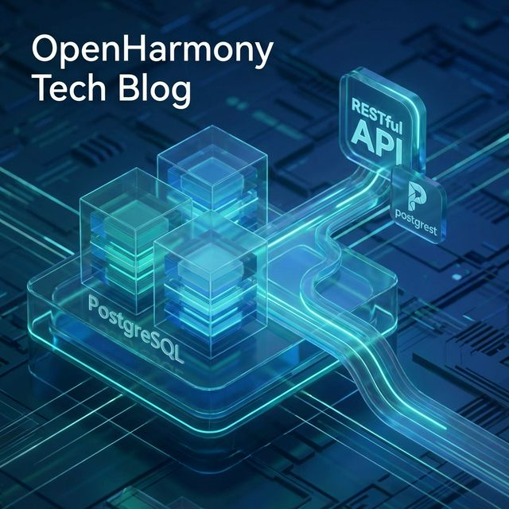
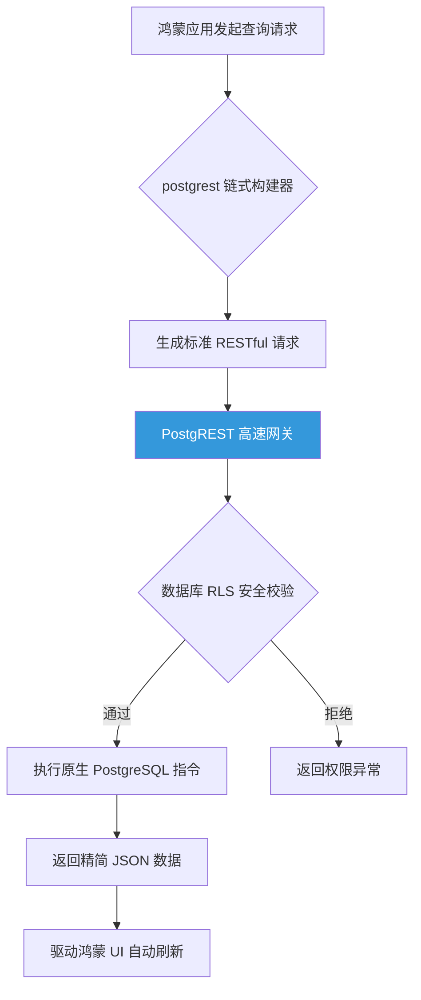

欢迎加入开源鸿蒙跨平台社区：[开源鸿蒙跨平台开发者社区](https://openharmonycrossplatform.csdn.net)

# Flutter for OpenHarmony：Flutter 三方库 postgrest — 鸿蒙端直接访问 PostgreSQL 数据库的极速连接器

## 前言

在开发 **Flutter for OpenHarmony** 应用时，传统的“端-接口-数据库”模式往往显得过于沉重。

如果只是为了实现基础的增删改查，却需要编写大量的后端 API 逻辑、处理复杂的 SQL 拼写以及繁琐的 JSON 打包，这不仅增加了开发成本，也导致系统在面对业务变动时极其脆弱。

`postgrest` 正是解决这一痛点的利器。它是专门为 `PostgREST`（一个能将 PostgreSQL 数据库直接转换为 RESTful API 的高性能网关）打造的 Dart 客户端驱动。通过它，开发者可以在鸿蒙端以类似于编写 SQL 的语义，直接完成对云端数据库的高级检索与操作。

今天，我们将深入探讨如何利用该库在鸿蒙平台上实现“零接口开发”的数据交互体验。

## 一、原理解析 / 概念介绍

### 1.1 基础概念

`postgrest` 并非简单的网络封装包，它在鸿蒙客户端与数据库之间建立了一种基于 **Row Level Security (RLS)** 的安全映射机制。

它将数据库表直接映射为 RESTFUL 资源，客户端发起的链式调用会被网关自动转换为高效的 SQL 执行指令。



### 1.2 进阶概念

- **流畅 API（Fluent API）**：提供了一套语义化的过滤操作，如 `eq` (等于)、`gt` (大于)、`in` (包含) 等，使得查询逻辑清晰可读。
- **行级安全（Row Level Security）**：权限控制不再依赖后端代码逻辑，而是由数据库底层根据请求者的 JWT 身份进行控制，确保多租户数据隔离的绝对安全。

## 二、核心 API / 组件详解

### 2.1 初始化连接器

在应用中建立连接非常简单，仅需一行代码即可创建全局可操作实例。

```dart
import 'package:postgrest/postgrest.dart';

void produceAbsolutePreciseAndZeroBackendApiBuild() async {
   // 1. 初始化客户端（连接到 PostgREST 兼容网关）
   final client = PostgrestClient('https://your-project.supabase.co/rest/v1/');
   
   // 💡 提示：通常需要设置 Authorization Header 配合 RLS 使用
   // client.options.headers['Authorization'] = 'Bearer YOUR_JWT_TOKEN';
   
   // 2. 执行查询：从 users_profiles 表中获取 status 为 active 的用户
   final List response = await client
        .from('users_profiles') 
        .select() 
        .eq('status', 'active'); 
   
   print("👑 鸿蒙端直接获取到的数据记录：$response"); 
}
```

## 三、场景示例

### 3.1 场景一：免后端接口的数据插入

在鸿蒙端实现日志上报或用户信息收集时，无需预先定义后端 API，直接操作数据表。

```dart
import 'package:postgrest/postgrest.dart';

void produceAndPerformPerfectInsertEngineMoneyObj() async {
   final client = PostgrestClient('https://mock-domain.com/api/');
   
   // 直接执行插入操作，数据将实时持久化到后端表结构中
   await client.from('logs_system').insert({
      'user_id': 1052,
      'action_type': 'login',
      'detail': '鸿蒙端登录成功'
   });
   
   print("📝 日志已直接入库，无需后端接口中转。");
}
```

<!-- IMAGE_PLACEHOLDER: [数据库管理面板实时数据变化截图] -->
<!-- 类型: 截图 -->
<!-- 内容: 展示鸿蒙应用点击插入后，PostgreSQL 后端面板实时刷新出新记录的对比图 -->

## 四、要点讲解 & OpenHarmony 平台适配挑战

### 4.1 暴露数据库风险与 RLS 护航

⚠️ **直接在客户端操作数据库路径，这对手持鸿蒙设备的安全性提出了更高要求。**

如果你在开启该库连接的同时，没有在 PostgreSQL 中正确配置 `RLS`（行级安全策略），这意味着你的数据库表可能完全暴露在互联网上，任何人都可以通过拦截请求来篡改数据。

✅ **适配策略：**
在 OpenHarmony 平台上使用此方案时，必须坚持“最小权限原则”。建议在数据库端配置复杂的策略，仅允许带有合法身份证书（JWT）的请求访问特定行。通过这种方式，既享受了零代码开发的便捷，又构建了超越传统中转后端的高强度安全防线。

## 五、综合实战：数据穿透中控台演示

下面展示如何利用 Flutter 构建一个直接驱动云端数据库的查询调试面板。

```dart
import 'package:flutter/material.dart';
import 'package:postgrest/postgrest.dart';

void main() => runApp(const SecuredInternalZeroBackendFullEngineApp());

class SecuredInternalZeroBackendFullEngineApp extends StatelessWidget {
  const SecuredInternalZeroBackendFullEngineApp({Key? key}) : super(key: key);

  @override
  Widget build(BuildContext context) {
    return MaterialApp(
      theme: ThemeData(primarySwatch: Colors.green),
      home: const SuperBeautyDirectDBTestScreen(),
    );
  }
}

class SuperBeautyDirectDBTestScreen extends StatefulWidget {
  const SuperBeautyDirectDBTestScreen({Key? key}) : super(key: key);

  @override
  _SuperBeautyDirectDBTestScreenState createState() => _SuperBeautyDirectDBTestScreenState();
}

class _SuperBeautyDirectDBTestScreenState extends State<SuperBeautyDirectDBTestScreen> {
  String _radarLogDisplay = "系统自检中...";
  late PostgrestClient _client;

  @override
  void initState() {
    super.initState();
    // 初始化模拟网关连接
    _client = PostgrestClient('https://my-supabase-proj-mock-example.co/rest/v1/');
  }

  void _triggerSeekAndAcquireValues() async {
      setState(() => _radarLogDisplay = "🔗 正在穿透网关指令...");
      
      try {
         // 💡 模拟直接检索高安全性用户表的前两条记录
         final List outcome = await _client.from('high_secure_users').select().limit(2);
         setState(() => _radarLogDisplay = "✅ 穿透成功，得到记录：\n\n$outcome");
      } catch (e) {
         setState(() => _radarLogDisplay = "❌ 捕获到预期拦截（未配置 RLS）：\n\n${e.toString()}");
      }
  }

  @override
  Widget build(BuildContext context) {
    return Scaffold(
      appBar: AppBar(title: const Text('数据穿透实验室')),
      body: SingleChildScrollView(
        padding: const EdgeInsets.symmetric(horizontal: 16, vertical: 24),
        child: Column(
          children: [
            const Text("基于 PostgREST 协议实现鸿蒙端直接驱动 SQL 后端架构", 
              style: TextStyle(fontWeight: FontWeight.bold, fontSize: 13, color: Colors.blueGrey)),
            const SizedBox(height: 30),
            ElevatedButton.icon(
               style: ElevatedButton.styleFrom(backgroundColor: Colors.teal, padding: const EdgeInsets.all(15)),
               icon: const Icon(Icons.hub), 
               label: const Text('执行零代码库查询测试'),
               onPressed: _triggerSeekAndAcquireValues,
            ),
            const SizedBox(height: 35),
            Container(
               width: double.infinity,
               padding: const EdgeInsets.all(12),
               decoration: BoxDecoration(color: Colors.black, borderRadius: BorderRadius.circular(12)),
               child: SelectableText(
                  _radarLogDisplay, 
                  style: const TextStyle(color: Colors.limeAccent, fontSize: 13, fontFamily: 'monospace', height: 1.5)
               )
            )
          ],
        ),
      ),
    );
  }
}
```

<!-- IMAGE_PLACEHOLDER: [鸿蒙真机运行查询结果截图] -->
<!-- 类型: 截图 -->
<!-- 内容: 展示鸿蒙应用面板在点击按钮后，从黑色控制台区域直接输出云端数据库原始 JSON 报文的状态 -->

## 六、总结

在追求极速敏捷开发的今天，`postgrest` 彻底打破了前端与后端之间的那堵墙。它赋予了鸿蒙开发者直接对话数据库的能力，使我们能够将更多精力投入到 UI 交互与用户业务逻辑中，而不是被乏味的样板接口所束缚。

核心要点回顾：
1. **零代码接口**：表即 API，极大缩短业务落地周期。
2. **链式操作**：语法直观，将 SQL 语义自然延伸到客户端。
3. **安全护航**：必须深度配合数据库 RLS 策略，确保权限隔离。
4. **适配优势**：减少中转层带来的延迟，显著提升鸿蒙应用在大规模数据检索下的响应速度。
