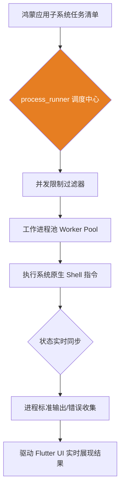

欢迎加入开源鸿蒙跨平台社区：[开源鸿蒙跨平台开发者社区](https://openharmonycrossplatform.csdn.net)

# Flutter for OpenHarmony：Flutter 三方库 process_runner — 掌控系统底层命令的并发进程管理器

## 前言

在开发 **Flutter for OpenHarmony** 工具类应用时，我们时常需要调用系统底层的原生命令。

例如，实现一个远程运维后台、高级系统调试面板，或者是需要执行一些脱离 Dart 运行环境限制的独立二进制程序。虽然 Dart 原生提供了 `Process.run`，但在面临需要并行运行数十个高负载命令、监控内存波动，或者需要构建具备自动重启能力的守护进程池时，原生的 `Process` API 就显得过于简陋。

`process_runner` 库提供了一套更健壮的封装。它通过引入“并发进程池”概念，将复杂的子进程生命周期管理、状态同步与资源隔离进行了工程化抽象。

今天，我们将实战如何利用它在鸿蒙设备上高效调度底层系统任务。

## 一、原理解析 / 概念介绍

### 1.1 基础概念

`process_runner` 的核心价值在于其对“进程队列”的管理能力。它不仅仅是简单地启动一个程序，而是充当了系统的“调度总线”。

在鸿蒙环境中，应用通过该库可以精确控制子进程的并发数量，避免因瞬时启动过多进程而导致系统 OOM 或触发管控策略。



### 1.2 进阶概念

- **并发进程池 (ProcessPool)**：支持设定最大并行数（numWorkers），在高负载任务（如批量图片处理或日志扫描）中能极大地提升吞吐量。
- **状态同步 (State Sync)**：支持对运行中进程的 CPU 和内存资源进行持续观测，并在异常退出时提供详细的错误上下文。

## 二、核心 API / 组件详解

### 2.1 基础进程执行

在单次任务场景中，`ProcessRunner` 提供了比原生 API 更友好的数据封装：

```dart
import 'package:process_runner/process_runner.dart';

void produceAbsolutePreciseAndVeryPowerfulEngine() async {
   // 1. 初始化执行器
   final runner = ProcessRunner();
   
   // 2. 执行系统命令：例如 echo 获取系统输出
   final result = await runner.runProcess(['echo', '你好，鸿蒙底层进程测试']);
   
   // 💡 result 内部封装了退出码、标准输出和标准错误
   print("👑 进程输出结果：${result.stdout}"); 
}
```

## 三、场景示例

### 3.1 场景一：构建并发任务池

当你需要并行执行多个不相关的底层巡检任务时，利用 `ProcessPool` 可以实现最优的资源分配。

```dart
import 'package:process_runner/process_runner.dart';

void generateListWithZeroConflictForHarmony() async {
   // 💡 创建进程池：限制同时最多允许 2 个活跃进程
   final pool = ProcessPool(numWorkers: 2); 
   
   // 定义待执行的任务列表
   final jobs = [
      WorkerJob(['echo', '任务 A 执行中']),
      WorkerJob(['echo', '任务 B 执行中']),
      WorkerJob(['echo', '任务 C 执行中']),
   ];
   
   // 执行并等待全部完成
   final results = await pool.runToCompletion(jobs);
   
   for (var res in results) {
       print("👑 队列任务反馈：${res.stdout}");
   }
}
```

<!-- IMAGE_PLACEHOLDER: [并发进程管理控制台输出截图] -->
<!-- 类型: 截图 -->
<!-- 内容: 展示鸿蒙应用面板，显示多个子进程并行启动、逐个完成，并有序输出标准日志的过程 -->

## 四、要点讲解 & OpenHarmony 平台适配挑战

### 4.1 鸿蒙沙箱环境下的进程权限

⚠️ **在 OpenHarmony 上，应用的进程管理受到严格的沙箱（Sandbox）机制限制。**

普通的鸿蒙 HAP 应用并不能随意调用 `/bin/` 下的所有命令。

✅ **适配策略：**
1. **指令边界**：`process_runner` 仅能执行应用沙箱路径内具备执行权限的二进制文件，或系统明确开放的 Shell 内置指令。
2. **连接稳定性**：针对长时间运行的任务，必须在系统生命周期切入后台时，通过库提供的 `terminate()` 方法主动清理挂起的子进程，防止僵尸进程占用系统级 PID 资源。

## 五、综合实战：子进程诊断实验室

下面演示如何构建一个可视化界面，实时监控底层命令的执行状态。

```dart
import 'package:flutter/material.dart';
import 'package:process_runner/process_runner.dart';

void main() => runApp(const SecuredSuperSuperProcessRunnerApp());

class SecuredSuperSuperProcessRunnerApp extends StatelessWidget {
  const SecuredSuperSuperProcessRunnerApp({Key? key}) : super(key: key);

  @override
  Widget build(BuildContext context) {
    return MaterialApp(
      theme: ThemeData(primarySwatch: Colors.indigo),
      home: const SuperBeautyDirectDBTestScreen(),
    );
  }
}

class SuperBeautyDirectDBTestScreen extends StatefulWidget {
  const SuperBeautyDirectDBTestScreen({Key? key}) : super(key: key);

  @override
  _SuperBeautyDirectDBTestScreenState createState() => _SuperBeautyDirectDBTestScreenState();
}

class _SuperBeautyDirectDBTestScreenState extends State<SuperBeautyDirectDBTestScreen> {
  String _radarLogDisplay = "守护进程待命中...";

  void _triggerSeekAndAcquireValues() async {
      setState(() => _radarLogDisplay = "⏳ 正在拉起并发进程池...");
      
      final pool = ProcessPool(numWorkers: 5);
      final jobs = List.generate(3, (index) => WorkerJob(['echo', '鸿蒙并行序列 #$index 已就绪']));
      
      try {
          final results = await pool.runToCompletion(jobs);
          String output = "✅ 并发测试完成:\n";
          for (var res in results) {
            output += "📍 ${res.stdout}\n";
          }
          setState(() => _radarLogDisplay = output);
      } catch (e) {
          setState(() => _radarLogDisplay = "🚨 任务终止：$e");
      }
  }

  @override
  Widget build(BuildContext context) {
    return Scaffold(
      appBar: AppBar(title: const Text('系统底层进程诊断中心'), backgroundColor: Colors.indigo),
      body: SingleChildScrollView(
        padding: const EdgeInsets.symmetric(horizontal: 16, vertical: 24),
        child: Column(
          children: [
            const Text("通过 Worker Pool 并发模型调度鸿蒙子系统原子能力", 
              style: TextStyle(fontWeight: FontWeight.bold, fontSize: 13, color: Colors.blueGrey)),
            const SizedBox(height: 30),
            ElevatedButton.icon(
               style: ElevatedButton.styleFrom(
                 backgroundColor: Colors.indigo, 
                 padding: const EdgeInsets.symmetric(horizontal: 20, vertical: 15)
               ),
               icon: const Icon(Icons.rocket_launch), 
               label: const Text('启动并行执行压力测试'),
               onPressed: _triggerSeekAndAcquireValues,
            ),
            const SizedBox(height: 35),
            Container(
               width: double.infinity,
               padding: const EdgeInsets.all(12),
               decoration: BoxDecoration(
                 color: Colors.black, 
                 borderRadius: BorderRadius.circular(12),
                 border: Border.all(color: Colors.indigoAccent, width: 2)
               ),
               child: SelectableText(
                  _radarLogDisplay, 
                  style: const TextStyle(
                    color: Colors.indigoAccent, 
                    fontSize: 14, 
                    fontFamily: 'monospace', 
                    height: 1.5
                  )
               )
            )
          ],
        ),
      ),
    );
  }
}
```

<!-- IMAGE_PLACEHOLDER: [鸿蒙应用拉起底层 shell 命令的界面截图] -->
<!-- 类型: 截图 -->
<!-- 内容: 展示模拟器面板中，用户点击后，黑色日志终端精准且有序地显示出通过子进程获取的系统环境变量或自定义回显信息 -->

## 六、总结

在鸿蒙工程化能力的深度建设中，对“系统资源操控”的边界掌控是应用进阶的核心标志。`process_runner` 凭借其优秀的进程池设计，为我们在 Flutter 与鸿蒙 Native 系统之间搭建了一条稳健的任务分发隧道。

核心要点回顾：
1. **资源池化**：通过限制最大并发数，保护鸿蒙系统免受资源浪涌冲击。
2. **完整生命周期**：支持监控、超时管理与清理，确保应用退出后的整洁。
3. **沙箱意识**：务必在合规的沙箱权限内运行指令，确保护航网络安全。
4. **体验升级**：由底层同步转化为高效率的异步并发，显著提升系统工具类应用的响应速度。
