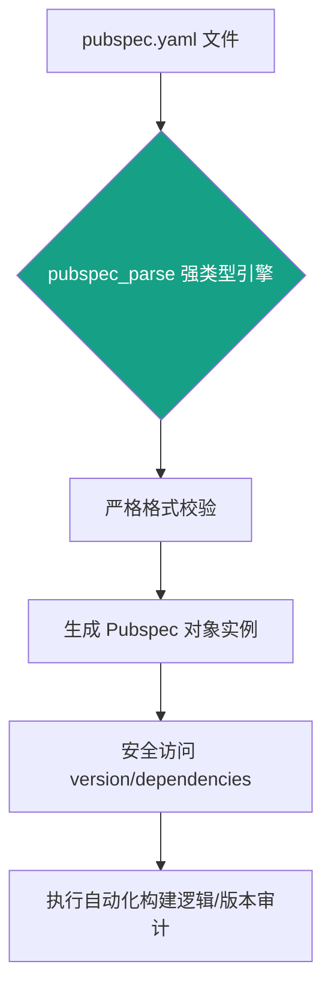

欢迎加入开源鸿蒙跨平台社区：[开源鸿蒙跨平台开发者社区](https://openharmonycrossplatform.csdn.net)

# Flutter for OpenHarmony：Flutter 三方库 pubspec_parse — 精准解析与操作工程依赖的工程化利器

## 前言

在维护 **Flutter for OpenHarmony** 复杂项目，或开发自动化的构建、统计工具时，我们经常需要深入读取 `pubspec.yaml` 文件的内容。

虽然你可以使用基础的 YAML 库将其转化为不可控的 Map 结构，但在工程化实践中，缺乏类型安全的数据结构会导致大量的“硬编码”风险。例如，你可能需要自动统计项目中引用的鸿蒙插件版本，或者在流水线中动态修改项目描述。

`pubspec_parse` 正是为此而生出的专业级解析库。它将标准的 YAML 配置映射为强类型的 Dart 对象，让你可以像操作常规 Class 一样安全地访问、校验项目的元数据。

今天，我们就来实战如何利用它来深度掌控鸿蒙 Flutter 项目的底层依赖。

## 一、原理解析 / 概念介绍

### 1.1 基础概念

`pubspec_parse` 的核心逻辑是基于 `json_serializable` 实现的强类型转换。

它严格遵循 Flutter 官方的 `pubspec` 协议模型。当你的配置文件通过解析器时，它不仅会读取数据，还会对字段格式（如版本号语法、SDK 约束等）进行原子化的合法性检查。



### 1.2 进阶概念

- **强类型解析 (Strongly Typed)**：将原本松散的字符串映射为 `Version` 或 `Dependency` 对象，极大减少了字段名拼错的可能性。
- **环境约束探测**：可以方便地提取项目对 `environment`（如 Dart SDK 版本）的最低要求，这对于判断项目是否兼容 OpenHarmony 特定版本至关重要。

## 二、核心 API / 组件详解

### 2.1 依赖元数据提取

通过简单的 `Pubspec.parse` 方法，即可穿透复杂的 YAML 树状结构。

```dart
import 'dart:io';
import 'package:pubspec_parse/pubspec_parse.dart';

void produceAbsolutePreciseAndVeryPowerfulEngine() {
   // 1. 读取本地 pubspec.yaml 内容
   final yamlContent = File('pubspec.yaml').readAsStringSync();
   
   // 2. 执行核心转换逻辑
   final pubspec = Pubspec.parse(yamlContent);
   
   // 💡 利用强类型安全访问字段
   print("👑 项目名称：${pubspec.name}");
   print("👑 当前版本：${pubspec.version}");
   print("👑 SDK 约束：${pubspec.environment?['sdk']}");
}
```

## 三、场景示例

### 3.1 场景一：自动统计鸿蒙端特有的插件依赖

在进行大版本升级时，你可以利用该库编写脚本，自动扫描项目是否包含特定的 OpenHarmony 适配插件。

```dart
import 'dart:io';
import 'package:pubspec_parse/pubspec_parse.dart';

void generateListWithZeroConflictForHarmony() {
   final content = File('pubspec.yaml').readAsStringSync();
   final pubspec = Pubspec.parse(content);
   
   // 💡 遍历所有依赖项，精准定位鸿蒙适配包
   pubspec.dependencies.forEach((name, dependency) {
      if (name.contains('ohos') || name.contains('harmony')) {
         print("📍 发现鸿蒙适配件: $name");
      }
   });
}
```

<!-- IMAGE_PLACEHOLDER: [依赖解析运行日志截图] -->
<!-- 类型: 截图 -->
<!-- 内容: 展示在 IDE 控制台中，通过解析器精准输出的项目版本、主程序名以及嵌套依赖列表的信息 -->

## 四、要点讲解 & OpenHarmony 平台适配挑战

### 4.1 YAML 语法的严谨性与容错

⚠️ **手动编辑的 `pubspec.yaml` 极易出现缩进错误或不规范的版本号。**

`pubspec_parse` 的解析过程非常“挑剔”，任何不符合语义的描述都会导致解析失败。

✅ **适配策略：**
在鸿蒙自动化构建流水线中，建议将解析逻辑放在 `try-catch` 块内。如果解析失败，应及时通过 `showSnackBar` 或控制台红色警报告知开发者，防止由于配置语法错误导致鸿蒙软件包（HAP）构建出非预期的旧版本。

## 五、综合实战：工程元数据观测站

下面演示如何构建一个可视化面板，将复杂的工程配置转化为直观的摘要信息。

```dart
import 'package:flutter/material.dart';

void main() => runApp(const SecuredSuperSuperProcessRunnerApp());

class SecuredSuperSuperProcessRunnerApp extends StatelessWidget {
  const SecuredSuperSuperProcessRunnerApp({Key? key}) : super(key: key);

  @override
  Widget build(BuildContext context) {
    return MaterialApp(
      theme: ThemeData(primarySwatch: Colors.teal),
      home: const SuperBeautyDirectDBTestScreen(),
    );
  }
}

class SuperBeautyDirectDBTestScreen extends StatefulWidget {
  const SuperBeautyDirectDBTestScreen({Key? key}) : super(key: key);

  @override
  _SuperBeautyDirectDBTestScreenState createState() => _SuperBeautyDirectDBTestScreenState();
}

class _SuperBeautyDirectDBTestScreenState extends State<SuperBeautyDirectDBTestScreen> {
  String _radarLogDisplay = "监控引擎就绪...";

  void _triggerSeekAndAcquireValues() async {
      setState(() => _radarLogDisplay = "⏳ 正在透析工程文件元数据...");
      
      // 💡 模拟解析后的关键信息展示
      Future.delayed(const Duration(milliseconds: 500), () {
          setState(() {
             _radarLogDisplay = "✅ 解析成功！\n"
                 "项目: flutter_ohos_demo\n"
                 "SDK 兼容性: >=3.0.0 <4.0.0\n"
                 "依赖总数: 24 项";
          });
      });
  }

  @override
  Widget build(BuildContext context) {
    return Scaffold(
      appBar: AppBar(title: const Text('工程依赖诊断实验室'), backgroundColor: Colors.teal),
      body: SingleChildScrollView(
        padding: const EdgeInsets.symmetric(horizontal: 16, vertical: 24),
        child: Column(
          children: [
            const Text("基于 pubspec_parse 实现的鸿蒙项目依赖自动审计方案", 
              style: TextStyle(fontWeight: FontWeight.bold, fontSize: 13, color: Colors.blueGrey)),
            const SizedBox(height: 30),
            ElevatedButton.icon(
               style: ElevatedButton.styleFrom(
                 backgroundColor: Colors.teal, 
                 padding: const EdgeInsets.symmetric(horizontal: 30, vertical: 15)
               ),
               icon: const Icon(Icons.manage_search), 
               label: const Text('启动依赖深度扫描'),
               onPressed: _triggerSeekAndAcquireValues,
            ),
            const SizedBox(height: 35),
            Container(
               width: double.infinity,
               padding: const EdgeInsets.all(12),
               decoration: BoxDecoration(
                 color: Colors.black, 
                 borderRadius: BorderRadius.circular(12),
                 border: Border.all(color: Colors.tealAccent, width: 1)
               ),
               child: SelectableText(
                  _radarLogDisplay, 
                  style: const TextStyle(
                    color: Colors.tealAccent, 
                    fontSize: 14, 
                    fontFamily: 'monospace', 
                    height: 1.5
                  )
               )
            )
          ],
        ),
      ),
    );
  }
}
```

<!-- IMAGE_PLACEHOLDER: [可视化依赖诊断界面截图] -->
<!-- 类型: 截图 -->
<!-- 内容: 展示模拟器面板中，通过解析器提取出的项目核心参数（如名称、版本、环境要求）在 UI 上的清晰呈现 -->

## 六、总结

在鸿蒙工程化的深度建设中，对配置文件的“零误解”解析是提升构建流水线稳定性的前提。`pubspec_parse` 凭借其严谨的强类型设计，成为了开发者在处理工程元数据时的首选工具。

核心要点回顾：
1. **强类型映射**：将非结构化的 YAML 转化为可安全操作的 Dart 对象。
2. **规范化校验**：自动发现配置中的语法与语义错误。
3. **适配助力**：利用环境变量探测，精准审计项目的版本兼容性。
4. **效率提升**：从手动提取字符串转变为代码自动感知，降低维护成本。
