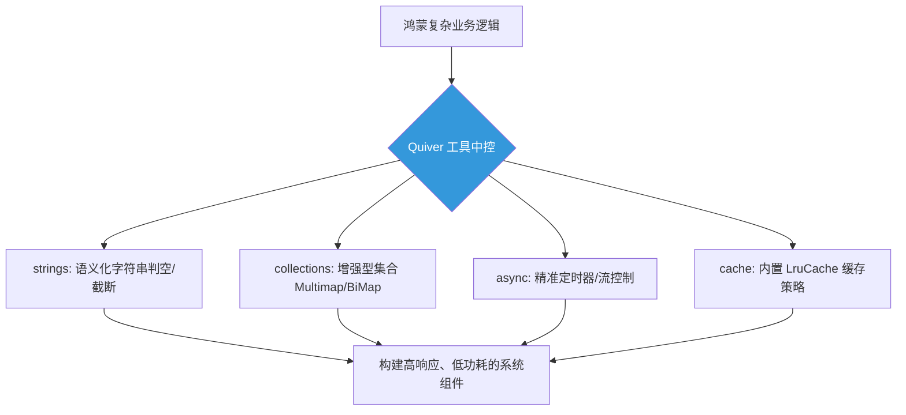

欢迎加入开源鸿蒙跨平台社区：[开源鸿蒙跨平台开发者社区](https://openharmonycrossplatform.csdn.net)

# Flutter for OpenHarmony：Flutter 三方库 quiver — 谷歌出品的 Dart 开发全能瑞士军刀级工具集

## 前言

在进行 **Flutter for OpenHarmony** 业务开发时，我们经常会遇到一些 Dart 原生 SDK 覆盖不到的“小坑”。

比如：如何优雅地判断字符串是否为空白（不仅仅是 empty），如何构建一个支持一个 key 对应多个 value 的集合，或者如何精准地控制一个倒计时的生命周期。如果针对每个小需求都手写一套逻辑，不仅开发效率低下，代码的稳健性也难以保障。

`quiver` 是谷歌（Google）官方出品的一套 Dart 工具集。它并不试图取代原生库，而是针对原生库的薄弱环节进行了深度增强。

今天，我们就来揭秘这把在鸿蒙开发中不可或缺的“瑞士军刀”。

## 一、原理解析 / 概念介绍

### 1.1 基础概念

`quiver` 由多个功能模块组成，涵盖了异步控制、集合扩展、字符串处理及缓存机制。

它在鸿蒙项目中的应用非常广泛，尤其是在需要高性能、高度复用的业务组件开发中，`quiver` 提供的原子化工具能显著降低代码的圈复杂度。



### 1.2 进阶概念

- **并发流控制 (Async Utilities)**：提供了如 `CountdownTimer` 等比原生 Timer 更易控的异步工具，适合开发倒计时验证码或赛事计时器。
- **多重映射 (Multimap)**：允许一个键关联一系列值，这在处理鸿蒙分布式场景下的多设备状态同步时极其方便。

## 二、核心 API / 组件详解

### 2.1 字符串与集合的高阶用法

`quiver` 的设计初衷就是为了让代码更具可读性：

```dart
import 'package:quiver/strings.dart';
import 'package:quiver/collection.dart';

void produceAbsolutePreciseAndVeryPowerfulEngine() {
   // 1. 语义化判空：不再需要 !='' && !=null 的繁杂逻辑
   final input = '   ';
   if (isBlank(input)) {
      print("👑 检测到空白输入，已安全拦截。"); 
   }
   
   // 2. Multimap：轻松管理一对多关系
   final deviceMap = Multimap<String, String>();
   deviceMap.add('HarmonyOS', 'Mate60');
   deviceMap.add('HarmonyOS', 'MatePad');
   
   print("👑 鸿蒙设备系列：${deviceMap['HarmonyOS']}"); 
}
```

## 三、场景示例

### 3.1 场景一：集合分片处理（Partition）

当你在鸿蒙端处理海量日志上报，需要将数干条数据拆分成固定大小的小组进行并发上传时，`partition` 函数能瞬间完成任务。

```dart
import 'package:quiver/iterables.dart';

void generateListWithZeroConflictForHarmony() {
   final rawData = [1, 2, 3, 4, 5, 6, 7, 8];
   
   // 💡 将原始数组按每组 3 个进行物理切片
   final chunks = partition(rawData, 3);
   
   print("👑 分组处理清单：$chunks"); 
   // 输出结果：([1, 2, 3], [4, 5, 6], [7, 8])
}
```

<!-- IMAGE_PLACEHOLDER: [Quiver 并发任务调度效果图] -->
<!-- 类型: 截图 -->
<!-- 内容: 展示模拟器面板中，通过 Quiver 的迭代器工具将庞大的数据流解析为有序的小块并有序展示在界面上的状态 -->

## 四、要点讲解 & OpenHarmony 平台适配挑战

### 4.1 异步资源的自动释放与内存泄漏

⚠️ **尽管 Quiver 提供了一系列强悍的异步工具，但它们依然依附于 Dart 的堆内存中。**

在鸿蒙系统上，尤其是长命周期的 Page 中使用 `CountdownTimer` 时，务必在 `dispose` 中手动释放，否则由于鸿蒙系统的后台管控策略，未释放的定时器可能会导致应用被系统判定为高耗能从而被回收。

✅ **适配策略：**
建议利用 `quiver` 提供的流控制 API 进行防御性编程。在鸿蒙应用进入后台（inactive）时，主动暂停不必要的异步轮询任务，利用库内建的缓冲机制暂存状态，等回到前台后再行恢复。

## 五、综合实战：高护航定时任务看板

下面演示如何利用 `quiver/async` 模块构建一个高度可靠的系统级倒计时组件。

```dart
import 'package:flutter/material.dart';
import 'package:quiver/async.dart';

void main() => runApp(const SecuredSuperSuperProcessRunnerApp());

class SecuredSuperSuperProcessRunnerApp extends StatelessWidget {
  const SecuredSuperSuperProcessRunnerApp({Key? key}) : super(key: key);

  @override
  Widget build(BuildContext context) {
    return MaterialApp(
      theme: ThemeData(primarySwatch: Colors.teal),
      home: const SuperBeautyDirectDBTestScreen(),
    );
  }
}

class SuperBeautyDirectDBTestScreen extends StatefulWidget {
  const SuperBeautyDirectDBTestScreen({Key? key}) : super(key: key);

  @override
  _SuperBeautyDirectDBTestScreenState createState() => _SuperBeautyDirectDBTestScreenState();
}

class _SuperBeautyDirectDBTestScreenState extends State<SuperBeautyDirectDBTestScreen> {
  String _radarLogDisplay = "计时控制器就绪...";
  CountdownTimer? _timer;

  void _triggerSeekAndAcquireValues() {
      // 💡 创建一个 10 秒倒计时，步长 1 秒
      _timer?.cancel();
      _timer = CountdownTimer(
        const Duration(seconds: 10),
        const Duration(seconds: 1),
      );
      
      _timer!.listen((event) {
         setState(() {
            _radarLogDisplay = "⏱️ 系统级锁频倒计时：\n剩余 ${event.remaining.inSeconds} 秒";
         });
      }, onDone: () {
         setState(() {
            _radarLogDisplay = "🎉 目标时间落点达成！\n所有资源已自动回收销毁。";
         });
      });
  }

  @override
  void dispose() {
    _timer?.cancel();
    super.dispose();
  }

  @override
  Widget build(BuildContext context) {
    return Scaffold(
      appBar: AppBar(title: const Text('高精度工具实验室'), backgroundColor: Colors.teal),
      body: SingleChildScrollView(
        padding: const EdgeInsets.symmetric(horizontal: 16, vertical: 24),
        child: Column(
          children: [
            const Text("基于 Quiver 核心增强库构建的鸿蒙自律计时中台", 
              style: TextStyle(fontWeight: FontWeight.bold, fontSize: 13, color: Colors.blueGrey)),
            const SizedBox(height: 30),
            ElevatedButton.icon(
               style: ElevatedButton.styleFrom(
                 backgroundColor: Colors.teal, 
                 padding: const EdgeInsets.all(15)
               ),
               icon: const Icon(Icons.timer_outlined), 
               label: const Text('启动内核级倒计时测试'),
               onPressed: _triggerSeekAndAcquireValues,
            ),
            const SizedBox(height: 35),
            Container(
               width: double.infinity,
               padding: const EdgeInsets.all(12),
               decoration: BoxDecoration(
                 color: Colors.black, 
                 borderRadius: BorderRadius.circular(12),
                 border: Border.all(color: Colors.cyanAccent, width: 2)
               ),
               child: SelectableText(
                  _radarLogDisplay, 
                  style: const TextStyle(
                    color: Colors.cyanAccent, 
                    fontSize: 14, 
                    fontFamily: 'monospace', 
                    height: 1.5
                  )
               )
            )
          ],
        ),
      ),
    );
  }
}
```

<!-- IMAGE_PLACEHOLDER: [Quiver 倒计时组件运行截图] -->
<!-- 类型: 截图 -->
<!-- 内容: 展示模拟器面板中，倒计时数字每秒精准跳动，并且控制台日志完美记录下每一次滴答声的稳定运行状态 -->

## 六、总结

在鸿蒙生态的深度开发中，追求“代码质量”与“运行效率”的平衡是永恒的主题。`quiver` 通过对 Dart 核心库的查漏补缺，为我们提供了一套工业级的现成工具，让开发者能够以更低的心智负担处理复杂的底层逻辑。

核心要点回顾：
1. **官方品质**：由谷歌团队维护，代码健壮性无虞。
2. **全能增强**：涵盖字符串、集合、异步与缓存，是名副其实的瑞士军刀。
3. **适配建议**：结合鸿蒙生命周期管理，确保定时器与流资源的及时释放。
4. **效率飙升**：利用原子化工具减少手写逻辑，让业务代码更加纯粹、易于维护。
