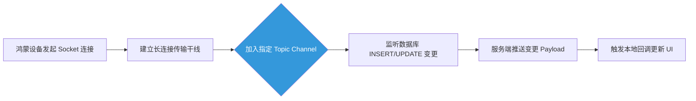

欢迎加入开源鸿蒙跨平台社区：[开源鸿蒙跨平台开发者社区](https://openharmonycrossplatform.csdn.net)

# Flutter for OpenHarmony：Flutter 三方库 realtime_client — 深度接管远端实时数据库与广播事件

## 前言

在开发 **Flutter for OpenHarmony** 应用时，如果业务涉及在线对战、实时行情或多人协作，传统的 HTTP 请求往往难以满足实时性要求。

我们需要一套能维持长连接、并主动向客户端推送更新（Push）的通信机制。`realtime_client` 正是为此设计的 WebSocket 高阶库。它最初由 Supabase 打造，凭借其协议的普世性，能完美驱动各种兼容 Elixir/Phoenix 频道的实时监听网关。

今天，我们将实战如何利用该库在鸿蒙平台上构建低延迟的实时交互体验。

## 一、原理解析 / 概念介绍

### 1.1 基础概念

`realtime_client` 屏蔽了 WebSocket 复杂的底层逻辑，包括重连机制、心跳检测和协议分片。

它采用“频道（Channel）”模式进行数据管理。你可以将它理解为一个广播电台，客户端通过订阅特定频道来监听数据库的变更事件（INSERT、UPDATE、DELETE）。



### 1.2 进阶概念

- **在线感知 (Presence)**：支持跟踪集群内其他节点的在线状态。这在实现“在线人数统计”或“正在输入...”等高级社交特性时非常高效。
- **自定义广播 (Broadcast)**：无需经过数据库持久层，直接通过 WebSocket 通道进行点对点信号传递。这对于同步鼠标指针坐标或音视频信令交换非常有用。

## 二、核心 API / 组件详解

### 2.1 长连接核心初始化

在应用中，连接实例通常作为全局单例进行维护：

```dart
import 'package:realtime_client/realtime_client.dart';

Future<void> launchHarmonyRealtimeNexus() async {
  // 1. 初始化根枢纽连接
  final socket = RealtimeClient('wss://your-harmony-backend.com/socket/v1',
        params: {'apikey': 'your-secure-token'}
  );
  
  // 2. 建立连接，内置心跳机制会自动保活
  socket.connect();
  
  // 3. 监听宏观连接状态
  socket.onOpen(() => print('✅ 鸿蒙设备已成功连接云端实时网关'));
}
```

### 2.2 逻辑频道挂载与数据监听

通过频道对象实现对特定表结构的细粒度监听：

```dart
// 1. 分配一个专属的主题频道
final channel = socket.channel('realtime:public:chat_messages');

// 2. 注册监听动作：当 chat_messages 表有新数据插入时触发
channel.on(
  RealtimeListenTypes.postgresChanges, 
  ChannelFilter(event: 'INSERT', schema: 'public', table: 'chat_messages'), 
  (payload, [ref]) {
    // 💡 获取到的 payload 为实时变更的完整 JSON 报文
    print('🚨 收到云端新消息推送：${payload['new_record']}');
  }
);

// 3. 完成订阅认证
channel.subscribe();
```

## 三、场景示例

### 3.1 场景一：多设备协同控制

在鸿蒙分布式场景下，你可以利用平板作为遥控器，实时控制智慧屏上的组件状态。通过 Broadcast 通道实现毫秒级的事件传递：

```dart
class RemoteCoopPointer {
   RealtimeChannel? laserChannel;
   
   void setupLaserRoom(RealtimeClient socket) {
      laserChannel = socket.channel('room:harmony_tv_001');
      
      // 订阅非数据库流转信号
      laserChannel?.on(
          RealtimeListenTypes.broadcast, 
          ChannelFilter(event: 'cursor-pos'), 
          (payload, [ref]) {
             print('接收到平板同步坐标：x:${payload['x']} y:${payload['y']}');
          }
      );
      laserChannel?.subscribe();
   }
   
   // 触发位置广播
   void broadcastMyMovement(double currentX) {
      laserChannel?.send(
         type: RealtimeListenTypes.broadcast,
         event: 'cursor-pos',
         payload: {'x': currentX, 'y': 0}
      );
   }
}
```

<!-- IMAGE_PLACEHOLDER: [联机协同控制台调试日志] -->
<!-- 类型: 截图 -->
<!-- 内容: 展示两台设备通过广播通道同步坐标的实时日志输出 -->

## 四、OpenHarmony 平台适配挑战

### 4.1 系统休眠与心跳续命

⚠️ **WebSocket 依赖 TCP 长链接，这对设备的电量管理提出了挑战。**

在鸿蒙系统上，当应用切入后台超过一定时间，系统可能会限制进程的网络权限，导致长连接因无法及时响应 Pong 报文而僵死。

✅ **适配策略：**
建议结合 `WidgetsBindingObserver` 监听应用生命周期。当应用进入 `paused` 状态时，应主动调用 `channel.unsubscribe()` 断开连接以节约电量；当应用返回 `resumed` 状态时，重新建立连接并拉取断连期间的差额数据。这种按需连接的方式能显著提升应用的稳定性和能效比。

## 五、综合实战：实时控制枢纽

下面演示如何构建一个集成开关连接与实时日志监控的一体化面板。

```dart
import 'package:flutter/material.dart';
import 'package:realtime_client/realtime_client.dart';

void main() => runApp(const LiveLinkHarmonyApp());

class LiveLinkHarmonyApp extends StatelessWidget {
  const LiveLinkHarmonyApp({Key? key}) : super(key: key);

  @override
  Widget build(BuildContext context) {
    return MaterialApp(
      theme: ThemeData(primarySwatch: Colors.deepOrange),
      home: const SocketCommanderScreen(),
    );
  }
}

class SocketCommanderScreen extends StatefulWidget {
  const SocketCommanderScreen({Key? key}) : super(key: key);

  @override
  _SocketCommanderScreenState createState() => _SocketCommanderScreenState();
}

class _SocketCommanderScreenState extends State<SocketCommanderScreen> {
  String liveLog = "[空闲] 尚未配置实时连接核心...";
  RealtimeClient? _socketControl;
  RealtimeChannel? _mainLobbyChannel;
  bool isPluggedIn = false;

  void _engageConnection() {
    setState(() => liveLog += "\n🟡 正在初始化链路信道...");
    
    _socketControl = RealtimeClient('wss://dummy.realtime-server.internal/v1',
        params: {'apikey': 'fake-key'});

    _socketControl!.onOpen(() {
      setState(() {
        isPluggedIn = true;
        liveLog += "\n✅ 长连接已激活，鸿蒙设备进入同步态。";
      });
      _joinLobby();
    });

    _socketControl!.connect();
  }

  void _joinLobby() {
    if (_socketControl == null) return;
    _mainLobbyChannel = _socketControl!.channel('public-lobby-007');
    
    _mainLobbyChannel!.on(
      RealtimeListenTypes.postgresChanges, 
      ChannelFilter(event: '*', schema: 'public', table: 'messages'), 
      (payload, [ref]) {
         setState(() {
            liveLog += "\n🚨 捕获远端突发变更: ${payload.toString().substring(0, 30)}...";
         });
      }
    );
    _mainLobbyChannel!.subscribe();
  }

  void _disconnectSafe() {
     _socketControl?.disconnect();
     setState(() {
       isPluggedIn = false;
       liveLog += "\n🔴 已主动断开，进入离线托管模式。";
     });
  }

  @override
  Widget build(BuildContext context) {
    return Scaffold(
      appBar: AppBar(title: const Text('实时推送指挥中心')),
      body: Padding(
        padding: const EdgeInsets.symmetric(horizontal: 16, vertical: 24),
        child: Column(
          children: [
            Row(
              mainAxisAlignment: MainAxisAlignment.spaceEvenly,
              children: [
                ElevatedButton.icon(
                  icon: const Icon(Icons.flash_on), 
                  label: const Text('接通核心总线'),
                  onPressed: isPluggedIn ? null : _engageConnection,
                ),
                ElevatedButton.icon(
                  style: ElevatedButton.styleFrom(backgroundColor: Colors.redAccent),
                  icon: const Icon(Icons.power_off), 
                  label: const Text('安全下撤'),
                  onPressed: isPluggedIn ? _disconnectSafe : null,
                ),
              ],
            ),
            const SizedBox(height: 30),
            Expanded(
               child: Container(
                  width: double.infinity,
                  padding: const EdgeInsets.all(12),
                  decoration: BoxDecoration(color: Colors.black, borderRadius: BorderRadius.circular(12)),
                  child: SingleChildScrollView(
                     child: Text(liveLog, 
                       style: const TextStyle(color: Colors.greenAccent, fontSize: 13, fontFamily: 'monospace'))
                  )
               )
            )
          ],
        ),
      ),
    );
  }
}
```

<!-- IMAGE_PLACEHOLDER: [实战面板交互运行截图] -->
<!-- 类型: 截图 -->
<!-- 内容: 展示鸿蒙应用面板在点击连接后，黑色终端区域实时滚动显示云端数据更新日志的状态 -->

## 六、总结

在鸿蒙万物互联的愿景中，数据的实时性决定了交互的高度。相比于低效的轮询，基于 `realtime_client` 的推送式交互（Push）赋予了应用真正的活力。它不仅大大降低了带宽损耗，更为跨端、跨设备的即时协同铺平了道路。

核心要点回顾：
1. **屏蔽复杂性**：内置自动重连与心跳，免去底层维护烦恼。
2. **多模式并行**：支持数据库监听、Presence 在线感知和自定义广播。
3. **鸿蒙适配**：重视应用生命周期管理，确保护航电量与连接稳定。
4. **体验升级**：从“用户拉取”变为“云端投递”，显著提升业务反馈速率。
