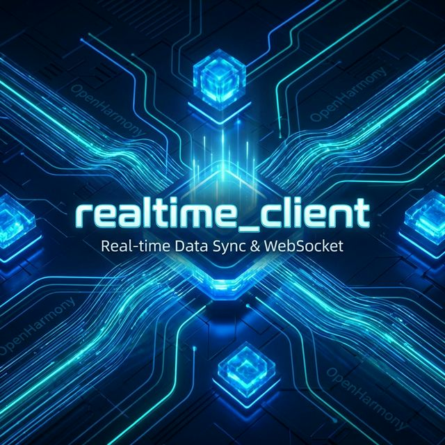
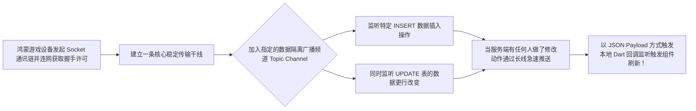

欢迎加入开源鸿蒙跨平台社区：https://openharmonycrossplatform.csdn.net
# Flutter for OpenHarmony：Flutter 三方库 realtime_client 深层接管远端实时数据库与广播事件（Supabase 监听流引擎）
## 前言
如果您开发的鸿蒙（OpenHarmony）应用带有**在线对战的棋牌室**、**股票实时行情面板**或者是**异地多人共同编辑一份文档的笔记软件**模块。那么像发微信一样一来一回的简单 Http 无疑是杯水车薪的弱小。我们需要维持通道长命百岁且不断自动向各端下发更新（Push）。这就引出了基于 WebSocket 高阶特性的库神：`realtime_client`。虽然它最初源于被大名鼎鼎的后端即服务应用引擎 Supabase 深深结合打造的模块，但由于其协议标准的普世性，也能很好的驱动任意一端兼容 Elixir/Phoenix 频道的实时监听网关模块。
## 一、原理解析 / 概念介绍
### 1.1 基础概念
该库屏蔽了 WebSocket 底层经常令人抓狂的重连、维持心跳处理和心智负担庞大的协议包分片操作。而是通过建立“房间通道频道模式（Channel & Room Mode）”让一切数据流通变为广播电台。你可以让一个控件同时窃听一到多个指定表的数据库变更通知事件。

### 1.2 进阶概念
- **游离存在 (Presence)**：这不光是单项接收广播，该框架支持跟踪网络集群内其他连接节点的存在状态！也就是说可以直接用它实现出完美的“当前聊天室实时几人在线”与“打字中...”的高级特征呈现。
- **自定义广播广播兵 (Broadcast)**：甚至不需要经过数据库持久层周转即可完成点对点传递信号！用来在同端之间进行音视频打洞协调或者交换鼠标指针坐标极其好用。
## 二、核心 API / 组件详解
### 2.1 编织起长连接的核心控制点与初始化
整个连接在应用里必须作为一个重型驻留单例保留存活：
```dart
// 获取核心通道控制端
import 'package:realtime_client/realtime_client.dart';
Future<void> launchHarmonyRealtimeNexus() async {
  print("正在构建和连接到全天候传输中转设施网关...");
  
  // 建立根枢纽连接 (假定这是一台兼容该标准协议的中央 WebSocket 高速网关)
  final socket = RealtimeClient('wss://your-harmony-sync-backend.com/socket/v1',
        // 传递安全的连接鉴权秘钥！确保数据不被泄密
        params: {'apikey': 'public-anon-key-your-token'}
  );
  
  // 必须手动呼叫让其接通，它内置了心跳保证不断桥！
  socket.connect();
  
  // 监控系统的宏观存活状态
  socket.onOpen(() => print('✅ 鸿蒙底座已经同云端达成全通共识连贯态！'));
}
```
### 2.2 定义复杂的行为并挂载监听器
接下来是在房间里的动作：
```dart
// 从根对象分配出来一个叫做“room:1”的特殊私密包厢或者表集合！
final channel = socket.channel('realtime:public:chat_messages');
// 定义：当任何人对这个群聊发出了 Insert 也就是发新贴的举动！立刻报警我们！
channel.on(
  RealtimeListenTypes.postgresChanges, 
  ChannelFilter(event: 'INSERT', schema: 'public', table: 'chat_messages'), 
  (payload, [ref]) {
    // 💡技巧：拿到的将是刚鲜活存进异地数据库的内容报文！
    print('🚨 突发广播：远端的数据库里有一条全新消息生成了！内容为：${payload['new_record']}');
  }
);
// 最后记得要求中心让我们进去并且认证这套动作。
channel.subscribe();
```
## 三、场景示例
### 3.1 场景一：基于多设备联动的鸿蒙控制协同演示
当你手中有一台运行该应用的鸿蒙控制平板，另外还有一个正在跑该软件的鸿蒙智屏。你需要用平板做激光笔发送坐标事件（这类数据没必要也没闲功夫存进传统数据库！）直接透过 Broadcast 通道抛掷：
```dart
class RemoteCoopPointer {
   RealtimeChannel? laserChannel;
   
   void setupLaserRoom(RealtimeClient socket) {
      laserChannel = socket.channel('room:harmony_tv_001');
      
      // 我们在此订阅来自同伴设备的鼠标非数据库流转信号：
      laserChannel?.on(
          RealtimeListenTypes.broadcast, 
          ChannelFilter(event: 'cursor-pos'), 
          (payload, [ref]) {
             print('接收到另一个系统甩投过来的飞去来标位置！坐标 x:${payload['x']} y:${payload['y']}');
             // 通知智屏移动小红点组件位置。
          }
      );
      laserChannel?.subscribe();
   }
   
   // 从另外设备的平板通过拖拽直接扔进数据海！实现秒级联通
   void broadcastMyMovement(double currentX) {
      // 通过服务器当二传手！毫秒级传输飞跨硬件。
      laserChannel?.send(
         type: RealtimeListenTypes.broadcast,
         event: 'cursor-pos',
         payload: {'x': currentX, 'y': 0}
      );
   }
}
```
<!-- IMAGE_PLACEHOLDER: 控制台输出带有不同按钮行为拦截结果和滑动数值坐标连续更新输出 -->
<!-- 类型: 截图 -->
<!-- 设备: 在开发套件内的终端模拟界面 -->
<!-- 内容: 控制台成功输出事件回传 -->
### 3.2 场景二：开发一款真正“实时显示”的社交应用头像圆点灯
利用本引擎 Presence 的深度功能可以直接感知到其他人在不在线的情况：
```dart
class StatusTracker {
  void watchFriendStatus(RealtimeChannel roomChannel) {
     roomChannel.on(
        RealtimeListenTypes.presence, 
        ChannelFilter(event: 'sync'), 
        (payload, [ref]) {
           final presentUsers = roomChannel.presence.state;
           print('👥 鸿蒙状态墙：当前有 ${presentUsers.length} 位访客同时停留在该资源面上。');
        }
     );
  }
}
```
## 四、OpenHarmony 平台适配要求及警示
### 4.1 对于鸿蒙系统底层网络策略在休眠切换的心跳续命
⚠️ **极其重要的注意事项**：WebSocket 本质是保持一条 TCP 在长线运行并互通 Ping/Pong。
在普通手机的鸿蒙平台上。当您把有着这个实时大监控链接的网络大厅界面退缩到模糊的后台进行其他操作的时候（切出后台 > 30秒）。这个 Socket 是极大可能性因为进程网络策略管制的封锁出现连接僵死中断（丢弃了 Ping 的响应）。
✅ **适配策略建议**：
在鸿蒙生命周期的全局观察类当中 (`WidgetsBindingObserver` 内的 `didChangeAppLifecycleState`)。明确知悉只要是进入被切出或者待机（paused / inactive），立刻切断停止其长连逻辑并解发缓存 `channel.unsubscribe()`；直到界面被 `resumed` 重返活动！再重新构建其链接或发出获取期间数据的差额！这不仅保活完美也能大大增强你的好评（极其省电和稳定）。
## 五、综合完整展示页面模板呈现
由于此包需高度依赖外部自有的或者基于 Supabase 的一个标准服务后方来运作展示。为了能够在实际中感受到他的使用和调用范式。以下呈现为一个假象的链接调试中控页面！
```dart
import 'package:flutter/material.dart';
import 'package:realtime_client/realtime_client.dart';
void main() => runApp(const LiveLinkHarmonyApp());
class LiveLinkHarmonyApp extends StatelessWidget {
  const LiveLinkHarmonyApp({Key? key}) : super(key: key);
  @override
  Widget build(BuildContext context) {
    return MaterialApp(
      title: '高护通道枢轴界面',
      theme: ThemeData(primarySwatch: Colors.deepOrange),
      home: const SocketCommanderScreen(),
    );
  }
}
class SocketCommanderScreen extends StatefulWidget {
  const SocketCommanderScreen({Key? key}) : super(key: key);
  @override
  _SocketCommanderScreenState createState() => _SocketCommanderScreenState();
}
class _SocketCommanderScreenState extends State<SocketCommanderScreen> {
  String liveLog = "[空闲] 尚未配置鸿蒙大连接核心...";
  RealtimeClient? _socketControl;
  RealtimeChannel? _mainLobbyChannel;
  bool isPluggedIn = false;
  void _engageConnection() {
    setState(() => liveLog += "\n🟡 正在生成链路信道尝试沟通云枢纽!");
    
    // 连接到自己部署或者由第三方云端厂商提供的标准频道接线生节点！
    _socketControl = RealtimeClient('wss://dummy.realtime-server.internal/v1',
        params: {'apikey': 'just_a_fake_public_key_to_pass'});
    _socketControl!.onOpen(() {
      setState(() {
        isPluggedIn = true;
        liveLog += "\n✅ 主干网已点亮，鸿蒙已进入深海互联态。";
      });
      _joinLobby();
    });
    _socketControl!.onError((error) => setState(() => liveLog += "\n❌ 底层阻断: $error"));
    _socketControl!.onClose((reason) => setState(() => liveLog += "\n🚪 网安门已被迫截断: $reason"));
    
    _socketControl!.connect();
  }
  void _joinLobby() {
    if (_socketControl == null) return;
    _mainLobbyChannel = _socketControl!.channel('public-lobby-007');
    
    // 偷听全部公共聊天表的一切所有异动更新操作。
    _mainLobbyChannel!.on(
      RealtimeListenTypes.postgresChanges, 
      ChannelFilter(event: '*', schema: 'public', table: 'messages'), 
      (payload, [ref]) {
         setState(() {
            liveLog += "\n🚨突发明细: ${payload.toString().substring(0, 30)}...";
         });
      }
    );
    _mainLobbyChannel!.subscribe();
  }
  void _disconnectSafe() {
     _socketControl?.disconnect();
     setState(() {
       isPluggedIn = false;
       liveLog += "\n🔴 彻底执行了安全收管主动拔除！";
     });
  }
  @override
  Widget build(BuildContext context) {
    return Scaffold(
      appBar: AppBar(title: const Text('动态全量直播枢轴操作区')),
      body: Padding(
        padding: const EdgeInsets.symmetric(horizontal: 16, vertical: 24),
        child: Column(
          children: [
            Row(
              mainAxisAlignment: MainAxisAlignment.spaceEvenly,
              children: [
                ElevatedButton.icon(
                  icon: const Icon(Icons.electrical_services), 
                  label: const Text('接通核心总线'),
                  onPressed: isPluggedIn ? null : _engageConnection,
                ),
                ElevatedButton.icon(
                  style: ElevatedButton.styleFrom(backgroundColor: Colors.redAccent),
                  icon: const Icon(Icons.cut), 
                  label: const Text('斩断联系安全下撤'),
                  onPressed: isPluggedIn ? _disconnectSafe : null,
                ),
              ],
            ),
            const SizedBox(height: 30),
            Expanded(
               child: Container(
                  width: double.infinity,
                  padding: const EdgeInsets.all(12),
                  decoration: BoxDecoration(color: Colors.black, borderRadius: BorderRadius.circular(12)),
                  child: SingleChildScrollView(
                     child: Text(liveLog, style: const TextStyle(color: Colors.greenAccent, fontSize: 13, fontFamily: 'monospace'))
                  )
               )
            )
          ],
        ),
      ),
    );
  }
}
```
<!-- IMAGE_PLACEHOLDER: 具有模拟上下线开关测试和显示状态的大黑框的控制台 UI 文字 -->
<!-- 类型: 截图 -->
<!-- 设备: 在任何支持运行编译工程环境的平台上 -->
<!-- 内容: 这个是带有一点 Hacker 风格感觉的应用面板显示文字 -->
## 六、总结
由于普通的接口是用户去拉（Pull）。这造就了当用户不刷新或者轮询没设置好的时候系统总是充满陈旧的僵硬感的数据块。一旦您的生态全面转移到了使用 `realtime_client` 这类 WebSocket 长连接体系以后，这就变成了被动接收系统推送流打进来（Push）。他对于开发如在线商城商品抢拍秒杀的倒数价格刷新、甚至是赛车游戏的同步具有无法磨灭的革命意义。拥抱全通的实时连接才能做好真正的万物互联数字设备！
📦 想进一步探究与服务端部署配合代码参考：[AtomGit 示例专栏](https://atomgit.com)
---
*声明：此文章经由开源数据连接探究小组提供资料支撑构建。*
欢迎加入开源鸿蒙跨平台社区：[开源鸿蒙跨平台开发者社区](https://openharmonycrossplatform.csdn.net)
