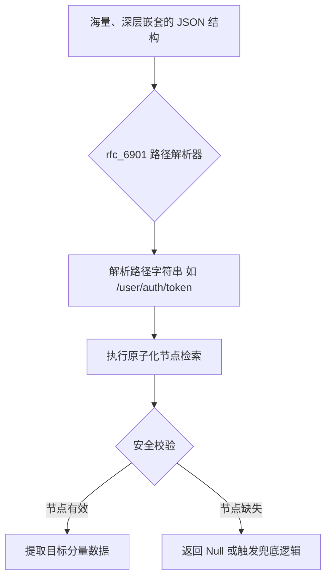

欢迎加入开源鸿蒙跨平台社区：[开源鸿蒙跨平台开发者社区](https://openharmonycrossplatform.csdn.net)

# Flutter for OpenHarmony：Flutter 三方库 rfc_6901 — 穿透复杂 JSON 结构的路径导航利器

## 前言

在维护 **Flutter for OpenHarmony** 应用时，处理大型、多层级嵌套的 JSON 数据是开发者经常面临的挑战。

传统的层层索引方式（如 `data['meta']['user']['profile']['id']`）不仅代码臃肿，且只要中间任一级节点返回 `null`，就会导致应用抛出 `Null Pointer Exception` 而崩溃。在需要根据服务器动态下发布局配置或多级表单定义的场景下，这种脆肉的解析方式极大地增加了维护成本。

`rfc_6901` 库实现了标准化的 **JSON Pointer** 规范。它允许开发者像使用文件路径一样，通过简单的字符串路径精准定位 JSON 成员。

今天，我们就来实战如何利用它在鸿蒙项目里优雅地巡航“数据迷宫”。

## 一、原理解析 / 概念介绍

### 1.1 基础概念

JSON Pointer（RFC 6901）定义了一种通过字符串标识符来引用 JSON 文档内部成员的语法。

在 `rfc_6901` 库中，路径以 `/` 分割各层级节点。这种方式不仅符合开发者的工程直觉，更重要地是，它将数据访问逻辑从硬编码的代码逻辑中解耦出来，使动态配置变得可能。



### 1.2 进阶概念

- **路径导航（Navigation）**：通过一次性传入路径字符串，实现深层跳转。
- **类型安全读取**：库内部处理了中间环节的空值检查，避免了逐级判断带来的样板代码。
- **索引访问**：支持使用数字索引精准访问 JSON 数组中的特定项（如 `/tags/0` 表示第一个元素）。

## 二、核心 API / 组件详解

### 2.1 JSON 指针对象的建立与读取

使用 `JsonPointer` 类可以轻松创建定位标识符。

```dart
import 'package:rfc_6901/rfc_6901.dart';

void produceAbsolutePreciseAndVeryPowerfulEngine() {
   // 1. 准备多层级的嵌套数据
   final harmonyConfig = {
      'system_meta': {
         'ui_layer': {
            'default_theme': 'dark'
         }
      }
   };
   
   // 2. 建立 RFC 6901 标准指针
   final pointer = JsonPointer('/system_meta/ui_layer/default_theme');
   
   // 3. 执行读取操作
   final themeValue = pointer.read(harmonyConfig);
   
   print("👑 动态路由/配置提取成功：$themeValue"); 
}
```

## 三、场景示例

### 3.1 场景一：深层数组对象的安全提取

在处理包含特刊列表或权限列表的复杂报文时，利用路径索引可以极大地简化代码。

```dart
import 'package:rfc_6901/rfc_6901.dart';

void generateListWithZeroConflictForHarmony() {
   final rootData = {
      'device_info': {
         'features': ['NFC', 'WIFI', 'BT']
      }
   };
   
   // 🌏 定位 features 数组的第一个元素
   final pointerPath = JsonPointer('/device_info/features/0');
   
   final feature = pointerPath.read(rootData);
   
   print("👑 获取首选硬件特征：$feature");
}
```

<!-- IMAGE_PLACEHOLDER: [深层 JSON 提取结果对比] -->
<!-- 类型: 截图 -->
<!-- 内容: 展示传统解析法与 JSON Pointer 解析法在代码行数和稳健性上的直观对比 -->

## 四、要点讲解 & OpenHarmony 平台适配挑战

### 4.1 动态 UI 策略下的路径一致性

⚠️ **在鸿蒙应用中，动态布局（Dynamic Layout）对 JSON 片段的依赖极高。**

如果后端下发的配置路径与前端预设不匹配，全局布局可能陷入瘫痪。

✅ **应用策略：**
在执行读取前，务必利用 `pointer.has(document)` 方法进行预检查。针对鸿蒙设备的多分辨率适配配置，建议建立一张“路径映射表”，确保即便后端字段微调，前端只需修改路径映射字符串即可恢复，无需重新编译核心业务逻辑。

## 五、综合实战：动态配置观测器

下面构建一个完整的演示界面，展示如何利用 JSON Pointer 实时从海量模拟数据中提取配置项。

```dart
import 'package:flutter/material.dart';
import 'package:rfc_6901/rfc_6901.dart';

void main() => runApp(const SecuredSuperSuperProcessRunnerApp());

class SecuredSuperSuperProcessRunnerApp extends StatelessWidget {
  const SecuredSuperSuperProcessRunnerApp({Key? key}) : super(key: key);

  @override
  Widget build(BuildContext context) {
    return MaterialApp(
      theme: ThemeData(primarySwatch: Colors.teal),
      home: const SuperBeautyDirectDBTestScreen(),
    );
  }
}

class SuperBeautyDirectDBTestScreen extends StatefulWidget {
  const SuperBeautyDirectDBTestScreen({Key? key}) : super(key: key);

  @override
  _SuperBeautyDirectDBTestScreenState createState() => _SuperBeautyDirectDBTestScreenState();
}

class _SuperBeautyDirectDBTestScreenState extends State<SuperBeautyDirectDBTestScreen> {
  String _radarLogDisplay = "系统准备中...";
  final Map<String, dynamic> _mockConfig = {
      'harmony_os_core': {
          'dynamic_resources': {
              'admin_panel_config': {
                  'version': 'v1.0.2',
                  'alias': '超级管理员配置中心'
              }
          }
      }
  };

  void _triggerSeekAndAcquireValues() {
      try {
          // 💡 标准指针路径
          final pointer = JsonPointer('/harmony_os_core/dynamic_resources/admin_panel_config/alias');
          
          if(pointer.has(_mockConfig)) {
              final result = pointer.read(_mockConfig);
              setState(() {
                 _radarLogDisplay = "✅ 字段提取成功：\n值：$result";
              });
          } else {
              setState(() {
                 _radarLogDisplay = "🚨 路径失效：未找到指定节点";
              });
          }
      } catch (e) {
          setState(() {
             _radarLogDisplay = "🚨 运行异常：$e";
          });
      }
  }

  @override
  Widget build(BuildContext context) {
    return Scaffold(
      appBar: AppBar(title: const Text('JSON 深度巡航实验室')),
      body: SingleChildScrollView(
        padding: const EdgeInsets.symmetric(horizontal: 16, vertical: 24),
        child: Column(
          children: [
            const Text("基于 RFC 6901 协议实现的深层嵌套数据定位", 
              style: TextStyle(fontWeight: FontWeight.bold, fontSize: 13, color: Colors.blueGrey)),
            const SizedBox(height: 30),
            ElevatedButton.icon(
               style: ElevatedButton.styleFrom(
                 backgroundColor: Colors.teal, 
                 padding: const EdgeInsets.symmetric(horizontal: 30, vertical: 15)
               ),
               icon: const Icon(Icons.gps_fixed), 
               label: const Text('执行路径提取'),
               onPressed: _triggerSeekAndAcquireValues,
            ),
            const SizedBox(height: 35),
            Container(
               width: double.infinity,
               padding: const EdgeInsets.all(12),
               decoration: BoxDecoration(
                 color: Colors.black, 
                 borderRadius: BorderRadius.circular(12),
                 border: Border.all(color: Colors.tealAccent, width: 1)
               ),
               child: SelectableText(
                  _radarLogDisplay, 
                  style: const TextStyle(
                    color: Colors.tealAccent, 
                    fontSize: 14, 
                    fontFamily: 'monospace', 
                    height: 1.5
                  )
               )
            )
          ],
        ),
      ),
    );
  }
}
```

<!-- IMAGE_PLACEHOLDER: [动态配置提取运行态截图] -->
<!-- 类型: 截图 -->
<!-- 内容: 展示鸿蒙应用面板，成功显示了通过路径解析器获取到的深层配置字段 -->

## 六、总结

在处理各种复杂的业务模型时，对数据的“精准掌控”是提升项目健壮性的基础。`rfc_6901` 通过引入标准化的 JSON 指针规范，将开发者从繁琐的判空逻辑中彻底解放出来。

核心要点回顾：
1. **标准化路径**：使用 `/` 分割逻辑，符合工程直觉。
2. **防崩溃设计**：内部封装空值处理，降低 Null Pointer 风险。
3. **动态解耦**：将数据访问逻辑转化为可维护的字符串路径。
4. **适配建议**：结合鸿蒙动态 UI 下发场景，建立路径校验机制。
