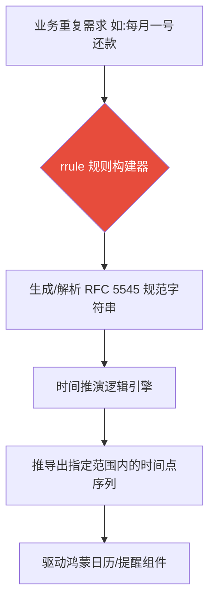

欢迎加入开源鸿蒙跨平台社区：[开源鸿蒙跨平台开发者社区](https://openharmonycrossplatform.csdn.net)

# Flutter for OpenHarmony：Flutter 三方库 rrule — 征服复杂日历重复规则的硬核推演引擎

## 前言

在开发 **Flutter for OpenHarmony** 日历、办公或财务类应用时，处理“重复性事件”是一项极具挑战性的任务。

现实生活中的规则异常繁琐：从简单的“每周四开会”，到复杂的“每个月最后一个工作日发工资”，甚至是“每隔两年的三月第三个星期三提醒”。如果仅靠简单的 `Duration` 累加，你将陷入平年润年、夏令时长短月以及时区跳转的逻辑泥潭，甚至可能导致 OOM（内存溢出）等性能危机。

`rrule` 库完美实现了全球通用的 **RFC 5545 (iCalendar)** 标准规范。它能通过极其简洁的声明式语法，精准推演出未来任何时间点。

今天，我们就来实战这个征服时间序列计算的“超级大脑”。

## 一、原原理性解析 / 概念介绍

### 1.1 基础概念

`rrule` 指的是 Recurrence Rule（重复规则）。它将复杂的重复逻辑抽象为一套标准化字符串。

该库的核心价值在于其高性能的推演算法。它不是通过遍历来查找时间点，而是根据规则直接计算出下一个符合条件的时刻，从而保证了在大范围时间跨度下的计算效率。



### 1.2 进阶概念

- **频率控制（Frequency）**：支持按年、月、周、日、小时甚至秒进行重复。
- **排除规则（Exclusions）**：支持在重复序列中剔除特定日期。
- **计算策略（Evaluation）**：支持无限重复或设定明确的结束边界（截止时间或重复次数）。

## 二、核心 API / 组件详解

### 2.1 规则配置与实例获取

使用 `RecurrenceRule` 对象可以直观地定义逻辑。

```dart
import 'package:rrule/rrule.dart';

void produceAbsolutePreciseAndVeryPowerfulEngine() {
   // 1. 定义规则：每周四重复一次
   final rrule = RecurrenceRule(
       frequency: Frequency.weekly,
       byWeekDays: {ByWeekDayEntry(DateTime.thursday)},
   );
   
   // 2. 从当前时间（必须建议使用 UTC）开始推演接下来的 5 次实例
   final instances = rrule.getInstances(
      start: DateTime.now().toUtc(),
   ).take(5);
   
   print("👑 未来 5 次会议时间序列：\n$instances"); 
}
```

## 三、场景示例

### 3.1 场景一：解析标准 RFC 字符串驱动业务逻辑

在实际工程中，后端通常只下发一条规则字符串。`rrule` 能瞬间将其转化为可计算的对象。

```dart
import 'package:rrule/rrule.dart';

void generateListWithZeroConflictForHarmony() {
   // 场景：每月最后一个星期五
   const rruleString = 'FREQ=MONTHLY;BYDAY=-1FR'; 
   
   final rule = RecurrenceRule.fromString(rruleString);
   
   final nextOccurrences = rule.getInstances(
      start: DateTime.now().toUtc(),
   ).take(3).toList();
   
   print("👑 RFC 规范解析结果：");
   for(var date in nextOccurrences) {
        print("📍 推演实例：$date");
   }
}
```

<!-- IMAGE_PLACEHOLDER: [日历重复规则推演日志展示] -->
<!-- 类型: 截图 -->
<!-- 内容: 展示控制台精准输出的跨月、跨年重复日期节点 -->

## 四、要点讲解 & OpenHarmony 平台适配挑战

### 4.1 UTC 计算与本地显示的转换

⚠️ **`rrule` 的内部计算高度依赖 UTC 时间以确保跨时区的绝对准确。**

在鸿蒙设备上，如果你直接将 UTC 序列展示给用户，会导致严重的时间偏移感。

✅ **适配策略：**
建议在调用 `getInstances(start: ...)` 时始终传入 UTC 化的起始时间。在获取到计算结果序列后，务必通过 `dateTime.toLocal()` 将其转化为鸿蒙系统的当前时区。这样做能确保即便在设备跨越地理时区时，你的日历提醒依然逻辑严密。

## 五、综合实战：重复规则测试中枢

下面演示如何构建一个可视化面板，将复杂的重复描述转化为具体的日期列表。

```dart
import 'package:flutter/material.dart';
import 'package:rrule/rrule.dart';

void main() => runApp(const SecuredSuperSuperProcessRunnerApp());

class SecuredSuperSuperProcessRunnerApp extends StatelessWidget {
  const SecuredSuperSuperProcessRunnerApp({Key? key}) : super(key: key);

  @override
  Widget build(BuildContext context) {
    return MaterialApp(
      theme: ThemeData(primarySwatch: Colors.deepPurple),
      home: const SuperBeautyDirectDBTestScreen(),
    );
  }
}

class SuperBeautyDirectDBTestScreen extends StatefulWidget {
  const SuperBeautyDirectDBTestScreen({Key? key}) : super(key: key);

  @override
  _SuperBeautyDirectDBTestScreenState createState() => _SuperBeautyDirectDBTestScreenState();
}

class _SuperBeautyDirectDBTestScreenState extends State<SuperBeautyDirectDBTestScreen> {
  String _radarLogDisplay = "系统自检就绪...";

  void _triggerSeekAndAcquireValues() {
      // 模拟配置：每个月第一个星期一
      const customRRuleStr = 'FREQ=MONTHLY;BYDAY=1MO'; 
      
      try {
          final rule = RecurrenceRule.fromString(customRRuleStr);
          final instances = rule.getInstances(
             start: DateTime.now().toUtc(),
          ).take(3).toList();
          
          String output = "✅ 已加载 RFC 规范: $customRRuleStr\n";
          output += "🚀 推演未来三次的具体时间(本地化):\n";
          
          for(var dt in instances) {
               final localTime = dt.toLocal();
               output += "📍 ${localTime.toString().substring(0, 10)}\n";
          }
          
          setState(() {
             _radarLogDisplay = output;
          });
      } catch (e) {
          setState(() {
             _radarLogDisplay = "🚨 规则解析异常：$e";
          });
      }
  }

  @override
  Widget build(BuildContext context) {
    return Scaffold(
      appBar: AppBar(title: const Text('复杂重复规则实验室'), backgroundColor: Colors.deepPurple),
      body: SingleChildScrollView(
        padding: const EdgeInsets.symmetric(horizontal: 16, vertical: 24),
        child: Column(
          children: [
            const Text("基于 RFC 5545 标准实现的业务时序计算中台", 
              style: TextStyle(fontWeight: FontWeight.bold, fontSize: 13, color: Colors.blueGrey)),
            const SizedBox(height: 30),
            ElevatedButton.icon(
               style: ElevatedButton.styleFrom(
                 backgroundColor: Colors.deepPurple, 
                 padding: const EdgeInsets.symmetric(horizontal: 30, vertical: 15)
               ),
               icon: const Icon(Icons.date_range), 
               label: const Text('触发规则自动推演'),
               onPressed: _triggerSeekAndAcquireValues,
            ),
            const SizedBox(height: 35),
            Container(
               width: double.infinity,
               padding: const EdgeInsets.all(12),
               decoration: BoxDecoration(
                 color: Colors.black, 
                 borderRadius: BorderRadius.circular(12),
                 border: Border.all(color: Colors.purpleAccent, width: 2)
               ),
               child: SelectableText(
                  _radarLogDisplay, 
                  style: const TextStyle(
                    color: Colors.purpleAccent, 
                    fontSize: 14, 
                    fontFamily: 'monospace', 
                    height: 1.5
                  )
               )
            )
          ],
        ),
      ),
    );
  }
}
```

<!-- IMAGE_PLACEHOLDER: [规则推演最终效果截图] -->
<!-- 类型: 截图 -->
<!-- 内容: 展示应用面板中，输入复杂规则后实时列出的精确本地化日期列表 -->

## 六、总结

在鸿蒙的全场景业务深度探索中，对“秩序”的掌控（如排期与提醒）是应用品质的试金石。通过引入 `rrule` 库，开发者可以从繁重的日历计算逻辑中解脱出来，转而关注业务价值本身。

核心要点回顾：
1. **标准驱动**：完美支持 iCalendar 规范，具备全球通用性。
2. **极速推演**：采用精准算法解决时序预测问题，规避循环陷阱。
3. **架构解耦**：通过字符串交换规则，实现高度的灵活性。
4. **适配要点**：坚持 UTC 计算，结合鸿蒙系统进行本地化呈现。
