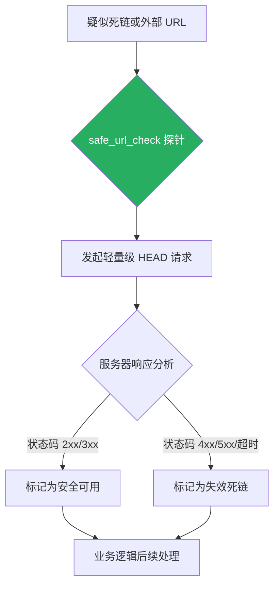

欢迎加入开源鸿蒙跨平台社区：[开源鸿蒙跨平台开发者社区](https://openharmonycrossplatform.csdn.net)

# Flutter for OpenHarmony：Flutter 三方库 safe_url_check — 高效的链接可用性与死链识别引擎

## 前言

在维护 **Flutter for OpenHarmony** 社交、新闻或电商类应用时，用户发布或系统下发的外部链接质量直接影响用户体验。

如果仅依赖 `Uri.tryParse`，我们只能判断字符串是否符合 URL 格式。然而，链接背后的服务器是否宕机、页面是否已 404，或者是否因重定向死循环而失效，仅凭本地格式校验是无法得知的。对于需要展示外部资源预览的应用来说，直接访问这些失效链接极易导致 UI 加载卡死或报错。

`safe_url_check` 提供了一种极轻量化的方式，通过高效的 HTTP 请求验证链接的真实可用性。

今天，我们就来实战如何利用它为鸿蒙应用构建一道“链接安全防火墙”。

## 一、原理解析 / 概念介绍

### 1.1 基础概念

`safe_url_check` 的核心逻辑是主动探测。

它不会像传统的 `http.get` 那样下载整个网页内容（这在移动端极其浪费流量和内存）。相反，它主要利用 HTTP **HEAD** 请求来检索服务器响应头。通过分析状态码（如 200-299 为成功，4xx 或 5xx 为失效），它能以极小的开销判断链接生死。



### 1.2 进阶概念

- **全方位验证（Comprehensive Validation）**：支持对重定向、TLS 握手以及自定义超时时间的深度控制。
- **低能效消耗**：由于不请求 Body 体，它在处理批量列表页中的链接检查时，能显著降低设备的无线电单元能耗。

## 二、核心 API / 组件详解

### 2.1 基础安全校验

库函数 `safeUrlCheck` 是核心入口，它完全基于异步 Future 构建。

```dart
import 'package:safe_url_check/safe_url_check.dart';

void produceAbsolutePreciseAndVeryPowerfulEngine() async {
   // 1. 待验证的目标链接
   final testUrl = 'https://openharmonycrossplatform.csdn.net';
   
   // 2. 执行安全探针，返回布尔值结果
   final bool isSafe = await safeUrlCheck(Uri.parse(testUrl));
   
   print("👑 链接可用性状态：${isSafe ? '安全' : '不可达'}"); 
}
```

## 三、场景示例

### 3.1 场景一：拦截社区推文中的 404 死链

通过预检，我们可以在用户点击前，将已经失效的资源置灰或标记。

```dart
import 'package:safe_url_check/safe_url_check.dart';

void generateListWithZeroConflictForHarmony() async {
   final brokenLink = 'https://example.com/404-page';
   
   final isValid = await safeUrlCheck(Uri.parse(brokenLink));
   
   if (!isValid) {
      print("👑 防守成功：系统检测到目标链接为死链，已自动拦截"); 
   } else {
      print("👑 链接验证通过，可以跳转");
   }
}
```

<!-- IMAGE_PLACEHOLDER: [链接校验日志输出展示] -->
<!-- 类型: 截图 -->
<!-- 内容: 展示控制台在毫秒级时间内对多个域名进行并发探测并返回布尔值的过程 -->

## 四、要点讲解 & OpenHarmony 平台适配挑战

### 4.1 异步网络超时与主线程保护

⚠️ **在鸿蒙系统的弱网环境下，网络探测可能会产生不可预期的延迟。**

虽然 `safe_url_check` 本身是异步的，但过长的等待时间会影响用户点击反馈的及时性。

✅ **适配策略：**
建议在调用时配合 `Future.timeout` 进行二次封装。同时，考虑到鸿蒙系统对进程网络权限的严格管理，如果应用由于隐私权限未获批，探测请求也会失败并返回 false。开发者应在应用初始化时确保 `ohos.permission.INTERNET` 已正确声明并获批。

## 五、综合实战：安全链接检查器面板

下面构建一个完整的交互界面，用户可以输入 URL 并通过探针实时观察验证结果。

```dart
import 'package:flutter/material.dart';
import 'package:safe_url_check/safe_url_check.dart';

void main() => runApp(const SecuredSuperSuperProcessRunnerApp());

class SecuredSuperSuperProcessRunnerApp extends StatelessWidget {
  const SecuredSuperSuperProcessRunnerApp({Key? key}) : super(key: key);

  @override
  Widget build(BuildContext context) {
    return MaterialApp(
      theme: ThemeData(primarySwatch: Colors.teal),
      home: const SuperBeautyDirectDBTestScreen(),
    );
  }
}

class SuperBeautyDirectDBTestScreen extends StatefulWidget {
  const SuperBeautyDirectDBTestScreen({Key? key}) : super(key: key);

  @override
  _SuperBeautyDirectDBTestScreenState createState() => _SuperBeautyDirectDBTestScreenState();
}

class _SuperBeautyDirectDBTestScreenState extends State<SuperBeautyDirectDBTestScreen> {
  String _radarLogDisplay = "守护引擎待命中...";
  final TextEditingController _urlCtrl = TextEditingController(
      text: "https://openharmonycrossplatform.csdn.net"
  );

  void _triggerSeekAndAcquireValues() async {
      setState(() => _radarLogDisplay = "⏳ 正在执行 HTTP HEAD 探测...");
      
      final urlStr = _urlCtrl.text;
      
      try {
          final uri = Uri.parse(urlStr);
          // 💡 执行探针核心
          final isSafe = await safeUrlCheck(uri);
          
          setState(() {
            _radarLogDisplay = isSafe 
                ? "✅ 验证通过：链接活跃且响应正常\n目标：$urlStr"
                : "❌ 验证失败：目标服务器未响应或返回错误状态码";
          });
          
      } catch (e) {
          setState(() {
            _radarLogDisplay = "🚨 异常：输入的 URL 格式可能不合法\n$e";
          });
      }
  }

  @override
  Widget build(BuildContext context) {
    return Scaffold(
      appBar: AppBar(title: const Text('安全链接实验室'), backgroundColor: Colors.teal),
      body: SingleChildScrollView(
        padding: const EdgeInsets.symmetric(horizontal: 16, vertical: 24),
        child: Column(
          children: [
            TextField(
              controller: _urlCtrl,
              decoration: const InputDecoration(
                 labelText: "待检测的外部链接",
                 border: OutlineInputBorder(),
                 prefixIcon: Icon(Icons.link)
              ),
            ),
            const SizedBox(height: 30),
            ElevatedButton.icon(
               style: ElevatedButton.styleFrom(
                 backgroundColor: Colors.teal, 
                 padding: const EdgeInsets.symmetric(horizontal: 30, vertical: 15)
               ),
               icon: const Icon(Icons.verified_user), 
               label: const Text('启动实时探测'),
               onPressed: _triggerSeekAndAcquireValues,
            ),
            const SizedBox(height: 35),
            Container(
               width: double.infinity,
               padding: const EdgeInsets.all(12),
               decoration: BoxDecoration(
                 color: Colors.black, 
                 borderRadius: BorderRadius.circular(12),
                 boxShadow: [BoxShadow(color: Colors.greenAccent.withOpacity(0.2), blurRadius: 10)]
               ),
               child: SelectableText(
                  _radarLogDisplay, 
                  style: const TextStyle(
                    color: Colors.greenAccent, 
                    fontSize: 14, 
                    fontFamily: 'monospace', 
                    height: 1.5
                  )
               )
            )
          ],
        ),
      ),
    );
  }
}
```

<!-- IMAGE_PLACEHOLDER: [链接探针运行态界面截图] -->
<!-- 类型: 截图 -->
<!-- 内容: 展示在鸿蒙设备上，面板成功识别了一个真实有效的链接并给出了绿色反馈 -->

## 六、总结

在信息爆炸的今天，对外部链接的主动管理是构建高品质鸿蒙应用的基础。`safe_url_check` 凭借其极低的系统开销和高效的探针算法，成为了防范死链与诱骗链接的最佳实践。

核心要点回顾：
1. **主动探测**：超越格式化校验，深入验证 HTTP 响应状态。
2. **能效优化**：基于 HEAD 请求设计，节省带宽与电量。
3. **安全拦截**：在用户触达前识别 404 及宕机页面。
4. **适配鸿蒙**：结合权限管理与超时处理，确保护航网络访问体验。
