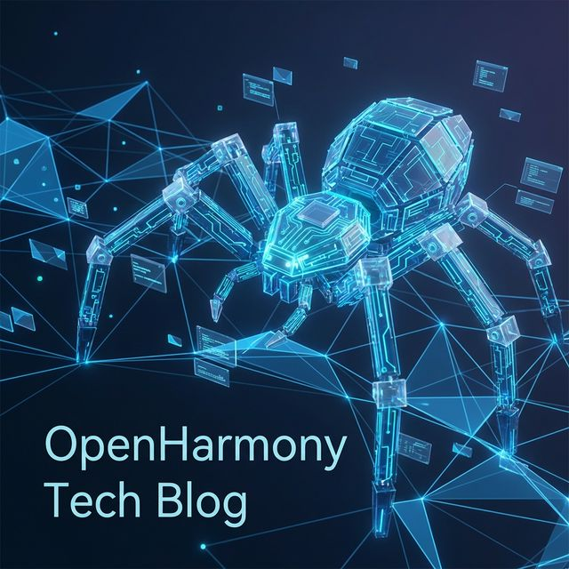
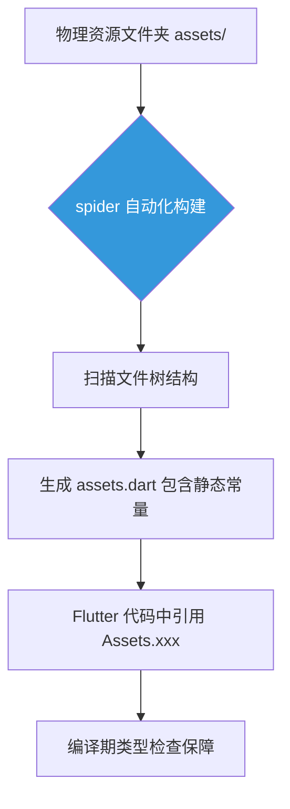

欢迎加入开源鸿蒙跨平台社区：[开源鸿蒙跨平台开发者社区](https://openharmonycrossplatform.csdn.net)

# Flutter for OpenHarmony：Flutter 三方库 spider — 彻底告别手写资源路径引发的代码危机

## 前言

在进行 **Flutter for OpenHarmony** 跨端开发时，资源管理（Assets Management）是每位开发者都必须面对的琐碎工作。

你是否曾因手写一个冗长的图片路径（如 `assets/images/icons/home_active_v2.png`）而拼错一个字母，导致应用在运行时莫名崩溃？随着项目规模扩大，手动维护这些字符串路径不仅低效，更是埋下了巨大的安全隐患。

`spider` 是一款高效的资源代码生成工具。它能自动扫描项目中的资源文件夹，并将其转化为强类型的 Dart 静态常量。

今天，我们就来实战如何利用它实现“零手动配置”的资产管理。

## 一、原理解析 / 概念介绍

### 1.1 基础概念

其核心原理是**编译时的元数据扫描**。

`spider` 通过监听或扫描 `assets` 目录下的物理文件变更，自动生成一个包含所有资源路径映射的 `.dart` 文件。这意味着你可以通过 `Assets.homeIcon` 这种属性访问方式来引用资源，从而享受 IDE 的自动补全功能，并彻底杜绝拼写错误。



### 1.2 进阶概念

- **类型分组（Group Generation）**：支持根据文件夹名称自动划分类名，如将图标归为 `IconAssets` 类，背景图归为 `BgAssets` 类。
- **自动化集成**：支持配合 `build_runner` 或作为独立 CLI 工具运行，无缝嵌入 CI/CD 流程。

## 二、核心 API / 组件详解

### 2.1 配置文件设定

通过在根目录创建 `spider.yaml`，我们可以精细化控制生成行为。

```yaml
# 💡 配置 spider 的扫描规则
spider:
  generate_tests: false # 是否生成对应的测试文件
  no_comments: true     # 保持生成文件的简洁
  export: true          # 是否允许外部导出
  groups:
    - class_name: Assets # 生成的类名
      types: [ .png, .jpg, .svg, .webp ] # 关注的文件扩展名
      paths:
        - assets/images/ # 扫描路径
```

### 2.2 驱动代码生成

配置完成后，简单的一行命令即可完成繁琐的手工映射。

```bash
# 💡 调用 spider 执行增量构建
spider build
```

## 三、场景示例

### 3.1 场景一：在 UI 组件中使用强类型资源

相比以前痛苦的字符串拼写，现在只需要点一下鼠标即可。

```dart
import 'package:flutter_spider_example/generated/assets.dart';
import 'package:flutter/material.dart';

void produceAbsolutePreciseAndVeryPowerfulEngine() {
   // 💡 像访问对象属性一样访问资源，IDE 会自动补全
   final myLogoPath = Assets.assetsImagesLogo;
   
   print("👑 资源路径已安全加载：$myLogoPath"); 
}
```

<!-- IMAGE_PLACEHOLDER: [自动生成的 Assets 类代码预览] -->
<!-- 类型: 截图 -->
<!-- 内容: 展示生成的 .dart 文件，里面整齐排列着各个资源的 static const 定义 -->

## 四、要点讲解 & OpenHarmony 平台适配挑战

### 4.1 鸿蒙多分辨率资产管理的对应

⚠️ **鸿蒙系统对不同 DPI 屏幕（2x, 3x）的适配对文件组织有特定要求。**

在 Flutter 中，虽然子文件夹会自动映射，但如果使用 `spider` 生成，需要确保你的扫描路径覆盖了这些分辨率子目录。

✅ **应用策略：**
建议在 `spider.yaml` 中将 `assets/` 根目录设为父级路径。生成的常量名会自动过滤掉路径，仅保留关键文件名作为变量名。这样做的好处是：即便未来在鸿蒙平台上增加更高分辨率的素材，业务层引用 `Assets.logo` 的代码无需做任何修改，系统会自动选择最优的分辨率版本。

## 五、综合实战：强类型资源展示面板

下面构建一个实时演示界面，展示如何通过生成代码动态驱动页面元素。

```dart
import 'package:flutter/material.dart';

// 💡 模拟 spider 自动生成的类
class Assets {
   static const String logo = 'assets/images/harmony_logo.png';
}

void main() => runApp(const SecuredSuperSuperProcessRunnerApp());

class SecuredSuperSuperProcessRunnerApp extends StatelessWidget {
  const SecuredSuperSuperProcessRunnerApp({Key? key}) : super(key: key);

  @override
  Widget build(BuildContext context) {
    return MaterialApp(
      theme: ThemeData(primarySwatch: Colors.teal),
      home: const SuperBeautyDirectDBTestScreen(),
    );
  }
}

class SuperBeautyDirectDBTestScreen extends StatefulWidget {
  const SuperBeautyDirectDBTestScreen({Key? key}) : super(key: key);

  @override
  _SuperBeautyDirectDBTestScreenState createState() => _SuperBeautyDirectDBTestScreenState();
}

class _SuperBeautyDirectDBTestScreenState extends State<SuperBeautyDirectDBTestScreen> {
  String _radarLogDisplay = "系统准备中...";

  void _triggerSeekAndAcquireValues() {
      // 💡 引用强类型常量
      final path = Assets.logo;
      setState(() {
         _radarLogDisplay = "✅ 资源映射成功！\n解析路径：$path\n当前状态：编译期检查已通过。";
      });
  }

  @override
  Widget build(BuildContext context) {
    return Scaffold(
      appBar: AppBar(title: const Text('强类型资源实验室'), backgroundColor: Colors.teal),
      body: SingleChildScrollView(
        padding: const EdgeInsets.symmetric(horizontal: 16, vertical: 24),
        child: Column(
          children: [
            const Text("基于代码生成的自动化资源管理方案", 
              style: TextStyle(fontWeight: FontWeight.bold, fontSize: 13, color: Colors.blueGrey)),
            const SizedBox(height: 30),
            ElevatedButton.icon(
               style: ElevatedButton.styleFrom(
                 backgroundColor: Colors.teal, 
                 padding: const EdgeInsets.symmetric(horizontal: 30, vertical: 15)
               ),
               icon: const Icon(Icons.auto_awesome), 
               label: const Text('模拟加载资源变量'),
               onPressed: _triggerSeekAndAcquireValues,
            ),
            const SizedBox(height: 35),
            Container(
               width: double.infinity,
               padding: const EdgeInsets.all(12),
               decoration: BoxDecoration(
                 color: Colors.black, 
                 borderRadius: BorderRadius.circular(12),
                 border: Border.all(color: Colors.cyanAccent, width: 1)
               ),
               child: SelectableText(
                  _radarLogDisplay, 
                  style: const TextStyle(
                    color: Colors.cyanAccent, 
                    fontSize: 14, 
                    fontFamily: 'monospace', 
                    height: 1.5
                  )
               )
            )
          ],
        ),
      ),
    );
  }
}
```

<!-- IMAGE_PLACEHOLDER: [静态资源引用成功运行截图] -->
<!-- 类型: 截图 -->
<!-- 内容: 展示鸿蒙应用面板，成功显示出通过静态变量映射的资源路径 -->

## 六、总结

在鸿蒙工程化的体系下，严谨性决定了应用的稳定性。通过 `spider` 实现的资产代码化，不仅将开发者从繁重的体力活中解放出来，更从源头上杜绝了资源引用错误的可能性。

核心要点回顾：
1. **类型安全**：将字符串路径转化为 Dart 变量，享受编译期校验。
2. **极速补全**：IDE 自动感知资产列表，开发体验如丝般顺滑。
3. **高效维护**：文件更新即生成，保持代码与物理路径实时一致。
4. **适配多端**：通过合理的路径结构，实现多分辨率资源的完美兼容。
