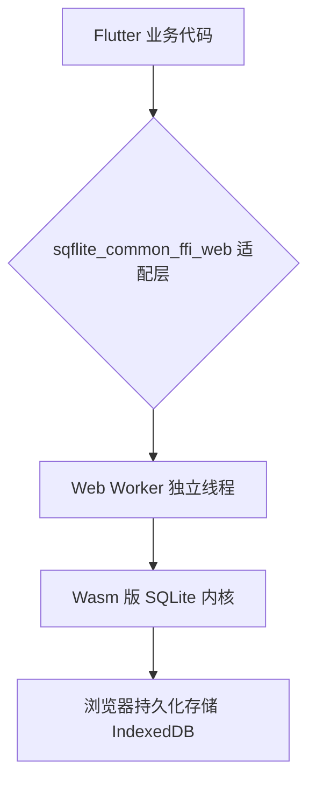

欢迎加入开源鸿蒙跨平台社区：[开源鸿蒙跨平台开发者社区](https://openharmonycrossplatform.csdn.net)

# Flutter for OpenHarmony：Flutter 三方库 sqflite_common_ffi_web — 冲破浏览器沙盒禁锢的 Web 级 SQLite 数据库支持引擎

## 前言

在开发 **Flutter for OpenHarmony** 跨平台应用时，数据持久化是一个绕不开的话题。尤其是在 Web 侧，开发者往往会受限于浏览器的安全沙盒。

传统的 `sqflite` 插件在 Web 端无法直接运行，因为浏览器并没有开放原生的 SQLite 文件读写权限。但现在，有了 `sqflite_common_ffi_web`，我们可以在鸿蒙应用的 Web 侧运行全功能的 SQLite 引擎。它不仅能提供强大的关系型数据存储能力，还能保持与移动端 API 的高度一致。

今天，我们就来深度解析这个“黑科技”库的适配与实战。

## 一、原理解析 / 概念介绍

### 1.1 基础概念

`sqflite_common_ffi_web` 的核心使命是在浏览器环境中通过模拟文件系统来支持 SQLite。它巧妙地利用了 WebAssembly（Wasm）技术，将 SQLite 的 C 语言内核编译为 Wasm 模块。

这样一来，复杂的数据库运算就可以直接在浏览器的高性能运行时中执行，而无需依赖宿主系统的原生驱动。



### 1.2 进阶概念

- **Web FFI 桥接（Web FFI Bridge）**：这是连接 Dart 代码与底层 C 函数的关键。由于浏览器不支持传统的动态库加载，`sqflite_common_ffi_web` 采用了一种特殊的 FFI 实现。
- **IndexedDB 存储后端**：SQLite 需要读写文件，而在 Web 端，实际的数据物理存储是在 IndexedDB 中完成的。这种映射机制确保了数据在页面刷新后依然存在。

## 二、核心 API / 组件详解

### 2.1 数据库工厂初始化

在 Web 环境下使用数据库，第一步是选择正确的数据库工厂（Database Factory）。

```dart
// 必须引入 Web 版专属包
import 'package:sqflite_common_ffi_web/sqflite_ffi_web.dart';
import 'package:sqflite/sqflite.dart';

void produceAbsolutePreciseAndVeryPowerfulEngine() async {
   // 💡 核心：指定使用 Web FFI 工厂
   var factoryToUseObject = databaseFactoryFfiWeb;
   
   // 🎨 像在手机端一样打开数据库，文件名将作为 IndexedDB 的存储标识
   var sysDbResObj = await factoryToUseObject.openDatabase('my_web_harmony_core.db');
   
   print("👑 数据库连接成功！实例对象：$sysDbResObj"); 
}
```

## 三、场景示例

### 3.1 场景一：离线数据缓存与本地设置存储

由于鸿蒙系统支持丰富的 Web 应用场景，利用数据库可以极大提升离线体验。

```dart
import 'package:sqflite_common_ffi_web/sqflite_ffi_web.dart';
import 'package:sqflite/sqflite.dart';

void generateListWithZeroConflictForHarmony() async {
   var coreSysFactory = databaseFactoryFfiWeb;
   var dataBaseInstanceSys = await coreSysFactory.openDatabase('harmony_cache_core.db');
   
   // 1. 创建表结构
   await dataBaseInstanceSys.execute('''
      CREATE TABLE IF NOT EXISTS SettingsLogs (
          id INTEGER PRIMARY KEY,
          keyName TEXT,
          valData TEXT
      )
   ''');
   
   // 2. 插入业务数据
   int idInResultData = await dataBaseInstanceSys.insert('SettingsLogs', {
      'keyName': 'themeSys', 
      'valData': 'darkObj'
   });
   
   print("👑 数据操作成功：插入 ID 为 $idInResultData");
}
```

<!-- IMAGE_PLACEHOLDER: [Web 数据库调试日志展示] -->
<!-- 类型: 截图 -->
<!-- 内容: 展示浏览器控制台输出的数据库操作 Log 和数据表结构预览 -->

## 四、要点讲解 & OpenHarmony 平台适配挑战

### 4.1 异步通信与并发控制

⚠️ **Web Worker 的引入虽然提升了性能，但也带来了通信开销。**

在鸿蒙系统上运行 Web 应用时，由于系统对 CPU 调度的优化，大量并发的数据库读写可能会导致 Worker 线程响应延迟。

✅ **应用策略：** 尽量合并查询操作，避免在循环中频繁开启事务。同时，要在应用退出时妥善关闭数据库句柄，防止 IndexedDB 资源锁定。

## 五、综合实战：数据库交互面板

下面我们构建一个完整的功能演示界面，展示如何在鸿蒙应用中实时读写 Web 数据库。

```dart
import 'package:flutter/material.dart';
import 'package:sqflite_common_ffi_web/sqflite_ffi_web.dart';
import 'package:sqflite/sqflite.dart';

void main() => runApp(const SecuredSuperSuperProcessRunnerApp());

class SecuredSuperSuperProcessRunnerApp extends StatelessWidget {
  const SecuredSuperSuperProcessRunnerApp({Key? key}) : super(key: key);

  @override
  Widget build(BuildContext context) {
    return MaterialApp(
      title: '鸿蒙 Web 数据库演示',
      theme: ThemeData(primarySwatch: Colors.green),
      home: const SuperBeautyDirectDBTestScreen(),
    );
  }
}

class SuperBeautyDirectDBTestScreen extends StatefulWidget {
  const SuperBeautyDirectDBTestScreen({Key? key}) : super(key: key);

  @override
  _SuperBeautyDirectDBTestScreenState createState() => _SuperBeautyDirectDBTestScreenState();
}

class _SuperBeautyDirectDBTestScreenState extends State<SuperBeautyDirectDBTestScreen> {
  String _radarLogDisplay = "系统准备就绪...";

  void _triggerSeekAndAcquireValues() async {
      setState(() => _radarLogDisplay = "⏳ 正在初始化 SQLite 环境...");
      
      try {
          var sysDBCoreFfi = databaseFactoryFfiWeb;
          var sysDbInstanceObj = await sysDBCoreFfi.openDatabase('test_core_sys.db');
          
          // 创建测试数据
          await sysDbInstanceObj.execute('CREATE TABLE IF NOT EXISTS TestLogSys (id INTEGER PRIMARY KEY, info TEXT)');
          await sysDbInstanceObj.insert('TestLogSys', {'info': 'HarmoyOS 系统适配测试：成功'});
          
          List<Map> recordDataSys = await sysDbInstanceObj.query('TestLogSys');
          
          setState(() {
            _radarLogDisplay = "✅ 数据库交互成功：\n${recordDataSys.toString()}";
          });
          
      } catch (e) {
          setState(() {
            _radarLogDisplay = "🚨 发生异常：$e";
          });
      }
  }

  @override
  Widget build(BuildContext context) {
    return Scaffold(
      appBar: AppBar(title: const Text('SQLite Web 实验室'), backgroundColor: Colors.teal),
      body: SingleChildScrollView(
        padding: const EdgeInsets.symmetric(horizontal: 16, vertical: 24),
        child: Column(
          children: [
            const Text("点击下方按钮，开始测试跨平台 SQLite 引擎", 
              style: TextStyle(fontWeight: FontWeight.bold, fontSize: 13, color: Colors.blueGrey)),
            const SizedBox(height: 30),
            ElevatedButton.icon(
               style: ElevatedButton.styleFrom(
                 backgroundColor: Colors.teal, 
                 padding: const EdgeInsets.symmetric(horizontal: 30, vertical: 15)
               ),
               icon: const Icon(Icons.calculate), 
               label: const Text('测试数据库连接'),
               onPressed: _triggerSeekAndAcquireValues,
            ),
            const SizedBox(height: 35),
            Container(
               width: double.infinity,
               padding: const EdgeInsets.all(12),
               decoration: BoxDecoration(
                 color: Colors.black, 
                 borderRadius: BorderRadius.circular(12),
                 boxShadow: [BoxShadow(color: Colors.black26, blurRadius: 10)]
               ),
               child: SelectableText(
                  _radarLogDisplay, 
                  style: const TextStyle(
                    color: Colors.limeAccent, 
                    fontSize: 13, 
                    fontFamily: 'monospace', 
                    height: 1.5
                  )
               )
            )
          ],
        ),
      ),
    );
  }
}
```

<!-- IMAGE_PLACEHOLDER: [鸿蒙设备上的数据库运行效果] -->
<!-- 类型: 截图 -->
<!-- 内容: 展示在鸿蒙系统浏览器中运行该示例的效果，黑色控制台区域正确显示了数据库查询结果 -->

## 六、总结

`sqflite_common_ffi_web` 的出现，彻底解决了 **Flutter for OpenHarmony** 应用在 Web 侧缺乏标准数据库支持的窘境。它凭借 Wasm 技术的高效和 IndexedDB 的持久化能力，为我们打造了完美的离线数据底座。

核心要点回顾：
1. **Wasm 驱动**：让 SQLite 逻辑能在浏览器中高效运行。
2. **工厂注入**：通过 `databaseFactoryFfiWeb` 实现代码跨端复用。
3. **鸿蒙适配**：重视多线程通信开销，优化长列表查询性能。
4. **存储持久性**：底层基于 IndexedDB，数据不丢失。
