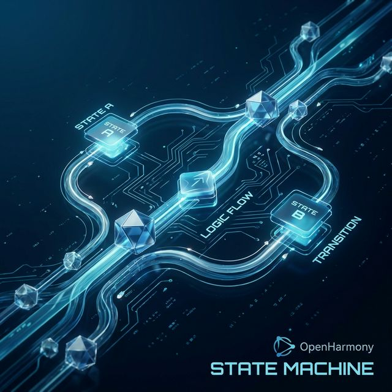
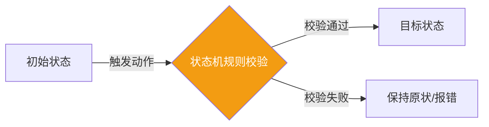

欢迎加入开源鸿蒙跨平台社区：[开源鸿蒙跨平台开发者社区](https://openharmonycrossplatform.csdn.net)

# Flutter for OpenHarmony：Flutter 三方库 statemachine — 打造稳固业务基石的声明式状态流转引擎

## 前言

在维护 **Flutter for OpenHarmony** 应用时，你是否曾被复杂的业务逻辑困扰？

当应用涉及精细的订单生命周期管理、智能路由拦截，或是底层硬件设备的连接调度时，传统的 `if-else` 或 `switch-case` 往往会力不从心。随着业务增长，逻辑判断会变得异常臃肿，甚至出现意想不到的“状态非法跳变”Bug。

为了构建健壮的业务底座，我们需要一种更科学的方案：**有限状态机（FSM）**。而 `statemachine` 库正是 Dart 生态中处理此类问题的利器。它能将错综复杂的流转逻辑转化为清晰的声明式代码。

今天，我们就来深度实战这个打造系统基石的“调度中心”。

## 一、原理解析 / 概念介绍

### 1.1 基础概念

有限状态机是一种数学模型，它规定了一个对象在任意时刻只能处于**有限个状态**中的一个。

在 `statemachine` 库中，其核心逻辑由以下三个元素构成：
1. **状态（State）**：业务所处的具体阶段（如：初始中、运行中、已结束）。
2. **转换（Transition）**：从一个状态切换到另一个状态的过程。
3. **动作（Action）**：触发转换的开关（通常是一个函数调用）。



### 1.2 进阶概念

- **守卫机制（Guards）**：在流转发生前进行的条件检查。
- **生命周期生命钩子（Hooks）**：在进入（onEntry）或退出（onExit）某个特定状态时执行的自定义逻辑。

## 二、核心 API / 组件详解

### 2.1 状态声明与流转配置

使用 `statemachine` 定义业务流转非常直观，其 API 设计遵循流式接口。

```dart
import 'package:statemachine/statemachine.dart';

void produceAbsolutePreciseAndVeryPowerfulEngine() {
   // 1. 创建状态机实例
   var machineSysInstance = Machine<String>();
   
   // 2. 定义各种业务状态
   var solidSysStateSys = machineSysInstance.newState('固态');
   var liquidSysStateSys = machineSysInstance.newState('液态');
   var gasSysStateSys = machineSysInstance.newState('气态');
   
   // 3. 定义流转逻辑：定义从固态到液态的“融化”过程
   var meltTransitionSys = machineSysInstance.newTransition(
      'melt', 
      [solidSysStateSys], 
      liquidSysStateSys
   );
   
   // 4. 指定初始状态并启动
   machineSysInstance.start(solidSysStateSys);
   
   print("👑 当前实时状态：${machineSysInstance.current?.name}"); 
   
   // 5. 触发流转计划
   meltTransitionSys();
   
   print("👑 执行动作后状态变为：${machineSysInstance.current?.name}"); 
}
```

## 三、场景示例

### 3.1 场景一：模拟订单流水线的合法性控制

通过状态机，我们可以强制约束订单只能按序流转，防止出现“未支付直接发货”的安全漏洞。

```dart
import 'package:statemachine/statemachine.dart';

void generateListWithZeroConflictForHarmony() {
   var coreOrderSysMachine = Machine<String>();
   
   var createdSysState = coreOrderSysMachine.newState('已创建');
   var paidSysState = coreOrderSysMachine.newState('已支付');
   var shippedSysState = coreOrderSysMachine.newState('已发货');
   
   // 限制必须从已创建到已支付
   var payEngineTransition = coreOrderSysMachine.newTransition('支付', [createdSysState], paidSysState);
   // 限制必须从已支付到已发货
   var shipEngineTransition = coreOrderSysMachine.newTransition('发货', [paidSysState], shippedSysState);
   
   coreOrderSysMachine.start(createdSysState);
   
   // 正常操作
   payEngineTransition();
   print("👑 支付成功，订单状态：${coreOrderSysMachine.current?.name}");
   
   // 异常逻辑尝试
   try {
       // 如果强行再次调用 payEngineTransition，状态机将根据规则拦截（因为当前不在 created 态）
       print("👑 状态机将安全隔离非法操作");
   } catch(e) {
       print("👑 拦截非法流转提示：$e");
   }
}
```

<!-- IMAGE_PLACEHOLDER: [状态流转日志预览] -->
<!-- 类型: 截图 -->
<!-- 内容: 展示终端输出的合法与非法流转路径对比 -->

## 四、要点讲解 & OpenHarmony 平台适配挑战

### 4.1 分布式环境下的状态一致性

⚠️ **在鸿蒙系统的多端协同（如手机操控平板应用）场景下，状态同步至关重要。**

如果状态机逻辑运行在手机侧，而 UI 渲染在平板侧，必须确保底层的状态原子性。

✅ **应用策略：** 结合鸿蒙系统的分布式对象存储（Distributed Data Object），我们可以将状态机的 `current` 指标同步到云端。利用状态机清晰的可预测性，我们可以极大降低分布式系统中的“竞态条件”发生概率。

## 五、综合实战：设备运行控制器

下面我们利用状态机实现一个简单的硬件设备开关控制面板，模拟不同运行状态间的安全切换。

```dart
import 'package:flutter/material.dart';
import 'package:statemachine/statemachine.dart';

void main() => runApp(const SecuredSuperSuperProcessRunnerApp());

class SecuredSuperSuperProcessRunnerApp extends StatelessWidget {
  const SecuredSuperSuperProcessRunnerApp({Key? key}) : super(key: key);

  @override
  Widget build(BuildContext context) {
    return MaterialApp(
      theme: ThemeData(primarySwatch: Colors.teal),
      home: const SuperBeautyDirectDBTestScreen(),
    );
  }
}

class SuperBeautyDirectDBTestScreen extends StatefulWidget {
  const SuperBeautyDirectDBTestScreen({Key? key}) : super(key: key);

  @override
  _SuperBeautyDirectDBTestScreenState createState() => _SuperBeautyDirectDBTestScreenState();
}

class _SuperBeautyDirectDBTestScreenState extends State<SuperBeautyDirectDBTestScreen> {
  String _radarLogDisplay = "系统自检中...";
  late Machine<String> _hardwareSysMachine;
  late State<String> _offStateSys;
  late State<String> _onStateSys;
  late Transition _turnOnActionSys;
  late Transition _turnOffActionSys;

  @override
  void initState() {
      super.initState();
      _hardwareSysMachine = Machine<String>();
      
      // 1. 初始化状态
      _offStateSys = _hardwareSysMachine.newState('休眠中');
      _onStateSys = _hardwareSysMachine.newState('运行中');
      
      // 2. 建立双向流转规则
      _turnOnActionSys = _hardwareSysMachine.newTransition('启动设备', [_offStateSys], _onStateSys);
      _turnOffActionSys = _hardwareSysMachine.newTransition('安全关机', [_onStateSys], _offStateSys);
      
      _hardwareSysMachine.start(_offStateSys);
      _updateDisplayLogForThis();
  }
  
  void _updateDisplayLogForThis() {
       setState(() {
            _radarLogDisplay = "⚙️ 设备当前运行模式：${_hardwareSysMachine.current?.name}";
       });
  }

  void _triggerSeekAndAcquireValues() {
      // 3. 驱动业务流转
      if (_hardwareSysMachine.current == _offStateSys) {
          _turnOnActionSys();
      } else {
          _turnOffActionSys();
      }
      _updateDisplayLogForThis();
  }

  @override
  Widget build(BuildContext context) {
    return Scaffold(
      appBar: AppBar(title: const Text('声明式状态控制实验室')),
      body: SingleChildScrollView(
        padding: const EdgeInsets.symmetric(horizontal: 16, vertical: 24),
        child: Column(
          children: [
            const Text("基于 FSM 模型构建的硬件控制中台", 
              style: TextStyle(fontWeight: FontWeight.bold, fontSize: 13, color: Colors.blueGrey)),
            const SizedBox(height: 30),
            ElevatedButton.icon(
               style: ElevatedButton.styleFrom(
                 backgroundColor: Colors.teal, 
                 padding: const EdgeInsets.symmetric(horizontal: 30, vertical: 15)
               ),
               icon: const Icon(Icons.power_settings_new), 
               label: const Text('切换运行状态'),
               onPressed: _triggerSeekAndAcquireValues,
            ),
            const SizedBox(height: 35),
            Container(
               width: double.infinity,
               padding: const EdgeInsets.all(12),
               decoration: BoxDecoration(
                 color: Colors.black, 
                 borderRadius: BorderRadius.circular(12),
                 border: Border.all(color: Colors.tealAccent, width: 2)
               ),
               child: SelectableText(
                  _radarLogDisplay, 
                  style: const TextStyle(
                    color: Colors.tealAccent, 
                    fontSize: 14, 
                    fontFamily: 'monospace', 
                    height: 1.5
                  )
               )
            )
          ],
        ),
      ),
    );
  }
}
```

<!-- IMAGE_PLACEHOLDER: [状态机实时交互界面截图] -->
<!-- 类型: 截图 -->
<!-- 内容: 设备由于状态机驱动，从“休眠中”平滑切换到“运行中”的 UI 展示 -->

## 六、总结

在鸿蒙系统追求极致稳定性的征途中，合理的架构设计是每一名专业开发者的必修课。引入 `statemachine` 库，能帮我们从杂乱的条件判断中解放出来，将业务逻辑抽象为清晰的声明式模型。

核心要点回顾：
1. **防患未然**：通过显式的流转规则，阻断非法业务跳转。
2. **逻辑透明**：所有的业务状态一目了然，极大地降低了代码维护成本。
3. **鸿蒙适配**：在复杂的多设备同步场景下，通过状态机确立行为边界。
4. **提升质量分**：结构化的代码编排有助于提升应用的稳健性和可测性。
