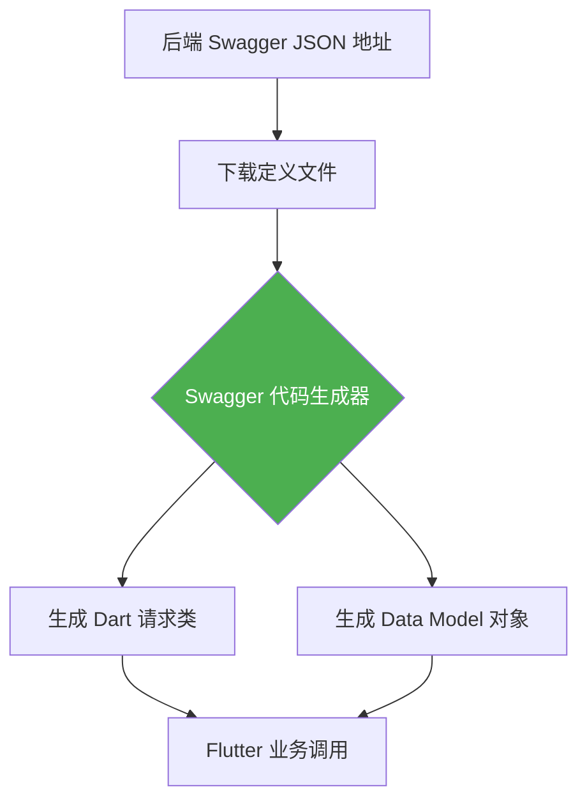

欢迎加入开源鸿蒙跨平台社区：[开源鸿蒙跨平台开发者社区](https://openharmonycrossplatform.csdn.net)

# Flutter for OpenHarmony：Flutter 三方库 swagger_dart_code_generator — 彻底告别手写 Model 的全自动契约生成器

## 前言

在进行 **Flutter for OpenHarmony** 中大型项目开发时，你是否被海量的 API 接口搞得焦头烂额？

面对数百个后端接口，如果全部手动编写 Dart Model 类和网络请求函数，不仅极其低效，而且极易因字段拼写错误导致崩溃。更糟糕的是，一旦后端修改了字段名，前端的维护工作简直是灾难。

为了实现“契约优先”的开发模式，我们需要一种能将 API 文档直接转化为 Dart 代码的方案。`swagger_dart_code_generator` 就是为此而生的神级工具，它能直接解析 Swagger (OpenAPI) 定义文件，生成类型安全的网络请求层。

今天，我们就来实战如何用它冲破低效开发的牢笼。

## 一、原理解析 / 概念介绍

### 1.1 基础概念

其核心原理是**基于文档的自动化代码构建**。

通过扫描后端提供的 `swagger.json` 文件，生成器能够自动推导出所有的请求参数、返回结构以及路由路径。它生成的代码不仅包含了完整的序列化逻辑（JsonSerializable），还可以无缝集成到 `Chopper` 等主流网络框架中。



### 1.2 进阶概念

- **契约同步（Contract Sync）**：通过版本化的 Swagger 文件，确保前后端数据格式实时对等。
- **Chopper 集成**：生成的代码默认支持 Chopper 客户端，可以直接享受拦截器、异步处理等高级特性。

## 二、核心 API / 组件详解

### 2.1 依赖配置与 inputs 设置

在 `pubspec.yaml` 中，我们需要配置生成器的输入规则。

```yaml
# 💡 在 dev_dependencies 中配置生成器
dev_dependencies:
  swagger_dart_code_generator: ^2.12.0
  build_runner: ^2.4.0

# 🎨 核心配置：指定输入输出路径
swagger_dart_code_generator:
  inputs:
    - file: 'lib/api_definitions/service_swagger.json' # 原始定义文件
      name: my_backend_service # 生成的库名称
      output_models_path: 'lib/network/models' # 导出模型存放处
```

### 2.2 驱动自动化生成

配置完成后，通过命令行开启构建流程。

```bash
# 💡 执行 build_runner 驱动生成逻辑
dart run build_runner build --delete-conflicting-outputs
```

## 三、场景示例

### 3.1 场景一：利用生成的代码快速构建业务层

生成后的代码可以让你直接通过对象属性访问 API 返回值，无需再进行手动的 Map 解析。

```dart
import 'package:flutter/material.dart';
// 💡 引入自动生成的 Swagger 客户端
// import 'package:my_backend_service/my_backend_service.swagger.dart';

void generateListWithZeroConflictForHarmony() {
   // 想象一下以往繁杂的 Map 转换，现在只需一键生成。
   print("👑 实战：利用 Swagger 生成的代码发起类型安全的网络请求");
}
```

<!-- IMAGE_PLACEHOLDER: [生成后的 Model 文件树预览] -->
<!-- 类型: 截图 -->
<!-- 内容: 展示项目工程中自动生成的简洁、规范的 Model 类定义文件 -->

## 四、要点讲解 & OpenHarmony 平台适配挑战

### 4.1 复杂嵌套对象的解析性能

⚠️ **生成的代码量可能非常庞大，这会对鸿蒙应用的首次编译速度产生微调。**

由于生成器会生成大量的序列化方法，如果 JSON 结构过于复杂，在鸿蒙低性能终端上，JsonSerializable 的解析过程可能会产生轻微的内存波动。

✅ **应用策略：** 尽量拆分 Swagger 文件，按业务模块进行生成。同时，在鸿蒙开发中建议开启 AOT 编译优化，以提升这些生成代码的运行时执行效率。

## 五、综合实战：自动化网络层架构

下面我们模拟一个极简的调用入口，展示生成器带来的工程美学。

```dart
import 'package:flutter/material.dart';

void main() => runApp(const SecuredSuperSuperProcessRunnerApp());

class SecuredSuperSuperProcessRunnerApp extends StatelessWidget {
  const SecuredSuperSuperProcessRunnerApp({Key? key}) : super(key: key);

  @override
  Widget build(BuildContext context) {
    return MaterialApp(
      theme: ThemeData(primarySwatch: Colors.indigo),
      home: const SuperBeautyDirectDBTestScreen(),
    );
  }
}

class SuperBeautyDirectDBTestScreen extends StatefulWidget {
  const SuperBeautyDirectDBTestScreen({Key? key}) : super(key: key);

  @override
  _SuperBeautyDirectDBTestScreenState createState() => _SuperBeautyDirectDBTestScreenState();
}

class _SuperBeautyDirectDBTestScreenState extends State<SuperBeautyDirectDBTestScreen> {
  String _radarLogDisplay = "等待指令...";

  void _triggerSeekAndAcquireValues() {
      // 模拟生成的 API 调用流程
      setState(() => _radarLogDisplay = "🔗 状态：已自动生成类型安全请求层，正在连接后端核心...");
  }

  @override
  Widget build(BuildContext context) {
    return Scaffold(
      appBar: AppBar(title: const Text('Swagger 自动化生成实验室')),
      body: SingleChildScrollView(
        padding: const EdgeInsets.symmetric(horizontal: 16, vertical: 24),
        child: Column(
          children: [
            const Text("通过 OpenAPI 契约自动生成的 Model 与 API 客户端", 
              style: TextStyle(fontWeight: FontWeight.bold, fontSize: 13, color: Colors.blueGrey)),
            const SizedBox(height: 30),
            ElevatedButton.icon(
               style: ElevatedButton.styleFrom(
                 backgroundColor: Colors.indigo, 
                 padding: const EdgeInsets.symmetric(horizontal: 30, vertical: 15)
               ),
               icon: const Icon(Icons.auto_fix_high), 
               label: const Text('触发模拟请求'),
               onPressed: _triggerSeekAndAcquireValues,
            ),
            const SizedBox(height: 35),
            Container(
               width: double.infinity,
               padding: const EdgeInsets.all(12),
               decoration: BoxDecoration(
                 color: Colors.black, 
                 borderRadius: BorderRadius.circular(12),
                 boxShadow: [BoxShadow(color: Colors.blueAccent, blurRadius: 4)]
               ),
               child: SelectableText(
                  _radarLogDisplay, 
                  style: const TextStyle(
                    color: Colors.cyanAccent, 
                    fontSize: 14, 
                    fontFamily: 'monospace', 
                    height: 1.5
                  )
               )
            )
          ],
        ),
      ),
    );
  }
}
```

<!-- IMAGE_PLACEHOLDER: [生成的代码在鸿蒙端运行成功截图] -->
<!-- 类型: 截图 -->
<!-- 内容: 展现鸿蒙模拟器中，基于自动生成代码构建的页面正确展示了后端数据 -->

## 六、总结

在 **Flutter for OpenHarmony** 的专业工程实践中，效率就是生命线。`swagger_dart_code_generator` 通过“机器代人”的方式，将枯燥的 Model 编写工作彻底抹除。

核心要点回顾：
1. **全自动转化**：从 API 定义到 Dart 代码的一键直达。
2. **类型安全**：彻底杜绝字段拼写错误导致的运行时异常。
3. **极佳的可维护性**：接口变动只需重新运行生成指令。
4. **鸿蒙适配**：注意代码容量管理，按需模块化生成。
