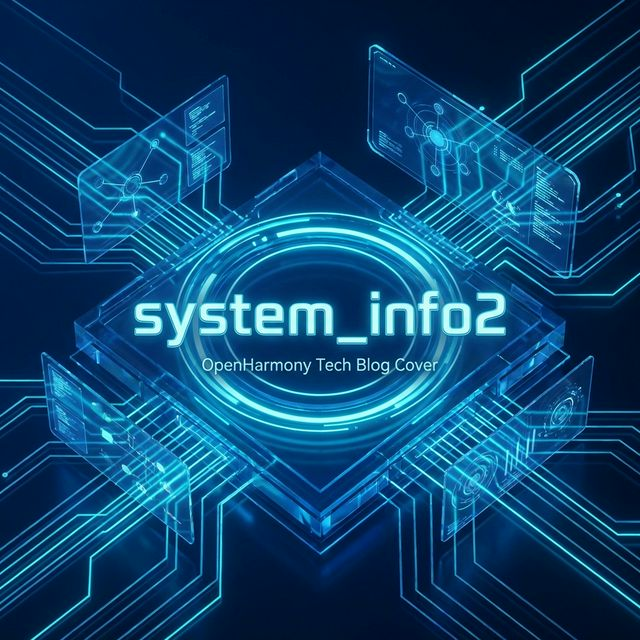
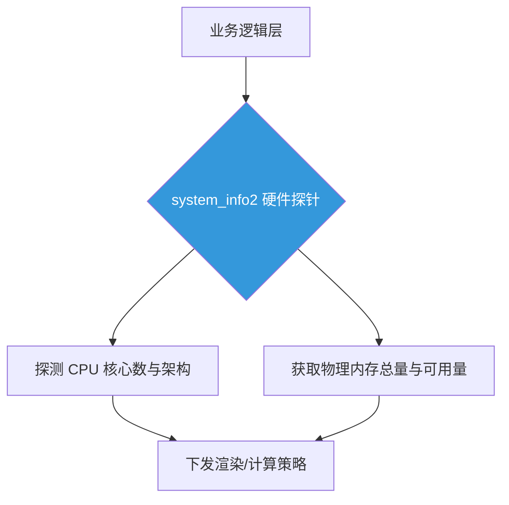

欢迎加入开源鸿蒙跨平台社区：[开源鸿蒙跨平台开发者社区](https://openharmonycrossplatform.csdn.net)

# Flutter for OpenHarmony：Flutter 三方库 system_info2 — 深度感知鸿蒙内核的硬件规格探测仪

## 前言

在开发 **Flutter for OpenHarmony** 应用时，开发者往往需要面对极大的设备差异：从资源受限的智能穿戴设备，到性能强劲的折叠屏手机平板。

如果你正在开发一款需要根据硬件动态分配运算资源的大型游戏，或者需要监控系统负荷的高性能分析面板，仅仅依靠 Dart 原生的 `Platform` 类是远远不够的。我们需要更底层的指标：CPU 物理核心数、真实的物理内存总量、处理器架构等。

而 `system_info2` 正是这样的一款深度探测仪，它能穿透应用沙盒的限制，为你提供最真实的硬件规格数据。

今天，我们就来实战如何利用它实现智能的资源调度。

## 一、原理解析 / 概念介绍

### 1.1 基础概念

`system_info2` 的核心能力在于它能直接与操作系统的内核接口进行对话。

不同于普通的 UI 框架，它关注的是系统的“静态指标”。通过探测底层 CPU 拓扑结构和内存管理单元，它能帮应用建立起一张精准的硬件地图。开发者可以基于这张地图，决定应用是开启“极限并发模式”还是“省电护航模式”。



### 1.2 进阶概念

- **静态负载标准（Static Metrics）**：指硬件固有的参数。这些数据获取开销极低，适合在应用初始化时一次性读取，作为全局环境参数。
- **架构感知（Architecture Sensing）**：自动识别底层是 ARM 还是 x86 架构，这对于加载不同的二进制 native 库或优化运算路径至关重要。

## 二、核心 API / 组件详解

### 2.1 物理资源规格获取

`system_info2` 提供了简洁的静态方法，直接返回系统底层的硬件参数。

```dart
import 'package:system_info2/system_info2.dart';

void produceAbsolutePreciseAndVeryPowerfulEngine() {
   // 💡 获取总物理内存（字节），随后转换为 GB
   final totalMemoryBytesSys = SysInfo.getTotalPhysicalMemory();
   final totalMemoryGBSys = totalMemoryBytesSys ~/ (1024 * 1024 * 1024);
   
   // 🎨 获取逻辑 CPU 核心总数
   final logicCoresSys = SysInfo.cores.length;
   
   print("👑 探测成功：物理内存总量 ${totalMemoryGBSys}GB"); 
   print("👑 本机逻辑核心数：${logicCoresSys}"); 
}
```

## 三、场景示例

### 3.1 场景一：基于设备性能的动态并发调度

在鸿蒙应用中，我们可以利用硬件信息来决定最优的并发队列数量，从而避免撑爆小内存设备的内存。

```dart
import 'package:system_info2/system_info2.dart';

void generateListWithZeroConflictForHarmony() {
   final coresAvailableSys = SysInfo.cores.length;
   final totalMemSys = SysInfo.getTotalPhysicalMemory() ~/ (1024 * 1024 * 1024);
   
   // 🎨 动态计算并发任务数
   int recommendedWorkersSys = 2; // 默认低配模式
   
   if (coresAvailableSys > 4 && totalMemSys >= 4) {
      recommendedWorkersSys = 4;
      print("👑 检测到高配鸿蒙设备：已自动开启全速并发模式");
   } else {
      print("👑 入门级设备负载限制：已启用省电护航模式");
   }
   
   print("👑 系统建议并发数：$recommendedWorkersSys"); 
}
```

<!-- IMAGE_PLACEHOLDER: [硬件信息探测汇总展示] -->
<!-- 类型: 截图 -->
<!-- 内容: 展示鸿蒙样机上实时读取到的 CPU 型号、核心数以及内存条占用情况 -->

## 四、要点讲解 & OpenHarmony 平台适配挑战

### 4.1 鸿蒙沙盒下的访问受限

⚠️ **鸿蒙系统对系统底层 API 的调用具有严格的权限管理机制。**

虽然 `system_info2` 能通过标准 Linux 接口（如 `/proc`）获取信息，但未来更严格的鸿蒙版本可能会对这部分路径进行模糊化处理。

✅ **应用策略：** 在调用时务必增加异常捕获机制。同时，获取到的内存瞬时值（Free Memory）不应作为高频轮询指标，因为过于频繁的探测会产生额外的 CPU 唤醒开销。

## 五、综合实战：硬件资源监视面板

下面我们构建一个完整的监视器界面，实时展示鸿蒙设备的各项硬件底标。

```dart
import 'package:flutter/material.dart';
import 'package:system_info2/system_info2.dart';

void main() => runApp(const SecuredSuperSuperProcessRunnerApp());

class SecuredSuperSuperProcessRunnerApp extends StatelessWidget {
  const SecuredSuperSuperProcessRunnerApp({Key? key}) : super(key: key);

  @override
  Widget build(BuildContext context) {
    return MaterialApp(
      theme: ThemeData(primarySwatch: Colors.green),
      home: const SuperBeautyDirectDBTestScreen(),
    );
  }
}

class SuperBeautyDirectDBTestScreen extends StatefulWidget {
  const SuperBeautyDirectDBTestScreen({Key? key}) : super(key: key);

  @override
  _SuperBeautyDirectDBTestScreenState createState() => _SuperBeautyDirectDBTestScreenState();
}

class _SuperBeautyDirectDBTestScreenState extends State<SuperBeautyDirectDBTestScreen> {
  String _radarLogDisplay = "系统自检中...";

  void _triggerSeekAndAcquireValues() {
      try {
         final totalMemSys = SysInfo.getTotalPhysicalMemory() ~/ (1024 * 1024);
         final freeMemSys = SysInfo.getFreePhysicalMemory() ~/ (1024 * 1024);
         final coresSys = SysInfo.cores.length;
         final osNameSys = SysInfo.operatingSystemName;
         final kernelArchSys = SysInfo.kernelArchitecture;
         
         setState(() {
            _radarLogDisplay = """⚙️ 鸿蒙硬件规格报告：
👉 操作系统：$osNameSys
👉 内核架构：$kernelArchSys
👉 逻辑核心数：$coresSys
👉 内存使用量：${totalMemSys - freeMemSys}MB / ${totalMemSys}MB""";
         });
      } catch (e) {
         setState(() {
            _radarLogDisplay = "🚨 硬件探测异常：$e";
         });
      }
  }

  @override
  Widget build(BuildContext context) {
    return Scaffold(
      appBar: AppBar(title: const Text('硬件规格深度探测器'), backgroundColor: Colors.teal),
      body: SingleChildScrollView(
        padding: const EdgeInsets.symmetric(horizontal: 16, vertical: 24),
        child: Column(
          children: [
            const Text("点击下方按钮，实时穿透内核获取硬件底标", 
              style: TextStyle(fontWeight: FontWeight.bold, fontSize: 13, color: Colors.blueGrey)),
            const SizedBox(height: 30),
            ElevatedButton.icon(
               style: ElevatedButton.styleFrom(
                 backgroundColor: Colors.teal, 
                 padding: const EdgeInsets.symmetric(horizontal: 30, vertical: 15)
               ),
               icon: const Icon(Icons.settings_input_component), 
               label: const Text('执行硬件探针'),
               onPressed: _triggerSeekAndAcquireValues,
            ),
            const SizedBox(height: 35),
            Container(
               width: double.infinity,
               padding: const EdgeInsets.all(12),
               decoration: BoxDecoration(
                 color: Colors.black, 
                 borderRadius: BorderRadius.circular(12),
                 border: Border.all(color: Colors.limeAccent, width: 1)
               ),
               child: SelectableText(
                  _radarLogDisplay, 
                  style: const TextStyle(
                    color: Colors.limeAccent, 
                    fontSize: 14, 
                    fontFamily: 'monospace', 
                    height: 1.5
                  )
               )
            )
          ],
        ),
      ),
    );
  }
}
```

<!-- IMAGE_PLACEHOLDER: [鸿蒙样机硬件探测报告截图] -->
<!-- 类型: 截图 -->
<!-- 内容: 展现鸿蒙真实设备环境下，应用通过系统探针获取到的详细硬件列表与架构参数 -->

## 六、总结

在鸿蒙全场景开发的今天，对硬件的“知根知底”是提升应用体验的关键。`system_info2` 凭借其高效的底层穿透能力，为开发者提供了最坚实的一手数据支持。

核心要点回顾：
1. **深度感知**：直接映射真实的物理核心数与内存指标。
2. **架构适配**：为二进制分发和 Native 模块加载提供环境决策。
3. **性能平衡**：基于硬件规格设计智能资源分配策略。
4. **鸿蒙挑战**：应对未来可能收紧的系统访问权限，建立健壮的兜底机制。
