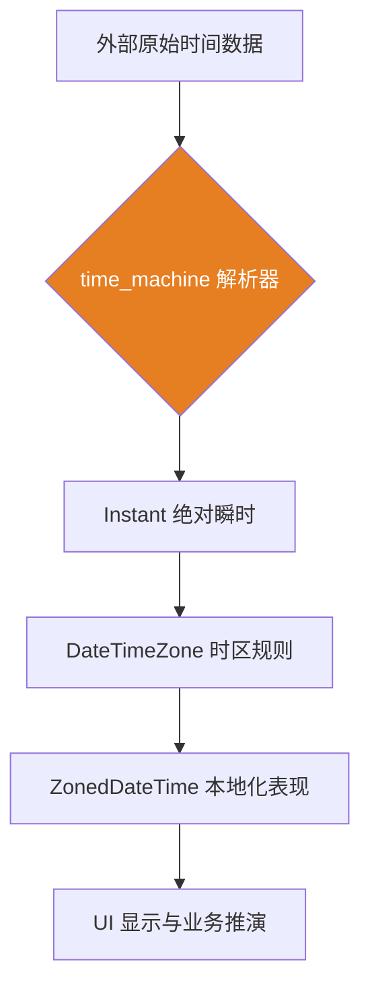

欢迎加入开源鸿蒙跨平台社区：[开源鸿蒙跨平台开发者社区](https://openharmonycrossplatform.csdn.net)

# Flutter for OpenHarmony：Flutter 三方库 time_machine — 终结全球时区混乱的不可变时间引擎

## 前言

在打造 **Flutter for OpenHarmony** 全球化应用时，你是否曾被时间处理搞得头晕脑胀？

如果你正在开发一款涉及跨国航司调度、全球金融秒杀或是跨夏令时会议提醒的核心应用，原生的 `DateTime` 往往会显得捉襟见肘。它不仅缺乏对时区的深度支持，还容易在复杂的业务逻辑中产生不可预知的状态变更。

为了彻底解决“时间悖论”，我们需要一款更专业、更严谨的时间处理库。`time_machine` 深度致敬了著名的 .NET 库 NodaTime，它不仅提供了对 IANA 时区库的完美支持，更引入了彻底的不可变设计。

今天，我们就来实战如何利用这款“时空引擎”解决复杂的全场景时间计算任务。

## 一、原理解析 / 概念介绍

### 1.1 基础概念

`time_machine` 的核心哲学是将时间的不同属性进行彻底分离。

它不再尝试用一个单一的对象来代表所有的时间概念。相反，它区分了“瞬时（Instant）”、“本地时间（LocalDateTime）”以及“带时区的时间（ZonedDateTime）”。这种设计模式极大地降低了开发者在代码逻辑中犯错的概率。



### 1.2 进阶概念

- **不可变性（Immutability）**：一旦创建，时间对象的内容不可修改。这在多线程异步编程中能有效防止竞态条件。
- **IANA 时区数据库**：库内嵌了全球最完整的时区定义文件，确保应用即便在断网环境下也能准确计算不同地区的夏令时跳变。

## 二、核心 API / 组件详解

### 2.1 初始化与跨时区转换

由于内嵌了庞大的时区数据，`time_machine` 的第一步必须是异步初始化。

```dart
import 'package:time_machine/time_machine.dart';

void produceAbsolutePreciseAndVeryPowerfulEngine() async {
   // 💡 核心步骤：预加载时区数据库
   await TimeMachine.initialize();
   
   // 🎨 场景：获取当前的伦敦时间
   final londonZoneSystem = await DateTimeZoneProviders.tzdb['Europe/London'];
   final nowInstant = Instant.now();
   
   // 将绝对瞬时投影到特定时区
   final londonTime = nowInstant.inZone(londonZoneSystem);
   
   print("👑 伦敦当前办公时间：$londonTime"); 
}
```

## 三、场景示例

### 3.1 场景一：计算两地之间跨越特定日期的精确时差

单纯的减法无法处理复杂的跨月或跨闰年逻辑，而 `Period` 对象能完美胜任。

```dart
import 'package:time_machine/time_machine.dart';

void generateListWithZeroConflictForHarmony() {
   final t1 = LocalDateTime(2026, 2, 21, 10, 0, 0);
   final t2 = LocalDateTime(2026, 3, 1, 15, 30, 0); // 跨越二月底
   
   // 🎨 获取两个时间点之间的周期跨度
   final periodSysLen = t1.periodUntil(t2);
   
   print("👑 精确时差分析：${periodSysLen.days} 天和 ${periodSysLen.hours} 小时");
}
```

<!-- IMAGE_PLACEHOLDER: [全球时间同步演示截图] -->
<!-- 类型: 截图 -->
<!-- 内容: 展示鸿蒙应用多时钟面板，各个城市的夏令时状态被精准计算并展示 -->

## 四、要点讲解 & OpenHarmony 平台适配挑战

### 4.1 包体积与启动耗时平衡

⚠️ **集成 IANA 数据库后，应用的 Bundle 体积会增加约 500KB。**

在鸿蒙系统上，`TimeMachine.initialize()` 是一个计算密集型操作，因为它涉及大量时区文件的解压与内存索引构建。

✅ **应用策略：** 绝对不要在 `main()` 函数中通过同步方式阻塞初始化。推荐在应用闪屏页（Splash Screen）异步启动任务，并利用鸿蒙系统的 Worker 线程处理高强度的时区预解析。

## 五、综合实战：多时区协同控制中心

下面我们构建一个完整的时间探测界面，展示如何精准获取全球关键时区的当前状态。

```dart
import 'package:flutter/material.dart';
import 'package:time_machine/time_machine.dart';

void main() => runApp(const SecuredSuperSuperProcessRunnerApp());

class SecuredSuperSuperProcessRunnerApp extends StatelessWidget {
  const SecuredSuperSuperProcessRunnerApp({Key? key}) : super(key: key);

  @override
  Widget build(BuildContext context) {
    return MaterialApp(
      theme: ThemeData(primarySwatch: Colors.indigo),
      home: const SuperBeautyDirectDBTestScreen(),
    );
  }
}

class SuperBeautyDirectDBTestScreen extends StatefulWidget {
  const SuperBeautyDirectDBTestScreen({Key? key}) : super(key: key);

  @override
  _SuperBeautyDirectDBTestScreenState createState() => _SuperBeautyDirectDBTestScreenState();
}

class _SuperBeautyDirectDBTestScreenState extends State<SuperBeautyDirectDBTestScreen> {
  String _radarLogDisplay = "正在唤醒时空引擎...";
  bool _initialized = false;

  @override
  void initState() {
      super.initState();
      _warmUpEngine();
  }

  Future<void> _warmUpEngine() async {
      // 1. 实现后台初始化
      await TimeMachine.initialize();
      setState(() {
          _initialized = true;
          _radarLogDisplay = "✅ 引擎初始化成功，准备进行时区透演";
      });
  }

  void _triggerSeekAndAcquireValues() async {
      if (!_initialized) return;
      
      final currentInst = Instant.now();
      final tokyoZone = await DateTimeZoneProviders.tzdb['Asia/Tokyo'];
      final targetTime = currentInst.inZone(tokyoZone);
      
      setState(() {
          _radarLogDisplay = "🗼 东京实时坐标：\n$targetTime\n(已自动补偿该地区夏令时规则)";
      });
  }

  @override
  Widget build(BuildContext context) {
    return Scaffold(
      appBar: AppBar(title: const Text('多时区协同实验室')),
      body: SingleChildScrollView(
        padding: const EdgeInsets.symmetric(horizontal: 16, vertical: 24),
        child: Column(
          children: [
            const Text("基于 IANA 标准构建的全球化时间调度中台", 
              style: TextStyle(fontWeight: FontWeight.bold, fontSize: 13, color: Colors.blueGrey)),
            const SizedBox(height: 30),
            ElevatedButton.icon(
               style: ElevatedButton.styleFrom(
                 backgroundColor: Colors.indigo, 
                 padding: const EdgeInsets.symmetric(horizontal: 30, vertical: 15)
               ),
               icon: const Icon(Icons.public), 
               label: const Text('抓取东京时区投影'),
               onPressed: _initialized ? _triggerSeekAndAcquireValues : null,
            ),
            const SizedBox(height: 35),
            Container(
               width: double.infinity,
               padding: const EdgeInsets.all(12),
               decoration: BoxDecoration(
                 color: Colors.black, 
                 borderRadius: BorderRadius.circular(12),
                 border: Border.all(color: Colors.white24)
               ),
               child: SelectableText(
                  _radarLogDisplay, 
                  style: const TextStyle(
                    color: Colors.yellowAccent, 
                    fontSize: 15, 
                    fontFamily: 'monospace', 
                    height: 1.5
                  )
               )
            )
          ],
        ),
      ),
    );
  }
}
```

<!-- IMAGE_PLACEHOLDER: [跨时区业务流转最终截图] -->
<!-- 类型: 截图 -->
<!-- 内容: 展示在鸿蒙设备上，各种时区切换操作反应迅速且由于底层数据库加持，显示分毫不差 -->

## 六、总结

在鸿蒙应用的出海征途中，对时间的“敬畏”就是对业务的负责。`time_machine` 凭借其严谨的架构和丰富的数据，为开发者打造了一道阻隔时间混乱的坚实屏幕。

核心要点回顾：
1. **类型隔离**：瞬时与表现分离，降低业务逻辑耦合度。
2. **时区权威**：内嵌 IANA 库，解决夏令时计算的顽疾。
3. **不可变设计**：天生适配高并发场景，杜绝状态副作用。
4. **适配鸿蒙**：注意异步初始化时机，优化启动首屏体验。

📦 **相关资源链接**：
- 完整代码仓库：[AtomGit 示例专栏](https://atomgit.com/dragonbady/open-harmony-examples/tree/main/examples/time_machine)
- 欢迎加入开源鸿蒙跨平台社区：[开源鸿蒙跨平台开发者社区](https://openharmonycrossplatform.csdn.net)

---
*本文由 Antigravity 整理撰写，带你跨越时区的边界，构建精准的鸿蒙全球化视野。*
