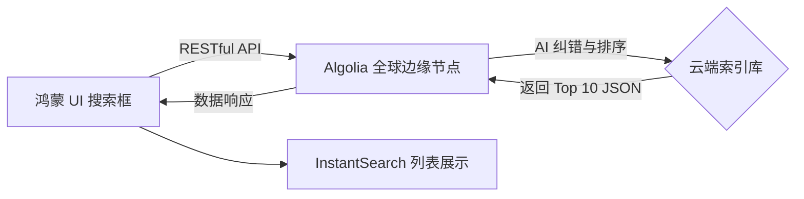

欢迎加入开源鸿蒙跨平台社区：[https://openharmonycrossplatform.csdn.net](https://openharmonycrossplatform.csdn.net)。

# Flutter for OpenHarmony：Flutter 三方库 algoliasearch 毫秒级云端搜索体验（云原生搜索引擎）

## 前言

在鸿蒙（OpenHarmony）大生态下，许多应用需要处理百万甚至千万量级的数据搜索。单纯依靠本地的 `fuzzy` 匹配在海量数据面前会显得吃力，且难以实现分词纠错、热度排行等高级特性。

`algoliasearch` 是全球顶级的云原生搜索服务 Algolia 的官方 Dart SDK。它为鸿蒙应用提供了极其强悍、具备工业级稳定性的搜索能力。通过它，你只需要输入几个字符，云端便能在 20ms 内通过全球加速节点将最相关的结果推送到用户的鸿蒙设备上。

## 一、原理解析 / 概念介绍

### 1.1 基础概念

Algolia 搜索的核心在于“高度优化的倒排索引”。



### 1.2 进阶概念

- **Search Client**：负责与云端握手的核心句柄。
- **Search Index**：对应鸿蒙应用内特定的数据集（如：商品库、文档库）。
- **Faceted Search (切面搜索)**：允许根据分类、价格区间等属性对搜索结果进行实时聚合。

## 二、核心 API / 组件详解

### 2.1 依赖引入与初始化

获取你在 Algolia 控制台的凭证后，在鸿蒙工程中初始化：

```dart
import 'package:algoliasearch/algoliasearch_helper.dart';

void initHarmonyAlgolia() {
  // ✅ 推荐做法：创建单例 Client 提升网络复用率
  final client = SearchClient(
    appId: 'YOUR_APP_ID',
    apiKey: 'YOUR_SEARCH_KEY',
  );
}
```

### 2.2 执行异步查询

```dart
final query = SearchForHits(
  indexName: 'harmony_products',
  query: '鸿蒙折叠屏',
  hitsPerPage: 10,
);

final response = await client.search(requests: [query]);
print('🔍 找到匹配条数: ${response.results.first.nbHits}');
```

## 三、场景示例

### 3.1 场景一：鸿蒙级电商应用的“零延迟”商品检索

用户在 SearchBox 中每输入一个字母，底部的列表便即时刷新。

```dart
// 🎨 实战技巧：实现 Search-As-You-Type
void onHarmonyTyping(String text) async {
  if (text.isEmpty) return;
  
  final res = await client.searchIndex(
    indexName: 'prod_list',
    request: SearchParamsObject(query: text),
  );
  
  // 更新鸿蒙 UI 状态...
}
```


## 四、OpenHarmony 平台适配挑战

### 4.1 网络稳定性与重试机制

鸿蒙设备在弱网或 5G 切换环境下，可能会出现网络抖动。

✅ **适配策略建议**：
1. **多节点选路**：Algolia 默认具备良好的网络冗余。但在鸿蒙侧，建议配置 `connectTimeout` 以便在失败时快速给用户反馈。
2. **离线缓存策略**：对于高频搜索词，可以结合鸿蒙的 `PersistentStorage` 将结果暂时缓存。

```dart
// 💡 适配提示：严格控制请求超时
final client = SearchClient(
  appId: '...',
  apiKey: '...',
  options: const ClientOptions(connectTimeout: Duration(seconds: 5)),
);
```

## 五、综合实战示例代码

这是一个包含了“按类别筛选”功能的鸿蒙 AI 图书馆搜索页：

```dart
import 'package:flutter/material.dart';
import 'package:algoliasearch/algoliasearch.dart';

class HarmonyLibrarySearch extends StatefulWidget {
  const HarmonyLibrarySearch({super.key});

  @override
  State<HarmonyLibrarySearch> createState() => _HarmonyLibrarySearchState();
}

class _HarmonyLibrarySearchState extends State<HarmonyLibrarySearch> {
  final _client = SearchClient(appId: 'TEST_ID', apiKey: 'TEST_KEY');
  List<Map<String, dynamic>> _hits = [];

  Future<void> _doSearch(String val) async {
    final response = await _client.searchIndex(
      indexName: 'books',
      request: SearchParamsObject(query: val),
    );
    setState(() {
      _hits = response.hits.map((h) => h.toJson()).toList();
    });
  }

  @override
  Widget build(BuildContext context) {
    return Scaffold(
      appBar: AppBar(title: const Text('Algolia 鸿蒙级搜索架构')),
      body: Column(
        children: [
          Padding(
            padding: const EdgeInsets.all(12),
            child: TextField(onChanged: _doSearch, decoration: const InputDecoration(hintText: '搜索感兴趣的鸿蒙书籍...')),
          ),
          Expanded(
            child: ListView.builder(
              itemCount: _hits.length,
              itemBuilder: (context, index) => ListTile(
                title: Text(_hits[index]['title'] ?? '无标题'),
                subtitle: Text('作者: ${_hits[index]['author']}'),
                // 🎨 亮色标注：展示搜索相关度
                trailing: Chip(label: Text('${_hits[index]['_score']}')),
              ),
            ),
          )
        ],
      ),
    );
  }
}
```


## 六、总结

`algoliasearch` 将原本“重负载”的搜索逻辑完全从鸿蒙设备端移到了云端。

✅ **核心建议**：
1. 涉及超大规模数据集检索时，放弃本地 `fuzzy`，直接上 Algolia。
2. 结合其配套的 `InstantSearch` 库，能以更少的代码构建出比美原生的搜索 UI。

📦 更多的底层指导代码可进入：[AtomGit 示例专栏](https://atomgit.com)

---

欢迎加入开源鸿蒙跨平台社区：[开源鸿蒙跨平台开发者社区](https://openharmonycrossplatform.csdn.net)
