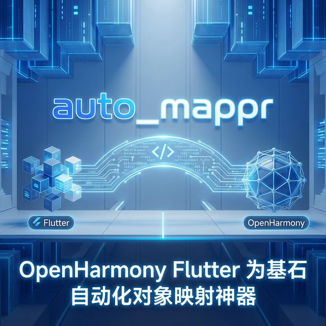
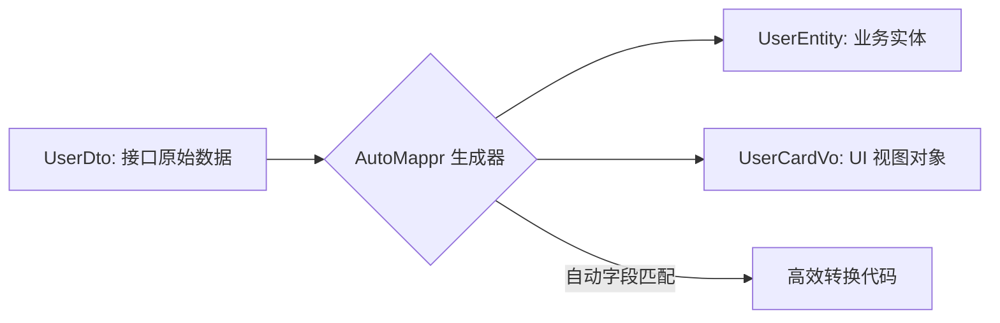

欢迎加入开源鸿蒙跨平台社区：[https://openharmonycrossplatform.csdn.net](https://openharmonycrossplatform.csdn.net)。

# Flutter for OpenHarmony：auto_mappr — 自动化对象映射神器



## 前言

在大型鸿蒙（OpenHarmony）应用中，手动编写不同层级对象（如 DTO 与 Entity）之间的映射函数既乏味又易错。`auto_mappr` 利用代码生成技术，自动构建高效的映射逻辑，助力架构瘦身。

## 一、核心价值

### 1.1 基础概念

`auto_mappr` 就像是一个智能的“搬运工”。通过简单的注解配置，它能自动识别源对象和目标对象中的相同字段并进行填充，对于不匹配的字段，它也提供了灵活的配置钩子。



### 1.2 进阶概念

- **Build Runner 集成**：利用 Dart 的静态分析能力，在编译期生成转换代码，运行期零反射开销，完美契合鸿蒙的性能要求。
- **Custom Mapping**：当字段名不一致（如 `user_name` 映射到 `userName`）时，支持一行配置解决。

## 二、核心 API / 组件详解

### 2.1 定义映射器类

在鸿蒙工程中创建一个专门负责转换的类。

```dart
import 'package:auto_mappr_annotation/auto_mappr_annotation.dart';

// ✅ 推荐做法：通过注解声明源与目标
@AutoMappr([
  MapType<UserDto, UserEntity>(),
])
class HarmonyMapper extends $HarmonyMapper {}
```

### 2.2 执行映射动作

```dart
final mapper = HarmonyMapper();
final entity = mapper.convert<UserDto, UserEntity>(userDto);
```

## 三、场景示例

### 3.1 场景一：鸿蒙级项目的“多重数据模型”转换

假设我们要将从鸿蒙本地数据库读出的 `DbUser` 转换成展示用的 `UserViewModel`。

```dart
// 💡 实战技巧：手动定义特殊转化逻辑
@AutoMappr([
  MapType<DbUser, UserViewModel>(
    fields: [
      // 🎨 场景：将数据库的 0/1 状态转换为 UI 显示的文字
      Field('statusText', custom: (user) => user.active ? '在线' : '离线'),
    ],
  ),
])
class UserMapper extends $UserMapper {}
```


## 四、OpenHarmony 平台适配挑战

### 4.1 代码生成时的性能与增量编译

鸿蒙大型项目可能有上千个 DTO。

✅ **适配策略建议**：
1. **模块化映射**：不要把整个鸿蒙应用的映射都塞进一个 `AutoMappr` 类里。按 Feature 模块拆分，可以加速编译并减少文件冲突。
2. **Nullable 安全处理**：鸿蒙端侧处理数据时，若 API 返回了非法 null 字段，确保在 `fields` 配置中加入 `whenNull` 默认处理逻辑。

```dart
// 💡 适配提示：防崩溃默认值处理
Field('avatarUrl', whenNull: 'https://default-avatar.png')
```

## 五、综合实战示例代码

这是一个完整的鸿蒙用户中心领域模型转换示例：

```dart
// user_mapper.dart (需运行 build_runner)
import 'package:auto_mappr_annotation/auto_mappr_annotation.dart';

class ApiUser {
  final String id;
  final String login_name;
  ApiUser(this.id, this.login_name);
}

class DomainUser {
  final String uuid;
  final String showName;
  DomainUser({required this.uuid, required this.showName});
}

@AutoMappr([
  MapType<ApiUser, DomainUser>(
    fields: [
      Field('uuid', from: 'id'),
      Field('showName', from: 'login_name'),
    ],
  ),
])
class GlobalMapper extends $GlobalMapper {}

// UI 使用处
void onDataLoaded(ApiUser apiData) {
  final domain = GlobalMapper().convert<ApiUser, DomainUser>(apiData);
  print('已自动转换为鸿蒙视图模型：${domain.showName}');
}
```


## 六、总结

`auto_mappr` 让鸿蒙项目的代码质量从“满地爬”跨越到了“工业化”。它消灭了手写转换逻辑中大约 90% 的低级错误。

✅ **核心建议**：
1. 任何涉及 3 个以上类之间互相转换的鸿蒙 Feature，都应该引入此库。
2. 保持映射逻辑的公开与透明，不要在转换函数里做过于沉重的业务判断。

📦 更多的底层指导代码可进入：[AtomGit 示例专栏](https://atomgit.com)

---

欢迎加入开源鸿蒙跨平台社区：[开源鸿蒙跨平台开发者社区](https://openharmonycrossplatform.csdn.net)
