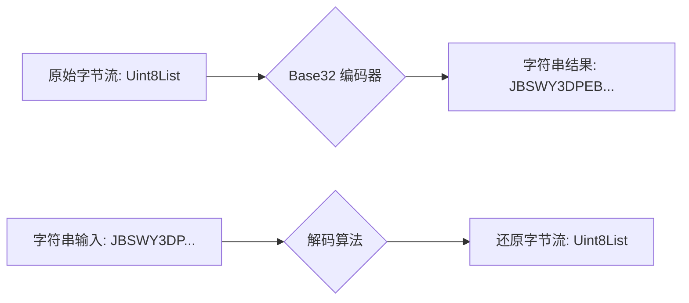
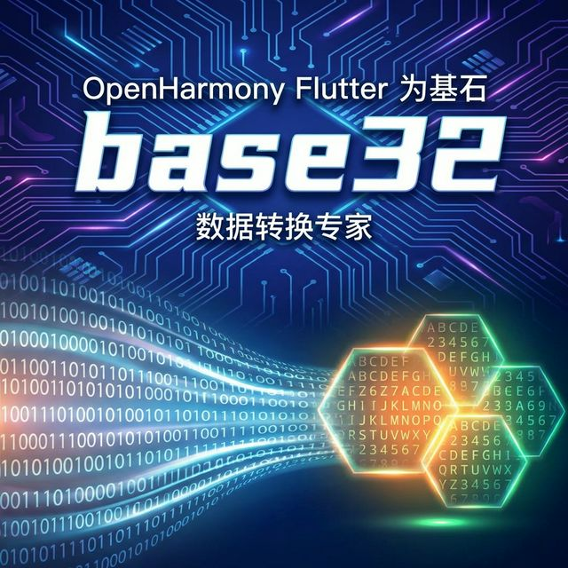

欢迎加入开源鸿蒙跨平台社区：[https://openharmonycrossplatform.csdn.net](https://openharmonycrossplatform.csdn.net)。

# Flutter for OpenHarmony：Flutter 三方库 base32 高性能处理 Base32 编解码（数据转换专家）

## 前言

在鸿蒙（OpenHarmony）的各种安全校验、OTP (一次性密码) 生成以及特定的网络协议中，`Base32` 编码比传统的 Base64 更具优势：它只包含不区分大小写的英文字母和数字，极其适合在鸿蒙应用中作为短码展示或 QR 码生成。

`base32` 库提供了一个纯粹、高效且符合 RFC 4648 标准的编解码实现。在进行鸿蒙设备间的密钥交换或校验码处理时，它是你最可靠的数据转换专家。

## 一、原理解析 / 概念介绍

### 1.1 基础概念

Base32 编码将 5 个字节的数据（40 位）映射为 8 个字符。与其兄弟 Base64 相比，它抛弃了容易混淆的符号（如 `+`, `/`）以及字母大小写干扰。



### 1.2 进阶概念

- **Padding (填充带)**：当数据不足 5 字节倍数时，Base32 会使用 `=` 进行末尾填充。
- **Hex Variant (十六进制变体)**：RFC 4648 还定义了一种保留排序属性的 Base32Hex 变体。

## 二、核心 API / 组件详解

### 2.1 依赖引入

```yaml
dependencies:
  base32: ^2.1.3
```

### 2.2 编解码用法

```dart
import 'package:base32/base32.dart';
import 'dart:typed_data';

void harmonyBase32Test() {
  // 1. 编码：从 Uint8List 转换为字符串
  var bytes = Uint8List.fromList([104, 101, 108, 108, 111]); // "hello"
  String encoded = base32.encode(bytes);
  print('✨ 鸿蒙设备处理后的编码串: $encoded');
  
  // 2. 解码：还原字节
  Uint8List decoded = base32.decode(encoded);
  print('📎 解码还原后的原始长度: ${decoded.length}');
}
```

## 三、场景示例

### 3.1 场景一：鸿蒙 TOTP (身份验证器) 密钥处理

在开发类 Google Authenticator 的鸿蒙应用时，用户扫描的 Key 字符串通常就是 Base32 格式。

```dart
import 'package:base32/base32.dart';

void processAuthSecret(String userSecret) {
  // 🎨 实战技巧：有些地方可能有多余空格或转换成了小写，先统一处理
  String cleanSecret = userSecret.replaceAll(' ', '').toUpperCase();
  
  try {
    var rawKey = base32.decode(cleanSecret);
    // 后续传入真正的 TOTP 算法...
    print('✅ 密钥解析成功，可进行鸿蒙二次认证。');
  } catch (e) {
    print('❌ 无效的 Base32 密钥！');
  }
}
```



## 四、OpenHarmony 平台适配挑战

### 4.1 字符串输入的严谨校验

鸿蒙应用在软键盘输入 Base32 密钥时，用户极易误输。

✅ **适配策略建议**：
1. **输入过滤**：利用鸿蒙的 `InputFilter` 限制用户只能输入 `A-Z` 和 `2-7`。
2. **容错重编**：如果用户输入了 `O`, `I`, `S` 这种字符，在解码前尝试自动替换为 `0`, `1`, `5`（取决于具体的业务容错协议）。

```dart
// 💡 技巧：严谨的输入清洗
String safeInput = rawInput.replaceAll(RegExp(r'[^A-Z2-7=]'), '');
```

## 五、综合实战示例代码

这是一个模拟鸿蒙安全剪贴板数据转换的示例：

```dart
import 'package:flutter/material.dart';
import 'package:base32/base32.dart';
import 'dart:convert';

class HarmonySecureConverter extends StatefulWidget {
  const HarmonySecureConverter({super.key});

  @override
  State<HarmonySecureConverter> createState() => _HarmonySecureConverterState();
}

class _HarmonySecureConverterState extends State<HarmonySecureConverter> {
  final _controller = TextEditingController();
  String _output = "结果将显示在此...";

  void _convert() {
    setState(() {
      try {
        final list = utf8.encode(_controller.text);
        _output = base32.encode(list);
      } catch (e) {
        _output = "错误: 转换失败";
      }
    });
  }

  @override
  Widget build(BuildContext context) {
    return Scaffold(
      appBar: AppBar(title: const Text('base32 数据脱敏工具')),
      body: Padding(
        padding: const EdgeInsets.all(24),
        child: Column(
          children: [
            TextField(
              controller: _controller,
              decoration: const InputDecoration(labelText: '原始文本'),
            ),
            const SizedBox(height: 20),
            ElevatedButton(onPressed: _convert, child: const Text('执行 Base32 转换')),
            const SizedBox(height: 40),
            const Text('转换结果 (可作为短码分享):'),
            SelectableText(_output, style: const TextStyle(fontWeight: FontWeight.bold, fontSize: 18, color: Colors.blue)),
          ],
        ),
      ),
    );
  }
}
```


## 六、总结

在鸿蒙生态的“数据互通”环节，`base32` 凭借其**高可读性**和**不区分大小写**的特性，是短数据编解码的最佳拍档。掌握它的 encode/decode 逻辑，能让你的鸿蒙安全应用更加专业。

✅ **核心建议**：
1. 始终假设用户输入的 Base32 串是未经处理的，必须手动 `.toUpperCase()`。
2. 内部逻辑存储一律保持 `Uint8List` 原始字节。

📦 更多的底层指导代码可进入：[AtomGit 示例专栏](https://atomgit.com)

---

欢迎加入开源鸿蒙跨平台社区：[开源鸿蒙跨平台开发者社区](https://openharmonycrossplatform.csdn.net)
