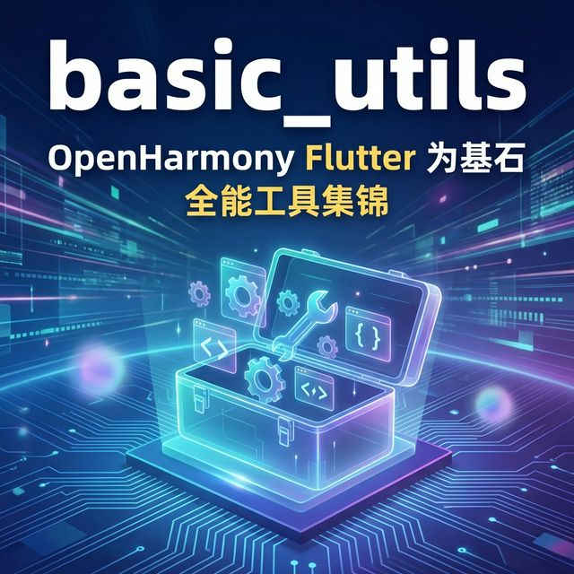
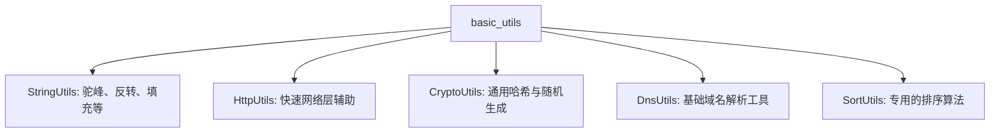

欢迎加入开源鸿蒙跨平台社区：[https://openharmonycrossplatform.csdn.net](https://openharmonycrossplatform.csdn.net)。

# Flutter for OpenHarmony：basic_utils — 全能进阶工具箱实战



## 前言

在鸿蒙应用的核心逻辑开发中，不仅需要基础校验，更需要高效的密码生成、字符串模式转换及网络 IP 解析。`basic_utils` 采用工厂模式，涵盖了大量重型逻辑工具，是架构师手中不可或缺的锦囊。

## 一、核心价值

### 1.1 基础概念

`basic_utils` 采用了分门别类的“工厂模式”，每个 `Utils` 类都只处理特定领域的高级逻辑。



### 1.2 进阶概念

- **领域专注 (Domain Focus)**：不同于通用库，它的每个子模块都达到了工业级的严谨度，比如其 Email 验证是基于顶级域名列表的。
- **扩展性**：提供了许多在日常 UI 开发中少见但极其关键的算法实现。

## 二、核心 API / 组件详解

### 2.1 依赖引入

```yaml
dependencies:
  basic_utils: ^5.6.3
```

### 2.2 核心工具方法展示

```dart
import 'package:basic_utils/basic_utils.dart';

void harmonyAdvancedUtilsDemo() {
  // 🎨 字符串进阶转换
  String label = StringUtils.toCamelCase('harmony_os_next_release');
  print('✨ 鸿蒙命名风格转换: $label'); // HarmonyOsNextRelease
  
  // 🔐 随机密码安全生成
  String pin = CryptoUtils.generateRandomString(6, special: false);
  print('🔑 鸿蒙备用验证码: $pin');
}
```

## 三、场景示例

### 3.1 场景一：鸿蒙本地配置管理中的 Key 格式化

当我们需要将用户输入的不规范字符串，统一存储为符合鸿蒙持久化规范的驼峰命名时。

```dart
import 'package:basic_utils/basic_utils.dart';

String formatConfigKey(String rawInput) {
  // 💡 技巧：利用 basic_utils 快速实现标准化
  if (StringUtils.isNullOrEmpty(rawInput)) return "default_key";
  return StringUtils.toPascalCase(rawInput);
}
```


## 四、OpenHarmony 平台适配挑战

### 4.1 网络工具的跨层访问

`HttpUtils` 内部依赖于传统的 `HttpClient`。在鸿蒙系统严格的沙箱环境下。

✅ **适配策略建议**：
1. **证书校验忽略**：在本地鸿蒙开发阶段，利用 `HttpUtils` 极其简单的函数快速跳过 HTTPS 证书验证（仅限开发环境）。
2. **异步安全**：由于它的工具类多为同步逻辑，在大批量处理（如大文件的 MD5 计算）时，建议配合 `Compute` 搬离主线程。

```dart
// 💡 适配提示：快速获取鸿蒙设备当前的公网 IP
String? publicIp = await HttpUtils.getPublicIp();
```

## 五、综合实战示例代码

这是一个包含了随机校验码生成与邮件严谨验证的鸿蒙注册中心逻辑：

```dart
import 'package:flutter/material.dart';
import 'package:basic_utils/basic_utils.dart';

class HarmonyToolboxPage extends StatefulWidget {
  const HarmonyToolboxPage({super.key});

  @override
  State<HarmonyToolboxPage> createState() => _HarmonyToolboxPageState();
}

class _HarmonyToolboxPageState extends State<HarmonyToolboxPage> {
  String _generatedToken = "";
  final _emailCtrl = TextEditingController();

  void _generate() {
    setState(() {
      _generatedToken = CryptoUtils.generateSecureRandomString(16);
    });
  }

  void _validateEmail() {
    bool isValid = EmailUtils.isEmail(_emailCtrl.text);
    ScaffoldMessenger.of(context).showSnackBar(
      SnackBar(content: Text(isValid ? "✅ 邮箱格式有效" : "❌ 请检查输入")),
    );
  }

  @override
  Widget build(BuildContext context) {
    return Scaffold(
      appBar: AppBar(title: const Text('basic_utils 极客工具实战')),
      body: Padding(
        padding: const EdgeInsets.all(20),
        child: Column(
          children: [
            ListTile(
              title: const Text('安全令牌'),
              subtitle: SelectableText(_generatedToken),
              trailing: ElevatedButton(onPressed: _generate, child: const Text('生成')),
            ),
            const Divider(),
            TextField(controller: _emailCtrl, decoration: const InputDecoration(labelText: '注册邮箱')),
            const SizedBox(height: 10),
            ElevatedButton(onPressed: _validateEmail, child: const Text('提交验证')),
          ],
        ),
      ),
    );
  }
}
```


## 六、总结

`basic_utils` 就像是鸿蒙开发者的一座“私人算法工厂”。它不仅仅解决了怎么做，更解决了如何把逻辑做得更严谨、更专业的问题。

✅ **核心建议**：
1. 涉及字符串转换、随机数生成或网络工具时，优先查阅该库。
2. 对于极高安全性的需求，优先使用其 `CryptoUtils` 的强随机序列生成方法。

📦 更多的底层指导代码可进入：[AtomGit 示例专栏](https://atomgit.com)

---

欢迎加入开源鸿蒙跨平台社区：[开源鸿蒙跨平台开发者社区](https://openharmonycrossplatform.csdn.net)
