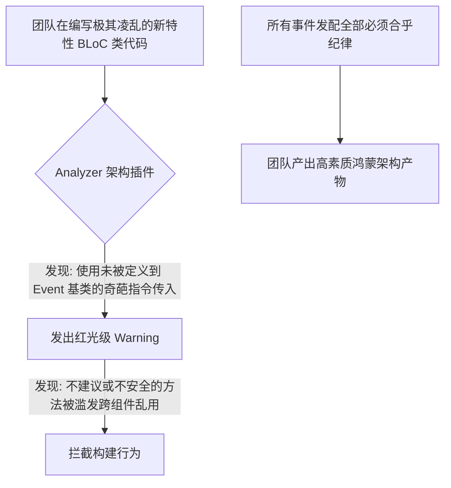

欢迎加入开源鸿蒙跨平台社区：[https://openharmonycrossplatform.csdn.net](https://openharmonycrossplatform.csdn.net)。

# Flutter for OpenHarmony：bloc_lint — 构建状态管理的硬性规范


## 前言

在大型鸿蒙（OpenHarmony）应用中，BLoC 架构虽优秀，但若开发者写法散漫，易造成状态泄漏等问题。`bloc_lint` 提供了专门的代码扫描规则，强制团队遵循规范，是从静态分析层面保障架构健壮性的卫士。

## 一、核心价值

### 1.1 基础概念

本机制就像是在 Dart 分析服务器里面插入了由 BLoC 作者参与或者基于经验而设定好的硬性代码规范探针体。



### 1.2 进阶概念

- **Bloc Provider Anti-patterns (反依赖滥用追踪)**：比如严厉禁止开发者在一个完全无关且非常危险的其他组件逻辑体类中极其随意地就拿走或者直接暴打调用其他领域内 Bloc 的重要受限方法导致架构分层直接穿孔。

## 二、核心 API / 项目配置

### 2.1 依赖引入与全局配置挂载接入

在鸿蒙工程的 `pubspec.yaml` 中，把它声明放置于 `dev_dependencies` （它不对线上生产包体重量产生任何物理污染与累赘添加）：

```yaml
dev_dependencies:
  bloc_lint: ^0.1.0 # 建议选择支持 Analyzer 扩展的适当发行版本
```

打开 `analysis_options.yaml` 加入它核心底蕴所带的强力分析法则声明：

```yaml
analyzer:
  plugins:
    - bloc_lint # 💡 重点：把这款独立强力外挂式插件真正插入分析流中予以执行
```

## 三、场景示例

### 3.1 场景一：针对高强度“状态复刻泄漏”这种严重违规做法实施抓捕

当开发者想要贪图快速方便在组件里边绕开 Event 发送系统，试图直接用极其暴力的形式更新其业务对象状态时被死死拦住。

```dart
// ❌ 极其令人失望的反范式业务调用
void tryToUpdateStateBypassSystem(BuildContext context) {
  // ⛔ Lint 警示触发: 绝不允许由于外界直接暴力拉取和调用被保护级别的 emit 或其关联变更！
  context.read<AccountBloc>().emit(SomeUnsafeState());
}
```


## 四、OpenHarmony 平台适配挑战

### 4.1 全局强规则引起的新老重构痛楚融合与平稳过渡阻力

尤其是在面对刚迁移升级成为或者正在进行庞大大规模转向为 BLoC 时原由于部分之前用 GetX 之类极度松散随便满天飞方式去习惯和开发完代码的老开发人员群体会由于大量的错误拦截不给运行产生极大且激烈的抵触情绪。

✅ **适配策略建议**：
1. **分级温和落地策**：在 `analysis_options` 具体自定义条目把最容易遭遇的法则设制成为只属于 `info` 信息等级提醒范围。如确实严重动到根骨可能会破坏数据源层级的数据流架构部分设成必须中断修复级别的 `error` 进行红光级严重拦管防阻机制处理，循序渐进拉起并扶正这艘鸿蒙业务巨轮项目质量体系基调，最终做到所有代码规范严格平滑达标统一整齐化。

## 五、综合实战示例代码

这是一个包含了对极其错误的和正确的“推荐安全写法流转”做正反示例对比研究的架构研究类 Lab：

```dart
import 'package:flutter/material.dart';
import 'package:flutter_bloc/flutter_bloc.dart';

// 此处构建一个基于纯粹指令流事件调度的基础业务处理器范本
class TestEvent {}
class SimpleRequestEvent extends TestEvent {}
class TestState {
  final int id;
  TestState(this.id);
}

class HarmonyDataBloc extends Bloc<TestEvent, TestState> {
  HarmonyDataBloc() : super(TestState(0)) {
     on<SimpleRequestEvent>((event, emit) {
        // 💡 重点：正确的封闭式的处理应该只能在于其自身管辖的内部范围领域内运行业务进行抛送数据更新
        emit(TestState(state.id + 1));
     });
  }
}

class HarmonyArchitectLab extends StatelessWidget {
  const HarmonyArchitectLab({super.key});

  @override
  Widget build(BuildContext context) {
    return BlocProvider(
      create: (_) => HarmonyDataBloc(),
      child: Scaffold(
        appBar: AppBar(title: const Text('极客规范防御实验室')),
        body: Center(
          child: Builder(
            builder: (ctx) {
              return Column(
                children: [
                  // 页面内容展现监听其结果输出状态
                  const Text('受鸿蒙严格底层事件驱动引擎控制体系，此体系无法从外部暴力攻破篡改。'),
                  ElevatedButton(
                    onPressed: () {
                      // ✅ 符合 Bloc_Lint 要求：正确正统安全干净的做法是抛送该定义给它的命令
                      ctx.read<HarmonyDataBloc>().add(SimpleRequestEvent());
                    },
                    child: const Text('极度安全的发配正规请求任务事件'),
                  )
                ],
              );
            }
          ),
        ),
      ),
    );
  }
}
```


## 六、总结

`bloc_lint` 的初衷在于杜绝因为使用者的散漫和随性所带来的各种破洞灾难。将一种状态管理的最佳共识设计思想从“人防准则阶段”提升为靠全自动化无任何商量余地机器执行级别的“技防法则锁定层次”控制执行力度。

✅ **核心建议**：
1. 项目采用 `flutter_bloc` 或其任何周边生态群且想要维护长期迭代稳健性的项目强烈加入为常规武器防线使用标准装备。
2. 配置的时候请先仔细去查看它库所提列出来的各种检查名类目录条项。

📦 更多的底层指导代码可进入：[AtomGit 示例专栏](https://atomgit.com)

---

欢迎加入开源鸿蒙跨平台社区：[开源鸿蒙跨平台开发者社区](https://openharmonycrossplatform.csdn.net)
