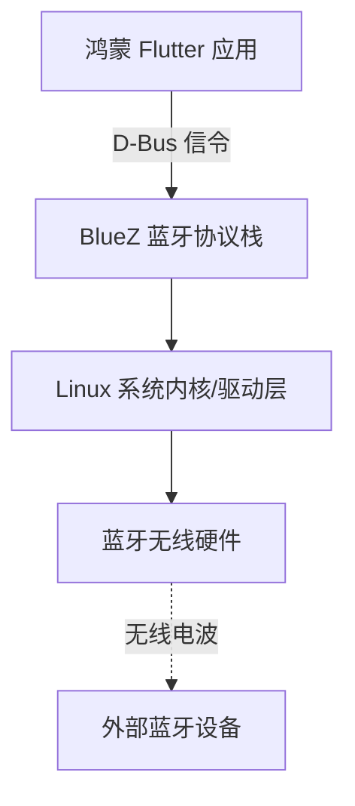
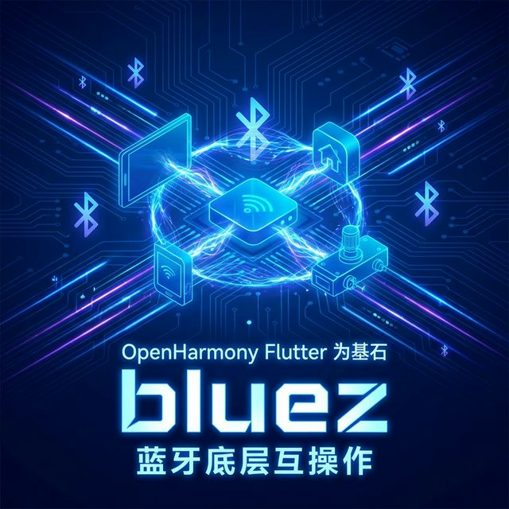

欢迎加入开源鸿蒙跨平台社区：[https://openharmonycrossplatform.csdn.net](https://openharmonycrossplatform.csdn.net)。

# Flutter for OpenHarmony：Flutter 三方库 bluez 玩转 Linux 风格的蓝牙操作（蓝牙底层互操作）

## 前言

随着鸿蒙（OpenHarmony）在工业互联网、智能座舱和物联网（IoT）领域的深入应用，与蓝牙设备的底层通信成为了许多开发者的刚需。在一些基于鸿蒙内核的特定工业版或车机版系统中，底层可能由于适配历史原因或分层设计，保留了类似 Linux 的 D-Bus 通信机制。

`bluez` 是一个专门用于与 Linux BlueZ 蓝牙协议栈通过 D-Bus 进行交互的 Dart 库。虽然对于普通的 HarmonyOS NEXT 手机开发我们通常使用官方的蓝牙插件，但在深度定制的鸿蒙发行版中，`bluez` 库为我们提供了一扇通往蓝牙底层控制的大门。

## 一、原理解析 / 概念介绍

### 1.1 基础概念

`bluez` 库并不直接操作蓝牙硬件，而是通过 **D-Bus (Desktop Bus)** 系统总线与系统级的蓝牙守护进程进行会话。



### 1.2 进阶概念

- **适配器 (Adapter)**：指设备本身的蓝牙硬件模块。
- **设备 (Device)**：指扫描到的外部蓝牙外设。
- **GATT 客户端 (GATT Client)**：用于读取和写入特定服务的特征值，实现数据交换。

## 二、核心 API / 组件详解

### 2.1 获取蓝牙适配器

这是所有操作的第一步，首先要确认鸿蒙设备当前的蓝牙适配器是否在线。

```dart
import 'package:bluez/bluez.dart';

Future<void> initHarmonyBluetooth() async {
  final client = BlueZClient();
  
  // ✅ 推荐做法：遍历所有可用的蓝牙适配器
  for (final adapter in client.adapters) {
    print('📻 发现蓝牙适配器: ${adapter.name}');
    print('🔌 状态: ${adapter.powered ? "已开启" : "已关闭"}');
  }
}
```

### 2.2 扫描周围设备

```dart
void scanDevices(BlueZAdapter adapter) async {
  // 💡 技巧：开启扫描模式
  await adapter.startDiscovery();
  
  adapter.devices.listen((device) {
    print('🔎 扫描到设备: ${device.alias} [${device.address}]');
  });
}
```

## 三、场景示例

### 3.1 场景一：工业级传感器的数据采集

在定制化的鸿蒙网关设备上，我们可能需要静默地连接一个工厂内的温湿度计。

```dart
import 'package:bluez/bluez.dart';

void connectToIndustrialSensor(BlueZDevice sensor) async {
  if (!sensor.connected) {
    print('🚀 正在建立与工业传感器的受信任连接...');
    await sensor.connect();
    print('✅ 连接成功！');
  }
}
```



## 四、OpenHarmony 平台适配挑战

### 4.1 权限与总线策略限制

在 OpenHarmony 较高的安全级别下，普通的 HAP 应用可能无法直接访问 D-Bus 总线。

✅ **适配策略建议**：
1. **系统预置权**：该库更适用于“系统级应用”或具有特殊特权的底层服务。
2. **SELinux 方案**：确保系统的 SELinux 策略允许你的 Flutter 进程通过 D-Bus 与 `org.bluez` 通信。
3. **适配判断**：在使用前通过鸿蒙平台通道检测 `/var/run/dbus/system_bus_socket` 是否存在。

```dart
// 💡 策略判断示例
bool checkDbusAvailability() {
  // 通过 Platform Channel 检查鸿蒙系统底层是否具备 D-Bus 或 BlueZ 支持
  return isHarmonyDesktopSpinOffVersion; 
}
```

## 五、实战测试示例代码

这是一个针对定制鸿蒙系统设计的简易蓝牙管理脚本：

```dart
import 'package:flutter/material.dart';
import 'package:bluez/bluez.dart';

class HarmonyBlueZManager extends StatefulWidget {
  const HarmonyBlueZManager({super.key});

  @override
  _HarmonyBlueZManagerState createState() => _HarmonyBlueZManagerState();
}

class _HarmonyBlueZManagerState extends State<HarmonyBlueZManager> {
  final BlueZClient _client = BlueZClient();
  List<BlueZDevice> _foundDevices = [];

  void _refreshAdapters() {
    setState(() {
      // 重新感知 D-Bus 总线上的设备状态
      if (_client.adapters.isNotEmpty) {
        _foundDevices = _client.adapters.first.devices;
      }
    });
  }

  @override
  Widget build(BuildContext context) {
    return Scaffold(
      appBar: AppBar(title: const Text('bluez 底层蓝牙探索 (鸿蒙定制版)')),
      body: Column(
        children: [
          ListTile(
            title: const Text('蓝牙总线状态'),
            subtitle: Text('适配器数量: ${_client.adapters.length}'),
            trailing: IconButton(
              icon: const Icon(Icons.refresh),
              onPressed: _refreshAdapters,
            ),
          ),
          const Divider(),
          Expanded(
            child: ListView.builder(
              itemCount: _foundDevices.length,
              itemBuilder: (context, index) {
                final d = _foundDevices[index];
                return ListTile(
                  leading: const Icon(Icons.bluetooth),
                  title: Text(d.alias),
                  subtitle: Text('MAC: ${d.address}'),
                  trailing: Text(d.connected ? '已连接' : '未连接'),
                  onTap: () async {
                    // 对连接过程进行极其严谨的异步异常处理
                    try {
                      await d.connect();
                    } catch (e) {
                      print('❌ 鸿蒙总线连接异常: $e');
                    }
                  },
                );
              },
            ),
          )
        ],
      ),
    );
  }
}
```


## 六、总结

`bluez` 不是为普通鸿蒙手机 App 设计的，但它却是**鸿蒙工业/车机开发者**操作 Linux 底层蓝牙协议栈的一把“金钥匙”。通过 **D-Bus 信令**，它绕过了许多传统 UI 框架层对蓝牙指令的频率限制。

✅ **核心建议**：
1. 先确认你的鸿蒙版本是否包含 `BlueZ` 守护进程。
2. 对于基于 AOSP 或 Linux 改版而来的鸿蒙发行版，该库效果极其震撼。

📦 更多的底层指导代码可进入：[AtomGit 示例专栏](https://atomgit.com)

---

欢迎加入开源鸿蒙跨平台社区：[开源鸿蒙跨平台开发者社区](https://openharmonycrossplatform.csdn.net)
