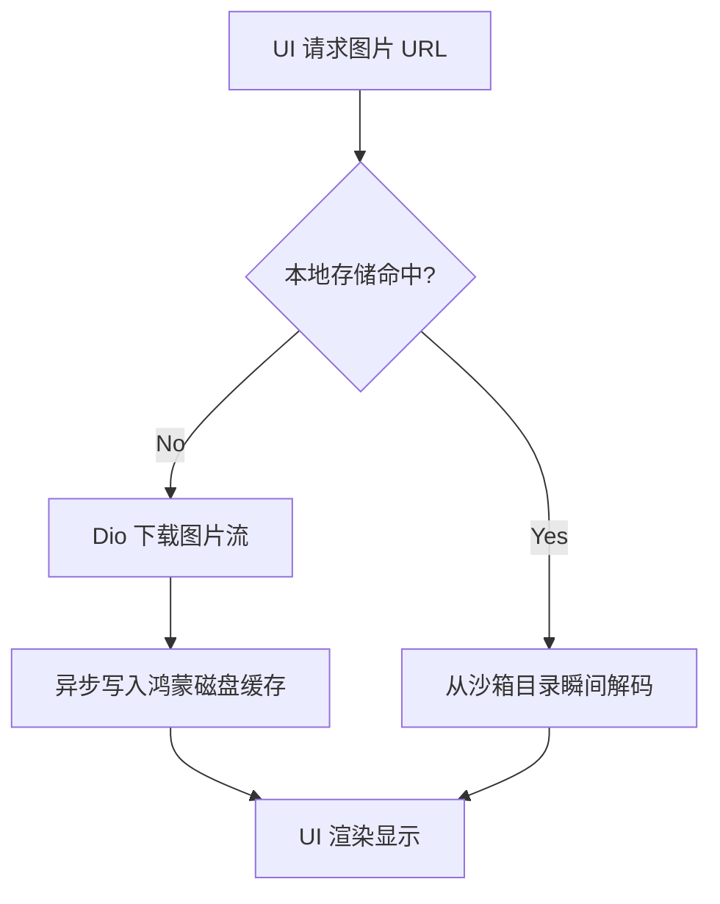

欢迎加入开源鸿蒙跨 platform 社区：https://openharmonycrossplatform.csdn.net

# Flutter for OpenHarmony：Flutter 三方库 cached_network_image — 极其强悍的网络图片智能缓存（性能优化引擎）

## 前言

在鸿蒙（OpenHarmony）的高性能列表、社交动态页或者是海量图片的画廊应用中，直接使用 `Image.network` 是极不明智的：它会导致图片每次重新加载时都会产生网络开销，且在快速滑动时会由于反复解码造成 UI 卡顿。

`cached_network_image` 是 Flutter 生态中图片渲染的“黄金标准”。它能自动化地将下载好的图片持久化到鸿蒙系统的沙箱存储中，并在下次请求时瞬间从磁盘读取，同时还提供了极其优雅的占位（Placeholder）和错误处理方案。在鸿蒙应用追求极致流畅度的背景下，它是每一位开发者的必选组件。

## 一、原理展示 / 概念介绍

### 1.1 基础概念

它在原生的图片渲染流中加入了一个智能“拦截层”。



### 1.2 进阶概念

- **CacheManager**：核心管理引擎，支持设置缓存的有效期（TTL）和最大磁盘空间占用。
- **Image Styling**：内置了与 `transparent_image` 风格一致的渐显动画，提升视觉高级感。

## 二、核心 API / 组件详解

### 2.1 依赖引入

```yaml
dependencies:
  cached_network_image: ^3.3.1
```

### 2.2 基础缓存加载

```dart
import 'package:cached_network_image/cached_network_image.dart';

Widget buildHarmonyImg(String url) {
  return CachedNetworkImage(
    imageUrl: url,
    // ✅ 推荐做法：设置精美的占位图
    placeholder: (context, url) => const CircularProgressIndicator(),
    errorWidget: (context, url, error) => const Icon(Icons.error),
    fit: BoxFit.cover,
  );
}
```

## 三、场景示例

### 3.1 场景一：鸿蒙级新闻列表的“秒开”体验

当用户再次打开应用阅读旧闻时，所有的缩略图都应该是瞬间呈现，无需网络等待。

```dart
// 💡 技巧：通过 memCacheHeight/Width 限制解码精度，极大地节省鸿蒙设备内存
CachedNetworkImage(
  imageUrl: post.cover,
  memCacheHeight: 200, // 💡 只在内存中解码 200px 高度的副本，防止内存抖动
);
```


## 四、OpenHarmony 平台适配挑战

### 4.1 磁盘缓存的空间清理

鸿蒙系统对应用占用的“存储空间”有监控。如果不加限制，长期滑动可能导致几十 GB 的缓存占用。

✅ **适配策略建议**：
1. **定制 CacheManager**：在鸿蒙初始化阶段，设置最大并发数和缓存清理策略。
2. **配合 path_provider**：由于插件默认使用临时目录，确保你的鸿蒙应用在触发“清理缓存”功能时，能精准找到该插件生成的存储文件夹。

```dart
// 💡 适配提示：自定义最大 100MB 的缓存空间
final customCacheManager = CacheManager(
  Config(
    'harmony_img_cache',
    stalePeriod: const Duration(days: 7),
    maxNrOfCacheObjects: 200,
  ),
);
```

## 五、综合实战示例代码

这是一个包含了圆形头像处理与加载状态反馈的鸿蒙用户卡片：

```dart
import 'package:flutter/material.dart';
import 'package:cached_network_image/cached_network_image.dart';

class HarmonyUserCard extends StatelessWidget {
  const HarmonyUserCard({super.key});

  @override
  Widget build(BuildContext context) {
    return ListTile(
      leading: ClipOval(
        child: CachedNetworkImage(
          imageUrl: 'https://i.pravatar.cc/150?u=harmony',
          width: 50, height: 50,
          // 💡 核心：加载时的淡入动效
          fadeInDuration: const Duration(milliseconds: 300),
          placeholder: (context, url) => Container(color: Colors.grey[200]),
        ),
      ),
      title: const Text('鸿蒙高级架构师'),
      subtitle: const Text('上次在线：10分钟前'),
    );
  }
}
```


## 六、总结

`cached_network_image` 解决了鸿蒙应用中“网络图片”引起的所有性能顽疾。它在保障用户流量的同时，通过极其智能的本地化加载策略，给予了应用“类原生”的响应速度。

✅ **核心建议**：
1. 涉及大图片展示（如详情页大图），务必设置合理的 `fadeInDuration`。
2. 针对鸿蒙端侧的内存，合理利用 `memCacheWidth` 降低高保真图片的内存压力。

📦 更多的底层指导代码可进入：[AtomGit 示例专栏](https://atomgit.com)

---

欢迎加入开源鸿蒙跨平台社区：[开源鸿蒙跨平台开发者社区](https://openharmonycrossplatform.csdn.net)
