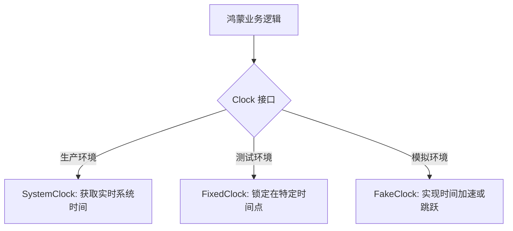
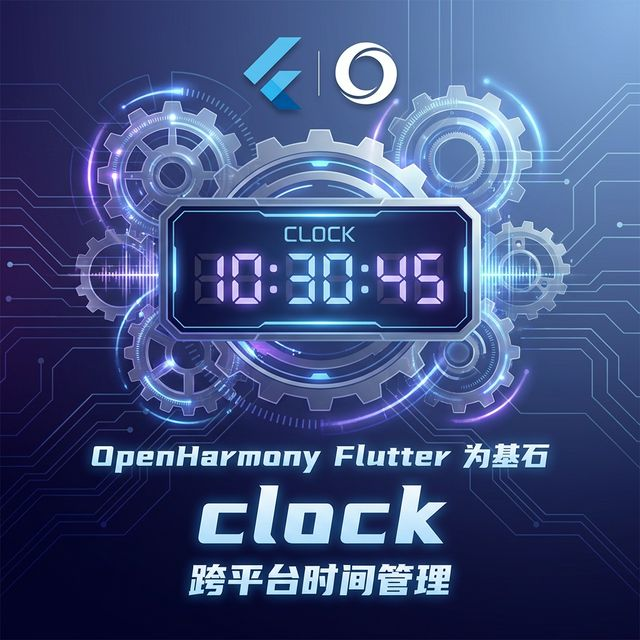

欢迎加入开源鸿蒙跨平台社区：[https://openharmonycrossplatform.csdn.net](https://openharmonycrossplatform.csdn.net)。

# Flutter for OpenHarmony：Flutter 三方库 clock 优雅地接管时间流逝（跨平台时间管理）

## 前言

在鸿蒙（OpenHarmony）应用开发过程中，我们经常需要处理与时间相关的逻辑，比如显示当前日期、计算倒计时或者在单元测试中模拟特定时间。直接使用 Dart 原生的 `DateTime.now()` 虽然简单，但在复杂的测试场景下，你会发现很难“冻结”或“穿越”时间。

`clock` 是由 Google 官方维护的一个轻量级工具库，它提供了一个统一的接口来访问当前时间。通过它，你可以轻松地在代码中注入一个“时钟”对象，从而实现对时间的精准控制。本文将带你深度领略 `clock` 在鸿蒙开发中的实战魅力。

## 一、原理解析 / 概念介绍

### 1.1 基础概念

`clock` 的核心思想是将“获取当前时间”这一动作抽象化。它不再是一个静态的系统调用，而是一个可以被替换的实体。



### 1.2 进阶概念

- **注入 (Injection)**：在你的顶层代码或包管理中注入一个全局的 `clock` 实例。
- **可测试性 (Testability)**：通过使用 `withClock` 函数，你可以在不修改业务代码的前提下，为特定的代码块配置一个虚假的时间源。

## 二、核心 API / 组件详解

### 2.1 依赖引入

在鸿蒙工程的 `pubspec.yaml` 中添加以下配置：

```yaml
dependencies:
  clock: ^1.1.1
```

### 2.2 核心 API 使用

在代码中，我们不再直接调用 `DateTime.now()`，而是通过 `clock.now()`。

```dart
import 'package:clock/clock.dart';

void showHarmonyTime() {
  // ✅ 推荐做法：通过 clock 获取时间
  final now = clock.now();
  print('🕒 当前鸿蒙设备系统时间: $now');
}
```

## 三、场景示例

### 3.1 场景一：在鸿蒙 UI 界面中控制显示

假设我们需要开发一个仅在特定节日（如：鸿蒙发布纪念日）展示的活动挂件。

```dart
import 'package:flutter/material.dart';
import 'package:clock/clock.dart';

class HarmonyAnniversaryWidget extends StatelessWidget {
  @override
  Widget build(BuildContext context) {
    // 💡 技巧：利用 clock.now() 方便后续测试活动的触发
    final now = clock.now();
    final isAnniversary = now.month == 8 && now.day == 9; // 假设 8月9日是纪念日

    return Center(
      child: isAnniversary 
        ? Text('🎉 欢迎来到鸿蒙开发者大会！', style: TextStyle(color: Colors.blue))
        : Text('✨ 鸿蒙生态持续建设中...', style: TextStyle(color: Colors.grey)),
    );
  }
}
```



## 四、OpenHarmony 平台适配挑战

### 4.1 鸿蒙系统时间同步

OpenHarmony 设备（如：开发板或智能手表）在未联网状态下，系统时钟可能不准。

✅ **适配策略**：
1. **网络对时**：在应用启动时，通过 NTP 协议获取标准时间。
2. **时钟偏移**：使用 `clock` 库包装一个带有偏移量的自定义时钟。

```dart
// 基于系统时间但带有 NTP 偏移量的时钟示例
class HarmonyNtpClock extends Clock {
  final Duration offset;
  HarmonyNtpClock(this.offset);

  @override
  DateTime now() => super.now().add(offset);
}
```

## 五、完整示例代码

下面是一个完整的鸿蒙适配示例，演示了如何在同一个应用中自由切换“真实时钟”和“虚假时钟”。

```dart
import 'package:flutter/material.dart';
import 'package:clock/clock.dart';

void main() {
  runApp(const HarmonyClockApp());
}

class HarmonyClockApp extends StatelessWidget {
  const HarmonyClockApp({super.key});

  @override
  Widget build(BuildContext context) {
    return MaterialApp(
      title: '鸿蒙时钟实战',
      theme: ThemeData(primarySwatch: Colors.blue),
      home: const HarmonyClockPage(),
    );
  }
}

class HarmonyClockPage extends StatefulWidget {
  const HarmonyClockPage({super.key});

  @override
  State<HarmonyClockPage> createState() => _HarmonyClockPageState();
}

class _HarmonyClockPageState extends State<HarmonyClockPage> {
  DateTime _displayTime = clock.now();

  void _refreshTime() {
    setState(() {
      _displayTime = clock.now(); // 始终使用 clock 获取
    });
  }

  void _timeTravel() {
    // 🎨 魔法：让代码临时“穿越”到 2077 年
    withClock(Clock.fixed(DateTime(2077, 1, 1)), () {
      setState(() {
        _displayTime = clock.now();
      });
    });
  }

  @override
  Widget build(BuildContext context) {
    return Scaffold(
      appBar: AppBar(title: const Text('Flutter for OpenHarmony 时间管理')),
      body: Center(
        child: Column(
          mainAxisAlignment: MainAxisAlignment.center,
          children: [
            Text('当前显示时间：', style: TextStyle(fontSize: 18)),
            const SizedBox(height: 10),
            Text(
              '${_displayTime.toLocal()}',
              style: const TextStyle(fontSize: 24, fontWeight: FontWeight.bold, color: Colors.blue),
            ),
            const SizedBox(height: 40),
            ElevatedButton(
              onPressed: _refreshTime,
              child: const Text('刷新真实时间'),
            ),
            const SizedBox(height: 10),
            ElevatedButton(
              onPressed: _timeTravel,
              style: ElevatedButton.styleFrom(backgroundColor: Colors.orange),
              child: const Text('穿越到 2077 (测试)'),
            ),
          ],
        ),
      ),
    );
  }
}
```


## 六、总结

在鸿蒙应用中引入 `clock` 库，不仅是代码风格的提升，更是对软件可维护性的深远投资。通过**要点讲解**中的依赖注入模式，我们可以让所有与时间相关的代码都变得清晰、可测试。

✅ **核心建议**：
1. 全局弃用 `DateTime.now()`，改用 `clock.now()`。
2. 在复杂的业务逻辑测试中，利用 `withClock` 进行确定性测试。

📦 更多的底层指导代码可进入：[AtomGit 示例专栏](https://atomgit.com)

---

欢迎加入开源鸿蒙跨平台社区：[开源鸿蒙跨平台开发者社区](https://openharmonycrossplatform.csdn.net)
