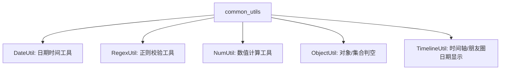

欢迎加入开源鸿蒙跨平台社区：[https://openharmonycrossplatform.csdn.net](https://openharmonycrossplatform.csdn.net)。

# Flutter for OpenHarmony：Flutter 三方库 common_utils 基础工具类的瑞士军刀（常用工具集）

## 前言

在参与鸿蒙（OpenHarmony）大前端开发时，我们经常会遇到一些细碎但繁琐的任务：身份证号校验、手机号脱敏、时间格式化、甚至是一个简单的倒计时逻辑。如果每个项目都手动写一套这些代码，不仅效率低下，还容易出错。

`common_utils` 是一款极其经典的 Dart 工具库，被称为 Flutter 开发者的“瑞士军刀”。它涵盖了日期、数字、正则、对象、JSON 等各个方面的工具方法。本文将手把手带你在鸿蒙适配中解锁这款效率神器的核心玩法。

## 一、原理解析 / 概念介绍

### 1.1 基础概念

`common_utils` 的设计哲学是将**职责单一化**。它并不包含任何 UI 组件，而是纯粹的逻辑封装，这使得它在鸿蒙跨平台场景中具有极佳的稳定性和性能。



### 1.2 进阶概念

- **高精度计算 (NumUtil)**：在鸿蒙处理金融类业务时，普通的 `double` 运算可能会产生精度丢失，`NumUtil` 提供了可靠的四舍五入和比较方案。
- **自定义正则 (RegexUtil)**：除了内置的常用正则，它还支持配置化的正则表达式自定义扩展。

## 二、核心 API / 组件详解

### 2.1 日期格式化 (DateUtil)

鸿蒙界面上展示时间最常用的功能：

```dart
import 'package:common_utils/common_utils.dart';

void formatDateExample() {
  String time = DateUtil.formatDateMs(
    DateTime.now().millisecondsSinceEpoch, 
    format: "yyyy-MM-dd HH:mm:ss"
  );
  print("🕒 鸿蒙应用格式化后的时间: $time");
}
```

### 2.2 数据校验 (RegexUtil)

校验用户输入的正确性：

```dart
bool isChinaPhone = RegexUtil.isMobileSimple("13800138000"); // 校验手机号
bool isEmail = RegexUtil.isEmail("dev@harmony.com");        // 校验邮箱
```

## 三、场景示例

### 3.1 场景一：鸿蒙社区类应用的“朋友圈”日期显示

我们需要根据时间差显示“刚刚”、“1分钟前”、“5小时前”等。

```dart
import 'package:common_utils/common_utils.dart';

void showTimeline() {
  int postTime = 1672531200000; // 假设这是一个发帖的时间戳
  String result = TimelineUtil.formatByDateTime(
    DateTime.fromMillisecondsSinceEpoch(postTime),
    locale: 'zh', // 适配中文语境
    dayFormat: DayFormat.Common
  );
  print("📝 该动态发布于: $result");
}
```


## 四、OpenHarmony 平台适配挑战

### 4.1 国际化与本地化支持

在鸿蒙系统分发到全球不同国家时，正则校验（如手机号规则）可能需要根据鸿蒙设备当前的系统语言环境动态切换。

✅ **适配策略**：
1. **策略模式**：不要写死 `RegexUtil.isMobileSimple`，而是结合鸿蒙的 `I18n` 获取当前地区，再调用对应的正则。
2. **精度敏感提示**：在鸿蒙的小型传感器设备上展示数值时，利用 `NumUtil.formatNum` 严格控制小数位数，防止 UI 溢出。

```dart
// 💡 技巧：数值位数的严格控制
String score = NumUtil.formatNum(98.7654321, 2); // 结果为 "98.77"
```

## 五、综合实战示例代码

下面是一个鸿蒙用户注册页面的核心逻辑封装：

```dart
import 'package:flutter/material.dart';
import 'package:common_utils/common_utils.dart';

class HarmonyRegisterPage extends StatefulWidget {
  const HarmonyRegisterPage({super.key});

  @override
  State<HarmonyRegisterPage> createState() => _HarmonyRegisterPageState();
}

class _HarmonyRegisterPageState extends State<HarmonyRegisterPage> {
  final TextEditingController _phoneCtrl = TextEditingController();
  String _message = "";

  void _validate() {
    String phone = _phoneCtrl.text;
    
    // ✅ 推荐做法：使用 ObjectUtil 判空
    if (ObjectUtil.isEmpty(phone)) {
      setState(() => _message = "⚠️ 鸿蒙助手提醒：手机号不能为空！");
      return;
    }

    // ✅ 使用 RegexUtil 校验手机号
    if (!RegexUtil.isMobileSimple(phone)) {
      setState(() => _message = "❌ 格式有误，请输入有效的内地手机号");
    } else {
      // ✅ 使用 NumUtil 进行简单的逻辑数值计算
      double fakeBonus = NumUtil.add(10.0, 5.5); 
      setState(() => _message = "✅ 校验通过！新用户奖励：$fakeBonus 元");
    }
  }

  @override
  Widget build(BuildContext context) {
    return Scaffold(
      appBar: AppBar(title: const Text('common_utils 鸿蒙实战')),
      body: Padding(
        padding: const EdgeInsets.all(20),
        child: Column(
          children: [
            TextField(
              controller: _phoneCtrl,
              decoration: const InputDecoration(labelText: '请输入手机号'),
            ),
            const SizedBox(height: 20),
            ElevatedButton(onPressed: _validate, child: const Text('立即校验')),
            const SizedBox(height: 20),
            Text(_message, style: const TextStyle(color: Colors.redAccent, fontSize: 16)),
          ],
        ),
      ),
    );
  }
}
```


## 六、总结

`common_utils` 库之于鸿蒙开发者，就像是油盐酱醋之于厨师。它极其通用且不可或缺。通过 **DateUtil**、**RegexUtil** 等工具的组合使用，能让你的鸿蒙业务逻辑代码量减少 40% 以上。

✅ **核心建议**：
1. 项目开始时就将该库作为标配。
2. 避免在业务代码中散落重复的位运算或正则逻辑。

📦 更多的底层指导代码可进入：[AtomGit 示例专栏](https://atomgit.com)

---

欢迎加入开源鸿蒙跨平台社区：[开源鸿蒙跨平台开发者社区](https://openharmonycrossplatform.csdn.net)
