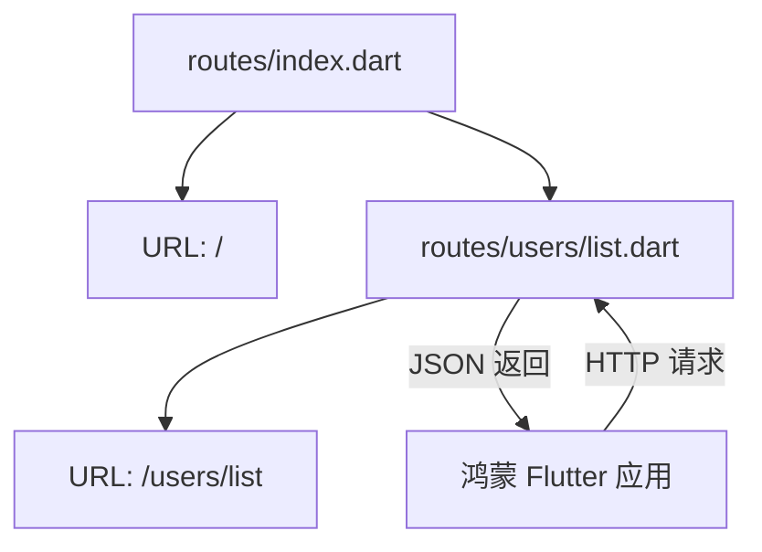
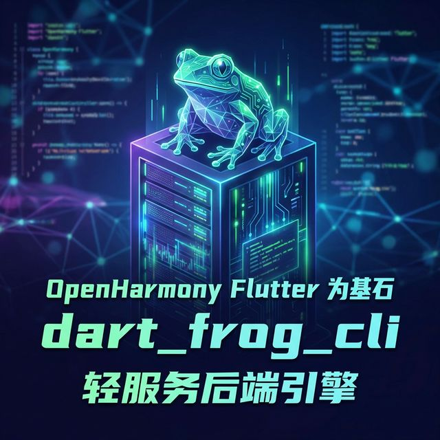

欢迎加入开源鸿蒙跨平台社区：[https://openharmonycrossplatform.csdn.net](https://openharmonycrossplatform.csdn.net)。

# Flutter for OpenHarmony：Flutter 三方库 dart_frog_cli 极简极速的服务端渲染（轻服务后端引擎）

## 前言

在鸿蒙（OpenHarmony）生态的开发中，我们不仅仅关注客户端的 UI 交互，往往还需要一个能极其快速响应、与 Flutter 数据模型无缝对接的“轻后端”。传统的 Java 或 Go 后端虽然强大，但维护两套语言模型是一套沉重的负担。

`dart_frog` 是一款由 Very Good Ventures 推出的极简 Dart 后端框架。而 `dart_frog_cli` 则是它的核心指挥部，通过极简的命令行操作，你可以在几秒钟内搭建出一个适配鸿蒙应用的 RESTful API 或 WebSocket 服务，实现“全栈 Java-less”的鸿蒙开发体验。

## 一、原理解析 / 概念介绍

### 1.1 基础概念

`dart_frog` 采用了极其创新的“基于文件系统的路由机制”。你不需要在代码里写长长的路由表，文件位置即 URL。



### 1.2 进阶概念

- **Middleware (中间件)**：用于处理鸿蒙全局的鉴权、日志记录、或是跨域保护。
- **Hot Reload (热重载)**：修改后端逻辑后，无需重启服务，鸿蒙应用即可感知最新 API 变化。

## 二、核心 API / 组件详解

### 2.1 安装 CLI 工具

在进行鸿蒙后端开发前，先全局安装指挥官：

```bash
dart pub global activate dart_frog_cli
```

### 2.2 创建路由处理函数

在 `routes/api/v1/hello.dart` 中，你只需要写一个极其简单的 `onRequest` 函数：

```dart
import 'package:dart_frog/dart_frog.dart';

Response onRequest(RequestContext context) {
  // ✅ 推荐做法：返回强类型的 JSON 响应，完美适配鸿蒙端侧解析
  return Response.json(
    body: {
      'status': 'OK',
      'platform': 'OpenHarmony',
      'msg': '来自 Dart Frog 的祝福'
    },
  );
}
```

## 三、场景示例

### 3.1 场景一：鸿蒙端侧“模拟数据源”开发

在进行鸿蒙业务联调时，如果正式后端还未准备好，我们可以用 `dart_frog` 极其快速地 Mock 出一套能真正运行的接口。

```dart
// 🎨 实战技巧：动态路径参数
// 文件路径: routes/post/[id].dart
import 'package:dart_frog/dart_frog.dart';

Response onRequest(RequestContext context, String id) {
  return Response.json(body: {'id': id, 'content': '示例内容...'});
}
```



## 四、OpenHarmony 平台适配挑战

### 4.1 局域网联调与证书策略

鸿蒙设备访问本地运行的后端时，通常会遇到 `Cleartext traffic` (不允许明文 HTTP) 的安全策略限制。

✅ **适配策略建议**：
1. **IP 映射**：不要在鸿蒙代码里写 `localhost`，必须使用局域网真实 IP（如：`192.168.1.5`）。
2. **鸿蒙安全例外配置**：在 `module.json5` 的网络链接配置中，添加对本地开发 IP 的 HTTPS 豁免名单。

```json
// 💡 config 建议：允许鸿蒙应用访问特定的本地开发机 IP
{
  "network": {
    "domain-config": [
      {"name": "192.168.1.5", "cleartext": true}
    ]
  }
}
```

## 五、综合实战示例代码

下面是搭建一个具有中间件（日志记录）功能的鸿蒙简易管理后台后端：

```dart
// middleware/log_middleware.dart
import 'package:dart_frog/dart_frog.dart';

Handler middleware(Handler handler) {
  return (context) async {
    // 💡 记录每一个来自鸿蒙设备的请求
    print('🐸 [Request] ${context.request.method} - ${context.request.url.path}');
    final response = await handler(context);
    return response;
  };
}

// routes/auth/login.dart
import 'package:dart_frog/dart_frog.dart';

Future<Response> onRequest(RequestContext context) async {
  if (context.request.method != HttpMethod.post) {
    return Response(statusCode: 405); // 方法不允许
  }
  
  final payload = await context.request.json();
  // 模拟鸿蒙特定的登录判断逻辑...
  return Response.json(body: {'token': 'harmony_secret_jwt_xxx'});
}
```


## 六、总结

`dart_frog_cli` 的引入，让鸿蒙开发者真正实现了“语言大一统”。你可以在 Flutter 项目和 Backend 项目之间极其自由地通过 Git submodule 共享 DTO 模型，避免了毁灭性的重复定义。

✅ **核心建议**：
1. 开发鸿蒙原生中台系统时，它是最佳的轻量化选型。
2. 结合 `dart_frog dev` 命令，享受和 Flutter UI 同样丝滑的开发热重载感受。

📦 更多的底层指导代码可进入：[AtomGit 示例专栏](https://atomgit.com)

---

欢迎加入开源鸿蒙跨平台社区：[开源鸿蒙跨平台开发者社区](https://openharmonycrossplatform.csdn.net)
