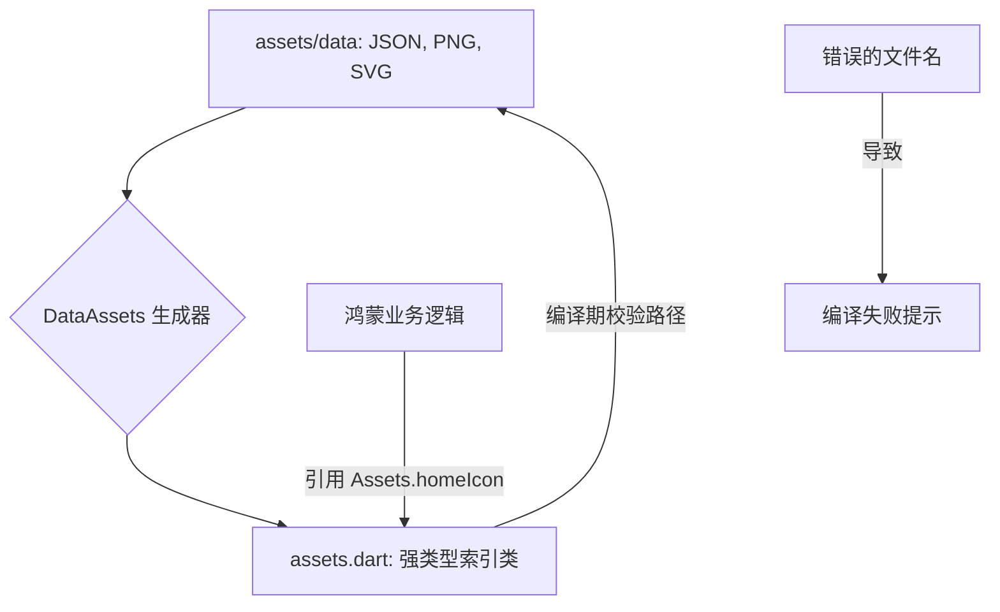

欢迎加入开源鸿蒙跨平台社区：[https://openharmonycrossplatform.csdn.net](https://openharmonycrossplatform.csdn.net)。

# Flutter for OpenHarmony：data_assets — 资源映射与自动装配实践


## 前言

在大型鸿蒙（OpenHarmony）工程中，手动管理静态资源路径极其容易出错。`data_assets` 提供了一套严谨的代码生成方案，能自动扫描资源并将其转换为强类型的 Dart 类，从根本上消灭了资源引用的运行时错误。

## 一、核心价值

### 1.1 基础概念

`data_assets` 的核心是资源到代码的静态映射。



### 1.2 进阶概念

- **Type Safety (类型安全)**：将字符串路径转化为 Dart 变量。
- **In-memory Access**：可以配合特定的生成策略，实现对配置文件的小型轻量级缓存读取。

## 二、核心 API / 组件详解

### 2.1 引入与工具安装

该库包含注解（Annotation）部分和生成器（Generator）部分：

```yaml
dependencies:
  data_assets: ^1.1.0

dev_dependencies:
  build_runner: any
  data_assets_generator: any
```

### 2.2 标记资源类

在鸿蒙工程中声明一个资源入口：

```dart
import 'package:data_assets/data_assets.dart';

@DataAsset(path: 'assets/configs')
class HarmonyConfigs extends $HarmonyConfigs {}
```

## 三、场景示例

### 3.1 场景一：鸿蒙级项目的“多主题”资源切换

自动生成包含所有图片路径的索引，确保开发时只需根据 IDE 的代码补全挑选图标。

```dart
// 💡 技巧：生成后的代码示例（伪代码）
class Assets {
  static const String ohosLogo = 'assets/brand/logo.png';
  static const String welcomeVideo = 'assets/media/start.mp4';
}

// UI 引用
Image.asset(Assets.ohosLogo) // ✅ 极其安全
```


## 四、OpenHarmony 平台适配挑战

### 4.1 资源目录层级过深的递归处理

鸿蒙工程往往按照 Ability 或原子化服务划分资源。

✅ **适配策略建议**：
1. **分模块扫描**：针对不同的 Feature 定义不同的 `@DataAsset` 注解类，避免生成的 `assets.dart` 文件过于庞大。
2. **文件名合法性检查**：该库对文件名极其敏感。在鸿蒙侧命名资源时，建议统一使用下划线（Snake Case），确保生成的 Dart 变量名符合规范。

## 五、综合实战示例代码

这是一个针对鸿蒙“配置文件”自动解析读取的示例：

```dart
import 'package:flutter/material.dart';
// 假设已生成配置文件索引
// import 'package:app/gen/assets.dart';

class HarmonyAssetLoader extends StatelessWidget {
  const HarmonyAssetLoader({super.key});

  @override
  Widget build(BuildContext context) {
    return Scaffold(
      appBar: AppBar(title: const Text('Asset 自动装配实战')),
      body: Center(
        child: Column(
          children: [
            const Text('正在加载系统图标...'),
            // 💡 核心：使用强类型引用，防止拼写错误
            Image.asset('assets/images/icon_main.png'), // 理想情况下变为 Assets.iconMain
            const SizedBox(height: 20),
            ElevatedButton(
              onPressed: () {
                // 演示资源路径的获取
                print('🚀 资源已就绪：assets/data/config.json');
              }, 
              child: const Text('检查配置文件路径'),
            ),
          ],
        ),
      ),
    );
  }
}
```


## 六、总结

`data_assets` 是鸿蒙工程走向“工业化生产”的必经之路。它彻底消灭了应用中因为“路径写错”而导致的闪退。

✅ **核心建议**：
1. 将 `build_runner watch` 作为开发时的常驻命令，实时同步资源变更。
2. 所有的图片、Lottie 动画、甚至是 JSON 配置文件，都统一通过此库进行管理。

📦 更多的底层指导代码可进入：[AtomGit 示例专栏](https://atomgit.com)

---

欢迎加入开源鸿蒙跨平台社区：[开源鸿蒙跨平台开发者社区](https://openharmonycrossplatform.csdn.net)
