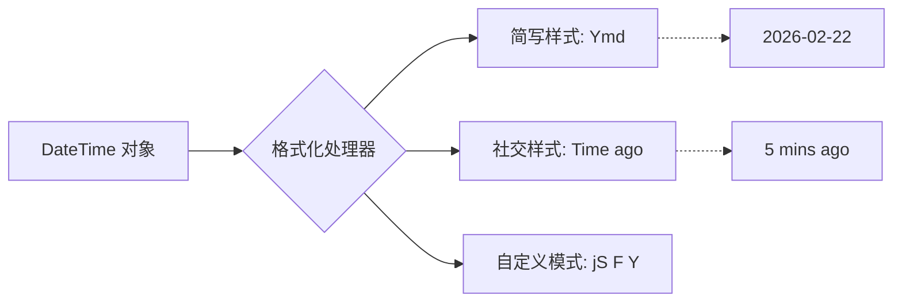

欢迎加入开源鸿蒙跨平台社区：[https://openharmonycrossplatform.csdn.net](https://openharmonycrossplatform.csdn.net)。

# Flutter for OpenHarmony：Flutter 三方库 date_time_format 极其强大的日期格式化工具（多风格显示）

## 前言

在鸿蒙（OpenHarmony）应用开发中，日期和时间的展示是一个极其高频且细节繁杂的需求。你是想要“2026-02-22”，还是想要“Feb 22nd, 2026”？或者是社交类应用中常见的“今晚 8 点”？

`date_time_format` 是一款轻量级、零依赖的日期格式化扩展库。它通过为 `DateTime` 类添加极其直观的扩展方法，让复杂的日期拼装变得像拼图一样简单。

## 一、原理解析 / 概念介绍

### 1.1 基础概念

传统的日期格式化往往需要通过 `Intl` 这种笨重的库。`date_time_format` 绕过了复杂的 ICU 配置，直接在 Dart 层提供可配置的占位符解析。



### 1.2 进阶概念

- **占位符机制 (Placeholders)**：如 `Y` 代表四位年份，`M` 代表三位月份简写。它支持超过 30 种不同的占位符组合。
- **扩展方法 (Extensions)**：你可以直接在任何日期对象上调用 `.format()`。

## 二、核心 API / 组件详解

### 2.1 依赖引入

在鸿蒙项目的 `pubspec.yaml` 中添加以下代码：

```yaml
dependencies:
  date_time_format: ^2.0.1
```

### 2.2 核心方法使用

```dart
import 'package:date_time_format/date_time_format.dart';

void harmonyDateDemo() {
  final now = DateTime.now();
  
  // ✅ 推荐做法：简单快速的内置格式
  print(now.format(DateTimeFormats.american)); // 输出: February 22, 2026 5:45 pm
  
  // 💡 自定义模式：S 还能实现 1st, 2nd, 3rd 这种英式序数输出
  print(now.format('D jS M, Y')); // 输出: Sun 22nd Feb, 2026
}
```

## 三、场景示例

### 3.1 场景一：鸿蒙健康应用的“每日运动摘要”

我们需要在标题上显示醒目的中文日期感。

```dart
import 'package:date_time_format/date_time_format.dart';

void showExerciseHeader() {
  final now = DateTime.now();
  // 🎨 场景模拟：格式化为“2026年02月22日”
  final displayDate = now.format('Y年m月d日');
  print('🏃‍♂️ 鸿蒙健康提醒 - $displayDate 运动已达标！');
}
```


## 四、OpenHarmony 平台适配挑战

### 4.1 国际化文本硬编码限制

`date_time_format` 的默认月份名称是英文。在鸿蒙国内版中，显示 "Feb" 显然不符合语境。

✅ **适配策略建议**：
1. **本地化注入**：该库支持 `DateTimeFormat.localizeMonth` 等方法来自定义语言包。
2. **时区一致性**：鸿蒙设备在休眠唤醒后，确保获取的 `DateTime` 经由系统同步。

```dart
// 💡 适配中文月份的简单方式
final chineseMonths = ['一', '二', '三', '四', ..., '十二'];
// 需调用库提供的设置接口...
```

## 五、综合实战示例代码

这是一个针对鸿蒙不同屏幕尺寸优化的日期展示中心页面：

```dart
import 'package:flutter/material.dart';
import 'package:date_time_format/date_time_format.dart';

class HarmonyTimeShowcase extends StatelessWidget {
  const HarmonyTimeShowcase({super.key});

  @override
  Widget build(BuildContext context) {
    final now = DateTime.now();

    return Scaffold(
      appBar: AppBar(title: const Text('鸿蒙日期美化实战')),
      body: ListView(
        padding: const EdgeInsets.all(16),
        children: [
          _buildCard("美式风格", now.format(DateTimeFormats.american)),
          _buildCard("紧凑风格", now.format('Y/m/d H:i')),
          _buildCard("带序数后缀", now.format('M jS, Y')),
          _buildCard("极简时间", now.format('h:i A')),
          _buildCard("自定义中文拼接", now.format('Y年m月d日')),
        ],
      ),
    );
  }

  Widget _buildCard(String title, String val) {
    return Card(
      child: ListTile(
        title: Text(title, style: const TextStyle(fontSize: 14, color: Colors.grey)),
        subtitle: Text(val, style: const TextStyle(fontSize: 20, fontWeight: FontWeight.bold, color: Colors.blueAccent)),
      ),
    );
  }
}
```


## 六、总结

`date_time_format` 是一款“小而美”的库。它去掉了复杂的本地化逻辑，只保留了最核心、最灵活的占位符模式，是非常适合鸿蒙轻量级应用的高效组件。

✅ **核心建议**：
1. 对于常规的后台管理系统或内容展示，该库的性能极大优于 `intl`。
2. 结合 `common_utils` 使用，效果极其震撼。

📦 更多的底层指导代码可进入：[AtomGit 示例专栏](https://atomgit.com)

---

欢迎加入开源鸿蒙跨平台社区：[开源鸿蒙跨平台开发者社区](https://openharmonycrossplatform.csdn.net)
