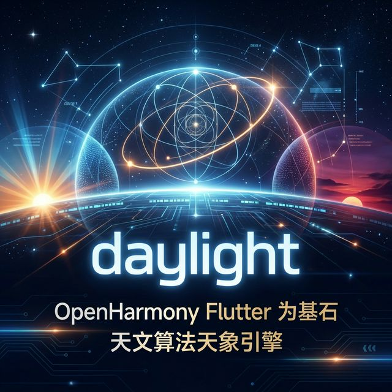
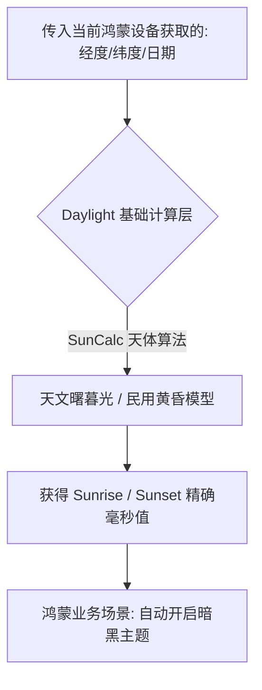

欢迎加入开源鸿蒙跨平台社区：[https://openharmonycrossplatform.csdn.net](https://openharmonycrossplatform.csdn.net)。

# Flutter for OpenHarmony：daylight — 鸿蒙设备精准日出日落计算



## 前言

在鸿蒙（OpenHarmony）的天气、摄影或智能主题类应用中，根据经纬度计算精准的日出日落时间是核心需求。`daylight` 库基于专业天文算法，支持纯本地计算相关天体相位，是构建地理感知能力的理想选择。

## 一、核心价值

### 1.1 基础概念

为了实现纯本地脱网计算，该库内置了大量的宇宙几何数学模型和常量公式。



### 1.2 进阶概念

- **Golden Hour (黄金时刻)**：除了最普通的日出日落，它能极其精准地得出适合摄影的“黄金时刻”与“蓝色时刻”。
- **Local Independence**：算法纯靠 Dart 引擎本地完成计算，在鸿蒙设备的弱网或者户外完全无网环境下同样坚如磐石。

## 二、核心 API / 组件详解

### 2.1 依赖引入

```yaml
dependencies:
  daylight: ^2.1.0 # 建议确认鸿蒙适配兼容的分支
```

### 2.2 构建极端精确的天体计算器

在鸿蒙工程中传入用户坐标以获取黄金时间：

```dart
import 'package:daylight/daylight.dart';

void calculateHarmonyLight() {
  // ✅ 指定天安门广场附近的经纬度常量
  final location = DaylightLocation(39.9042, 116.4074);
  
  // 实例化针对今天的计算上下文
  final daylight = DaylightCalculator(location);
  final dailyResults = daylight.calculateForDay(DateTime.now());
  
  // 💡 提取核心数据
  print('🌅 北京今天的极速日出时间：${dailyResults.sunrise}');
  print('🌇 即刻开启鸿蒙夜间模式的日落推荐点：${dailyResults.sunset}');
}
```

## 三、场景示例

### 3.1 场景一：鸿蒙级应用的“智慧护眼”引擎调度

应用不需要傻瓜式地在晚上 8 点开启夜间模式，而是根据用户所处半球的真实日落时间，极其优雅、渐进式地调暗 UI 背景。

```dart
// 💡 技巧：利用 twilight 属性探测夜间的真正深度
final twilightEnds = dailyResults.civilTwilightEnd; 
if (DateTime.now().isAfter(twilightEnds!)) {
   print('切换为纯黑模式');
}
```


## 四、OpenHarmony 平台适配挑战

### 4.1 位置获取的不确定性与精密度处理

由于天体位置算法极其依赖高精度的 `double` 值。

✅ **适配策略建议**：
1. **配合定位插件**：需要配合如鸿蒙底层 `location` 相关的包在获取到精确 GPS 定位后，再传入给 `DaylightLocation` 当做初始化参数。切记不要硬编码，哪怕相差几十公里，日出时间也有偏差。
2. **时区的极值映射**：如果在鸿蒙系统的全球化应用（UTC Time）环境下，务必将计算出的时间统一转换为 DateTime 的本地表达（`.toLocal()`），避免因为时区不同给用户带去极高的理解壁垒。

## 五、综合实战示例代码

这是一个结合了极其直观的终端时间转换实战的鸿蒙天文学 Demo：

```dart
import 'package:flutter/material.dart';
import 'package:daylight/daylight.dart';

class HarmonySkyLab extends StatefulWidget {
  const HarmonySkyLab({super.key});

  @override
  _HarmonySkyLabState createState() => _HarmonySkyLabState();
}

class _HarmonySkyLabState extends State<HarmonySkyLab> {
  String _lightInfo = "准备初始化宇宙级算法...";

  void _runAstrology() {
    final daylightCalculator = DaylightCalculator(DaylightLocation(31.2304, 121.4737)); // 上海
    final results = daylightCalculator.calculateForDay(DateTime.now());

    setState(() {
      _lightInfo = "📍 定位：上海\n"
                  "🌅 破晓黄昏: ${results.civilTwilightBegin?.toLocal().toString().substring(0, 16)}\n"
                  "🌄 日出时分: ${results.sunrise?.toLocal().toString().substring(0, 16)}\n"
                  "🌇 最佳摄影: ${results.goldenHourEnd?.toLocal().toString().substring(0, 16)}";
    });
  }

  @override
  Widget build(BuildContext context) {
    return Scaffold(
      appBar: AppBar(title: const Text('天象引擎实验室')),
      body: Center(
        child: Column(
          children: [
            const Padding(padding: EdgeInsets.all(20), child: Text('🌍 👇 基于位置的本地实时计算')),
            Text(_lightInfo, style: const TextStyle(fontSize: 18, height: 2), textAlign: TextAlign.center),
            const Spacer(),
            ElevatedButton(onPressed: _runAstrology, child: const Text('分析今日太阳相位')),
            const SizedBox(height: 50),
          ],
        ),
      ),
    );
  }
}
```


## 六、总结

`daylight` 让鸿蒙平台上的时间操作突破了单一钟表的维度。将自然宇宙的光影规律集成到你的代码中，从而为用户提供更符合生物钟的跨平台创新应用极其关键的落脚点。

✅ **核心建议**：
1. 涉及自然摄影、天气、健康护眼的鸿蒙应用必不可少。
2. 由于其实纯 Dart 包，不存在任何 C 底层调用瓶颈，鸿蒙 NEXT 可 100% 放心服用。

📦 更多的底层指导代码可进入：[AtomGit 示例专栏](https://atomgit.com)

---

欢迎加入开源鸿蒙跨平台社区：[开源鸿蒙跨平台开发者社区](https://openharmonycrossplatform.csdn.net)
