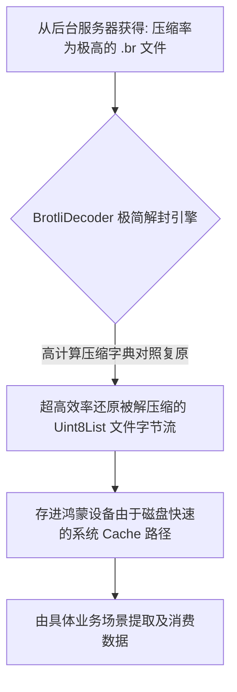

欢迎加入开源鸿蒙跨平台社区：[https://openharmonycrossplatform.csdn.net](https://openharmonycrossplatform.csdn.net)。

# Flutter for OpenHarmony：es_compression — 高性能 Brotli 与 Zstd 算法实战


## 前言

在重度数据交互的鸿蒙（OpenHarmony）应用中，高压缩率直接关系到加载速度与存储成本。`es_compression` 将前沿的 Brotli 与 Zstandard 算法引入客户端，能在保障性能的同时大幅降低网络流量，是对抗高带宽支出的利器。

## 一、核心价值

### 1.1 基础概念

为了在各跨平台移动端保障这些复杂 C+ 原源算法的可用，利用 Dart 特性搭建编解码器。



### 1.2 进阶概念

- **Zstandard (Zstd 极速算法支持)**：极具实战意义的现代算法支持，在压制等级持平的强压环境下其压缩速度超越 GZIP 两到三倍乃至以上，专门应对大容量海量记录（日志包）数据的处理与传输。
- **Stream Compression (切片流能力)**：在对大文件处理过程中可以不占据连续的几百兆大且沉重的内存开销，直接接载 `dart:io` 的转换流以流式通过解压和落盘工作。

## 二、核心 API / 组件详解

### 2.1 依赖引入

```yaml
dependencies:
  es_compression: ^2.1.0 # 建议确认相关编解码器兼容情况
```

### 2.2 构建高性能文本编解码示例

在鸿蒙工程中应用 Brotli 解析一段大面积配置请求的网络结果反馈：

```dart
import 'dart:convert';
import 'package:es_compression/brotli.dart';

void decodeHarmonyLargeBuffer(List<int> rawCompressedBytes) {
  // ✅ 推荐做法：极其简单犹如原生基础 ZLIB 一般的顶层编解
  final decodedBytes = brotli.decode(rawCompressedBytes);
  
  // 此时可以直接将其转化为超大配置 JSON
  final configDataStr = utf8.decode(decodedBytes);
  print('✅ 鸿蒙客户端借助 Brotli 算法瞬间完成了解压和字典重组！');
}

void encodeImportantLog(String payloadText) {
  // 💡 对于极其重磅的数据备份日志也可以发起上报时的预重压处理后再向外走
  final heavilyCompressedPayload = brotli.encode(utf8.encode(payloadText));
}
```

## 三、场景示例

### 3.1 场景一：鸿蒙级应用的“极致网络流”下行省流利器

让 Dio 网络组件支持原本其底层因为没内置而不兼容处理的前端 Brotli 网页/数据。

```dart
// 💡 技巧：如果你的后端大量采用 br 返回而不是 gzip
import 'package:es_compression/brotli.dart';
final BrotliCodec codec = BrotliCodec();
// 当请求截获到头部 content-encoding: br，则执行对于底层 byte 结构进行还原
var unzipped = codec.decoder.convert(response.data);
```


## 四、OpenHarmony 平台适配挑战

### 4.1 超密计算带来的极速降频与由于 Dart 单线程带来的阻塞冲突

因为在解密大面积数据时全权处于 Dart VM 基于字典对冲匹配计算环境。

✅ **适配策略建议**：
1. **强制 Isolate 逃亡部署**：在处于任何超越 100KB 及以上的繁重复原解压和打包过程中，务必要把相关任务切放置进纯净的 `compute(decodeHandler, rawBytes)` 的执行体里边去，因为主线程的渲染对于其将产生难以置信的灾难顿卡冲突情况。
2. **极权性能考量 (电池发热)**：若无必要极其节约每一丝传输带宽，在考虑采用 ZStd 等高等级重压缩往回上传发向云端接口数据时衡量对于鸿蒙端侧电量开销与上传请求时间，两者寻求某种折中。

## 五、综合实战示例代码

这是一个针对流解压缩技术的异步后台文件挂载下载体验环境实况 Lab：

```dart
import 'dart:convert';
import 'package:flutter/material.dart';
import 'package:es_compression/brotli.dart';

class HarmonyCodecLab extends StatefulWidget {
  const HarmonyCodecLab({super.key});

  @override
  _HarmonyCodecLabState createState() => _HarmonyCodecLabState();
}

class _HarmonyCodecLabState extends State<HarmonyCodecLab> {
  String _opStatus = "等待极端强力压缩算法处理...";

  void _runCompressionTest() {
    // 💡 原始海量冗余日志文本构造
    final largeRedundantLog = List.generate(1000, (i) => "鸿蒙告警监测日志: [系统节点] 处于挂载安全阈值").join("\n");
    final originalBytes = utf8.encode(largeRedundantLog);
    
    // 经过高强度 Brolti 重新缩编压制
    _opStatus = "原始开销: ${originalBytes.length} Bytes\n";
    final brBytes = brotli.encode(originalBytes);
    
    setState(() {
       _opStatus += "🚀 启用由于先进引擎重编: ${brBytes.length} Bytes\n";
       _opStatus += "节省总体开销约 ${(100 - (brBytes.length/originalBytes.length) * 100).toStringAsFixed(1)}%！";
    });
  }

  @override
  Widget build(BuildContext context) {
    return Scaffold(
      appBar: AppBar(title: const Text('前端引擎重算法试验平台')),
      body: Center(
        child: Column(
          children: [
            const Padding(padding: EdgeInsets.all(20), child: Text('🌍 开启工业极其前沿级压制测试')),
            Text(_opStatus, style: const TextStyle(fontSize: 18, color: Colors.blueGrey, height: 1.5)),
            const Spacer(),
            ElevatedButton(onPressed: _runCompressionTest, child: const Text('瞬间执行压铸试验')),
            const SizedBox(height: 50),
          ],
        ),
      ),
    );
  }
}
```


## 六、总结

`es_compression` 把极具工业前沿属性且一直多在服务端发力的 Brotli/ZStd 顶级体系能力真正平民化转移给予了各移动终端前置处理节点之中。这是开发者极其能够轻易省下海量 CDN/对象存储带宽极强利器。

✅ **核心建议**：
1. 日志压缩上传与离线资源大型初始化挂接等应用环节为绝对神兵利器，请必须纳入体系考察运用。
2. 配置于网络中间代理处如果碰到一些奇特的无法识别包，可以借它来作为解码探照器使用解析分析。

📦 更多的底层指导代码可进入：[AtomGit 示例专栏](https://atomgit.com)

---

欢迎加入开源鸿蒙跨平台社区：[开源鸿蒙跨平台开发者社区](https://openharmonycrossplatform.csdn.net)
