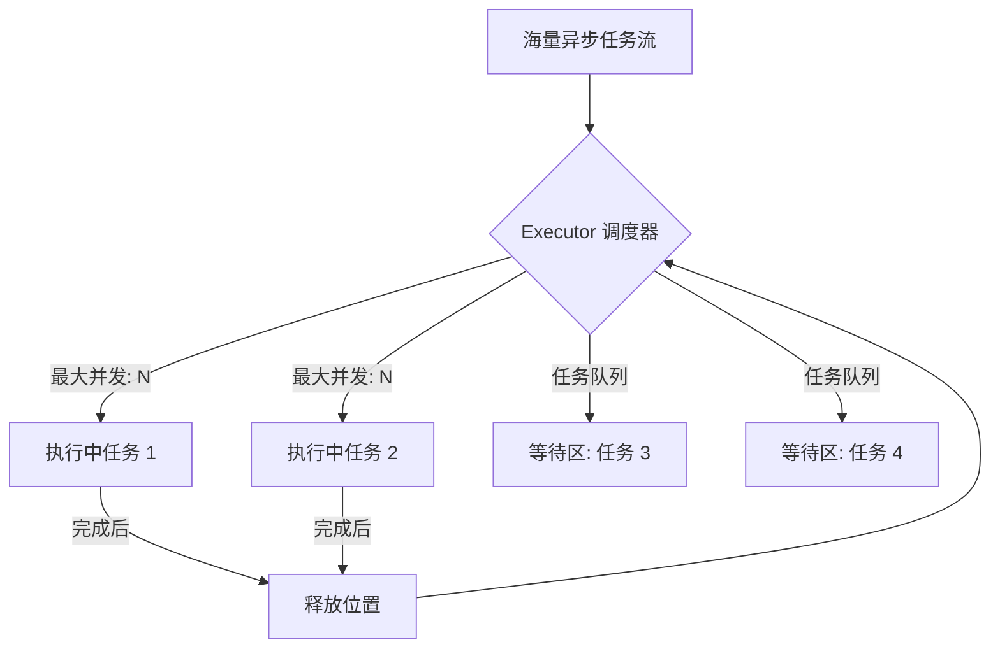

欢迎加入开源鸿蒙跨平台社区：[https://openharmonycrossplatform.csdn.net](https://openharmonycrossplatform.csdn.net)。

# Flutter for OpenHarmony：executor — 并发执行与限流控制器


## 前言

在鸿蒙（OpenHarmony）高性能开发中，同时处理海量异步任务（如批量下载或节点初始化）易导致系统资源过载。`executor` 提供了一套优雅的任务调度机制，允许开发者精确控制并发上限，通过队列平滑处理任务，保障应用流畅性。

## 一、核心价值

### 1.1 基础概念

`executor` 像是一个高效的流水线指挥官，它负责接收任务，并在限定的“加工位”（主线程/Isolate）中进行分发。



### 1.2 进阶概念

- **Concurrency (并发度)**：同一时刻允许运行的任务数。
- **Auto-Retry (自动重试)**：配合底层逻辑，它能实现对失败任务的有序重调度。
- **Isolate Support**：在鸿蒙多核环境下，可将任务下发到子线程中执行。

## 二、核心 API / 组件详解

### 2.1 初始化执行器

```dart
import 'package:executor/executor.dart';

final executor = Executor(concurrency: 5); // ✅ 推荐做法：限制并发数为 5，防止撑爆鸿蒙连接池
```

### 2.2 提交任务

```dart
void batchHarmonyDownload() async {
  for (var i = 0; i < 100; i++) {
    // 🎨 将任务计划入队
    executor.scheduleTask(() async {
      await Future.delayed(const Duration(seconds: 1));
      print('✅ 鸿蒙资源 $i 下载完成');
    });
  }
}
```

## 三、场景示例

### 3.1 场景一：鸿蒙级图库的批量相册索引

我们需要扫描分布式文件系统中的 500 张图片并生成缩略图，如果不限流，UI 必卡死。

```dart
import 'package:executor/executor.dart';

Future<void> indexHarmonyPhotos(List<String> paths) async {
  final photoExecutor = Executor(concurrency: 2); // 💡 技巧：计算密集型任务并发可以设低一点
  
  final results = await photoExecutor.joinAll(
     paths.map((p) => () => generateThumbnail(p)).toList()
  );
}
```


## 四、OpenHarmony 平台适配挑战

### 4.1 任务执行与生命周期解耦

鸿蒙应用在进入“最近任务”界面或后台挂起时，过多的正在执行任务可能被系统强杀。

✅ **适配策略建议**：
1. **持久化队列**：配合鸿蒙的 `PersistentStorage`。
2. **状态感知**：当接收到 `APP_STATE_BACKGROUND` 信号时，利用 `executor.close()` 优雅拒绝新任务入队，防止应用后台行为超标。

```dart
// 💡 适配提示：配合鸿蒙应用状态
void onAppBackground() {
  executor.close(); // 停止接收新任务，已有的会继续完成
}
```

## 五、综合实战示例代码

这是一个包含了进度反馈的鸿蒙批量 API 数据采集器：

```dart
import 'package:flutter/material.dart';
import 'package:executor/executor.dart';

class HarmonyTaskDashboard extends StatefulWidget {
  const HarmonyTaskDashboard({super.key});

  @override
  State<HarmonyTaskDashboard> createState() => _HarmonyTaskDashboardState();
}

class _HarmonyTaskDashboardState extends State<HarmonyTaskDashboard> {
  final _executor = Executor(concurrency: 3);
  int _pending = 0;
  int _completed = 0;

  void _addBulkTasks() {
    for (int i = 0; i < 30; i++) {
      setState(() => _pending++);
      _executor.scheduleTask(() async {
        await Future.delayed(const Duration(milliseconds: 1500));
        if (mounted) {
          setState(() {
            _pending--;
            _completed++;
          });
        }
      });
    }
  }

  @override
  Widget build(BuildContext context) {
    return Scaffold(
      appBar: AppBar(title: const Text('Executor 鸿蒙调度实战')),
      body: Center(
        child: Column(
          children: [
            const SizedBox(height: 30),
            CircularProgressIndicator(value: _completed / 30),
            const SizedBox(height: 20),
            Text('🏗️ 正在排队执行: $_pending', style: const TextStyle(fontSize: 18)),
            Text('✅ 已经完成任务: $_completed', style: const TextStyle(color: Colors.green)),
            const Spacer(),
            ElevatedButton(onPressed: _addBulkTasks, child: const Text('启动超大批量任务（并发限流：3）')),
            const SizedBox(height: 40),
          ],
        ),
      ),
    );
  }
}
```


## 六、总结

`executor` 是构建“工业级”鸿蒙应用、追求极致体验的最佳伴侣。它不仅仅是一个限流器，更是应对极高负载场景下一层坚固的“缓冲垫”。

✅ **核心建议**：
1. 网络请求密集型任务建议 `concurrency: 5-8`。
2. I/O 密集型或计算密集型任务建议 `concurrency: 2-3`。

📦 更多的底层指导代码可进入：[AtomGit 示例专栏](https://atomgit.com)

---

欢迎加入开源鸿蒙跨平台社区：[开源鸿蒙跨平台开发者社区](https://openharmonycrossplatform.csdn.net)
