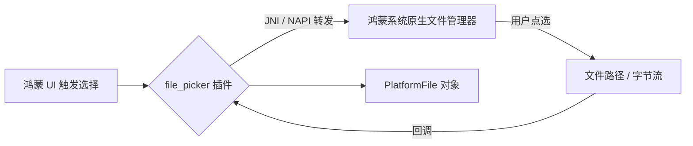

欢迎加入开源鸿蒙跨平台社区：[https://openharmonycrossplatform.csdn.net](https://openharmonycrossplatform.csdn.net)。

# Flutter for OpenHarmony：Flutter 三方库 file_picker — 多功能跨平台文件选择器（系统交互引擎）

## 前言

在鸿蒙（OpenHarmony）办公、教育或资源管理类应用中，让用户从海量的本地存储中“挑选”出一个文件（如：PDF 合同、教学视频、或者压缩包）是一个最基础的交互动作。手动去写底层的存储权限申请和文件树遍历极其痛苦。

`file_picker` 是一款享誉社区的文件选择插件。它不仅支持单选、多选，还支持按类型（图片、视频、任意文件等）过滤。在鸿蒙设备上，它能极其流畅地调起系统原生文件管理器，一站式解决文件拾取问题。

## 一、原理展示 / 概念介绍

### 1.1 基础概念

`file_picker` 通过 MethodChannel 调起鸿蒙系统的 FilePicker 接口。



### 1.2 进阶概念

- **PlatformFile**：不仅仅是路径，它还包含了文件名、大小以及读取文件字节流的便捷方法。
- **Type Filtering**：允许你指定允许选择的后缀（如：只选 `.txt` 和 `.doc`）。

## 二、核心 API / 组件详解

### 2.1 引入依赖

```yaml
dependencies:
  file_picker: ^8.0.0
```

### 2.2 拾取单文件示例

```dart
import 'package:file_picker/file_picker.dart';

void pickHarmonyFile() async {
  // ✅ 推荐做法：通过 pickFiles 调起选择
  FilePickerResult? result = await FilePicker.platform.pickFiles(
    type: FileType.custom,
    allowedExtensions: ['jpg', 'pdf', 'doc'],
  );

  if (result != null) {
    PlatformFile file = result.files.first;
    print('📦 已选择鸿蒙文件: ${file.name}, 大小: ${file.size}');
  }
}
```

## 三、场景示例

### 3.1 场景一：鸿蒙级应用的“简历附件”上传

让用户在求职应用中，从系统“下载”文件夹中快速选中 PDF 简历。

```dart
import 'package:file_picker/file_picker.dart';

Future<void> attachResume() async {
  // 💡 技巧：仅限单选，限制类型为 PDF
  FilePickerResult? result = await FilePicker.platform.pickFiles(
    type: FileType.custom,
    allowedExtensions: ['pdf'],
  );
  
  if (result != null) {
     // 处理上传逻辑...
  }
}
```


## 四、OpenHarmony 平台适配挑战

### 4.1 临时路径与读取权限

鸿蒙系统对文件路径有严格的沙箱保护（沙箱隔离）。从 FilePicker 拿到的路径可能是一个经过混淆的 URI 或者是临时缓存路径。

✅ **适配策略建议**：
1. **直接读取字节流**：不要过分依赖 `file.path`，因为在某些鸿蒙版本上，由于权限原因你可能无法根据路径再次打开文件。建议直接使用插件提供的 `file.bytes` 或通过 `File(file.path!).readAsBytes()` 立即消费。
2. **清理缓存**：大文件选择后，插件会在鸿蒙系统的缓存目录下产生副本。建议在任务完成后调用 `FilePicker.platform.clearTemporaryFiles()` 以节省用户空间。

## 五、综合实战示例代码

这是一个包含了多文件选择与列表展示的鸿蒙文件采集中心：

```dart
import 'package:flutter/material.dart';
import 'package:file_picker/file_picker.dart';

class HarmonyFileCollector extends StatefulWidget {
  const HarmonyFileCollector({super.key});

  @override
  _HarmonyFileCollectorState createState() => _HarmonyFileCollectorState();
}

class _HarmonyFileCollectorState extends State<HarmonyFileCollector> {
  List<PlatformFile> _files = [];

  void _pickFiles() async {
    final result = await FilePicker.platform.pickFiles(allowMultiple: true);
    if (result != null) {
      setState(() {
        _files = result.files;
      });
    }
  }

  @override
  Widget build(BuildContext context) {
    return Scaffold(
      appBar: AppBar(title: const Text('file_picker 鸿蒙实战')),
      body: ListView.builder(
        itemCount: _files.length,
        itemBuilder: (context, index) {
          final f = _files[index];
          return ListTile(
            leading: const Icon(Icons.file_present, color: Colors.blue),
            title: Text(f.name),
            subtitle: Text('${(f.size / 1024).toStringAsFixed(2)} KB'),
            trailing: const Icon(Icons.check_circle, color: Colors.green),
          );
        },
      ),
      floatingActionButton: FloatingActionButton(
        onPressed: _pickFiles,
        child: const Icon(Icons.add_to_photos),
      ),
    );
  }
}
```


## 六、总结

`file_picker` 为鸿蒙应用与系统文件资源之间搭起了一座“免维护”的桥梁。它极大程度简化了文件交互逻辑，是生产力工具开发者的首选。

✅ **核心建议**：
1. 合理使用 `type` 过滤器，通过系统级的预览减少用户错误点选。
2. 涉及移动端多选大文件时，务必监听内存状态。

📦 更多的底层指导代码可进入：[AtomGit 示例专栏](https://atomgit.com)

---

欢迎加入开源鸿蒙跨平台社区：[开源鸿蒙跨平台开发者社区](https://openharmonycrossplatform.csdn.net)
