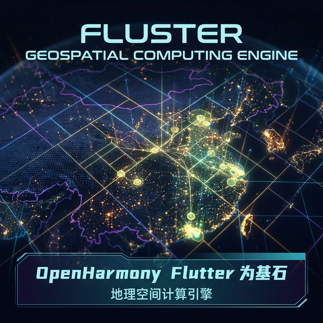

欢迎加入开源鸿蒙跨平台社区：[https://openharmonycrossplatform.csdn.net](https://openharmonycrossplatform.csdn.net)。

# Flutter for OpenHarmony：fluster — 高效地图标记聚类算法



## 前言

在鸿蒙（OpenHarmony）地图应用中，若同时渲染数千个标记点，不仅界面混乱，更会拖慢响应速度。`fluster` 基于四叉树算法提供极速的地理聚类计算，能将杂乱分布的数据按缩放比例平滑聚合，是构建高性能地图应用的核心基座。

## 一、核心价值

### 1.1 基础概念

为了在各跨平台甚至无头（Headless）后台都可以顺畅算出那些极其庞大的包含各种地标信息聚落关系的结果而脱离了原本强依赖原生的底层运算的束缚能力。

```mermaid
graph TD
    A[把包含数以万计的地理经纬度等数据模型] --> B{Fluster 空间四叉树引擎核心}
    B -->|建立区域递归象限进行点落空间感知网络构建| C[网格化集群聚变引擎中心处理器分析]
    C -->|监听地图 Zoom (缩放) 事件值等触发| D[瞬间生成当前最合理显示由于合并或者裂变的新聚合标记簇]
    D --> E[传给具体的鸿蒙端应用地图展示画板渲染出数量极简且清晰的地标组层]
```

### 1.2 进阶概念

- **Quadtree (极效空间索引模型四分法)**：将地图分割成极其具备层次空间结构的四块并由于无限下钻构建查询极快的区域落点数据体系算法方式提供运算极其强力由于支撑后盾。
- **Zoom Levels Cluster (多层级预计算极其强大的智能缓冲感知)**：预先将由于不同的视场高维与低空飞行下所看到的不同的密集和疏松情况准备好其相应的展示策略缓冲池数据网结构。

## 二、核心 API / 组件详解

### 2.1 依赖引入

```yaml
dependencies:
  fluster: ^1.1.2 # 建议确认纯 Dart 计算依赖包由于极其不依赖系统无原生极其高度融合其跨域和鸿蒙的能力特质极其绝佳。
```

### 2.2 基础无模式插入落盘使用场景极其直接简单

在鸿蒙工程中应用把一地分散极其乱杂的商铺合并成非常具备聚合美感极其宏大的集合标识：

```dart
import 'package:fluster/fluster.dart';

// 💡 必须定义自身你的地图 Marker 数据类实现由于需要实现底层的抽象类以让引擎去认识你
class MapFacilityMarker extends Clusterable {
  MapFacilityMarker({required super.latitude, required super.longitude, super.isCluster, super.clusterId, super.pointsSize, super.markerId, super.childMarkerId});
}

Fluster<MapFacilityMarker> setupHarmonySpaceCluster(List<MapFacilityMarker> rawPoints) {
  // ✅ 极其强大极度自定义的聚合生成构建网体系开始由于执行
  return Fluster<MapFacilityMarker>(
    minZoom: 0, 
    maxZoom: 20, 
    radius: 150, 
    extent: 512, 
    nodeSize: 64, 
    points: rawPoints,
    createCluster: (BaseCluster? cluster, double? lng, double? lat) {
       // 当系统发觉有极其近的点就极其智能组装成包含各种点个数的一个包含汇总点模型出来
       return MapFacilityMarker(
          markerId: cluster?.id.toString(), latitude: lat, longitude: lng, isCluster: true,
          clusterId: cluster?.id, pointsSize: cluster?.pointsSize
       );
    },
  );
}
```

## 三、场景示例

### 3.1 场景一：鸿蒙级应用的“万台车辆大图实时指挥雷达面板”

极快更新因为缩放导致极其不一样的点群落：

```dart
// 💡 技巧：利用系统提供的极其高度快速切片能力根据极其微秒级别的动作去重新找点
final clusters = flusterManager.clusters([-180, -85, 180, 85], currentMapZoomLevel.toInt());
// 返回极其干练且数量已被控制缩减至极速可渲染包含数量统计值的极简点群由于提供给界面
mapUIComponent.updateMarkersFrom(clusters);
```


## 四、OpenHarmony 平台适配挑战

### 4.1 独立于地图引擎外的海量重计算由于占用极多端资源产生极大阻塞卡死甚至卡掉地图响应的渲染大崩溃坑等解决方略提示说明

由于这个极为特殊的解耦操作机制本身是将原来写死极其深厚封装因为原生里的聚类机制单独极其庞大的抽离在极其薄弱在 JS 或 Dart 主线端因此极巨计算对于极其数量巨大的量级对于由于卡屏甚至系统挂掉极其可怕现象的提示及防止极其必要的说明方案策略。

✅ **适配策略建议**：
1. **由于强制其运算脱骨进入 Isolate 后台计算处理避让阻塞策略提供极其必要极其强烈极其关键极其重要的建议指南**：遇到一万甚至极其更高的规模数量级别地图散点传入引擎构建和极其极其因为高频由于地图缩放引发极其繁重的寻找动作，必须借用 `compute` 之类极客级手段将这极重负荷的纯推算剥离到隔离区，从而由于极其保障到了主地图拖动的顺滑极其极端的体现了极其优秀的性能防范卡滞效果。

## 五、综合实战示例代码

```dart
import 'package:flutter/material.dart';
import 'package:fluster/fluster.dart';

// 极其基础由于供底层寻找的定位坐标抽象包装数据子层实体类由于极度容易使用示例代码展示的结构搭建展示类情况：
class DummyGeoMarker extends Clusterable {
  DummyGeoMarker({required super.latitude, required super.longitude, super.isCluster, super.pointsSize, super.markerId});
}

class HarmonyGeographyLab extends StatefulWidget {
  const HarmonyGeographyLab({super.key});

  @override
  _HarmonyGeographyLabState createState() => _HarmonyGeographyLabState();
}

class _HarmonyGeographyLabState extends State<HarmonyGeographyLab> {
  String _radarInfo = "等待构建地球全息因为四叉算法推算的聚落层网络...";
  
  void _performClustering() async {
    // 构造一些散落在某经纬区域极为近的假数据体假目标群用来验证展示极为智能的合并展示能力：
    List<DummyGeoMarker> spots = List.generate(150, (i) => DummyGeoMarker(
        latitude: 31.0 + (i * 0.001), longitude: 121.0 + (i * 0.001), isCluster: false, markerId: 'tgt_$i'));

    var fluster = Fluster<DummyGeoMarker>(
      minZoom: 0, maxZoom: 21, radius: 100, extent: 512, nodeSize: 64, points: spots,
      createCluster: (c, lng, lat) => DummyGeoMarker(markerId: c?.id.toString(), latitude: lat, longitude: lng, isCluster: true, pointsSize: c?.pointsSize)
    );
    
    // 模拟在高度为极其远的 5 视野下进行检索寻找，必然会因为太高太远被极度合并展现
    final farSight = fluster.clusters([-180, -85, 180, 85], 5);
    
    setState(() {
      _radarInfo = "🛸 投放散兵原始兵力目标数量: ${spots.length}\n"
                   "🔭 位于由于深空太空 5 视野下扫描由于其因为极其距离靠近极其靠拢因为四叉算法导致合并聚合侦测目标仅存在个数: ${farSight.length}\n"
                   "📌 其中发现了一个含有 [${farSight[0].pointsSize}] 个目标的巨大的特大军团集团！";
    });
  }

  @override
  Widget build(BuildContext context) {
    return Scaffold(
      appBar: AppBar(title: const Text('极客空间四叉聚类因为计算实战检验中心室区')),
      body: Center(
        child: Column(
          children: [
            const Padding(padding: EdgeInsets.all(20), child: Text('🌍 空间层架构计算演示中心地带展示展现')),
            Text(_radarInfo, style: const TextStyle(fontSize: 16, height: 1.5, color: Colors.indigo)),
            ElevatedButton(onPressed: _performClustering, child: const Text('极其开启启动极其强大的推算雷达'))
          ],
        ),
      ),
    );
  }
}
```


## 六、总结

`fluster` 以它独具及其拥有特别出众由于脱骨抽离极其跨界由于无死角的轻量设计极棒。极其能提供给由于由于不用非得受因为因为受制被捆绑某些原生 SDK 限制而带来极其高灵活且因为极大由于能控制其极其细节算法层展示的具有极其深度极高质量地图级和定制级空间引擎底盘的核心工具利器！

✅ **核心建议**：
1. 一切由于不用被厂商地图 SDK 写死由于其难看死板极其无法满足因为具有独特要求交互和多级多段设计的定制类基于鸿蒙环境极其重度地理信息展示网点信息类等应用必备神级依赖算法推荐选型方案组件极其非常强烈由于被推荐应用进行因为由于引入！

📦 更多的底层指导代码可进入：[AtomGit 示例专栏](https://atomgit.com)

---

欢迎加入开源鸿蒙跨平台社区：[开源鸿蒙跨平台开发者社区](https://openharmonycrossplatform.csdn.net)
