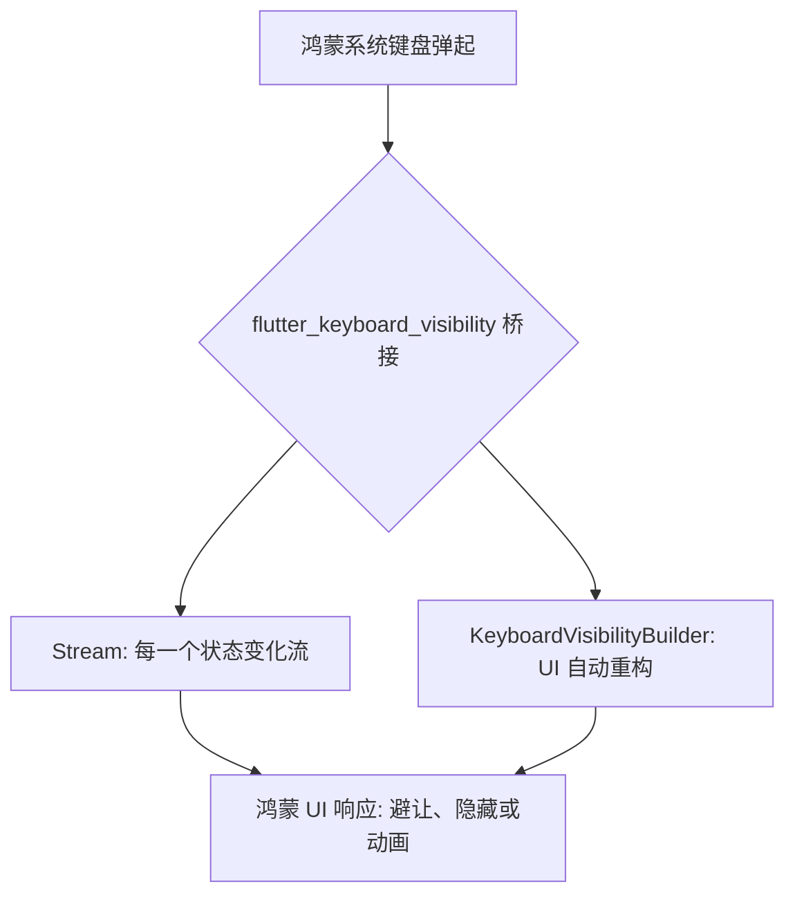

欢迎加入开源鸿蒙跨平台社区：[https://openharmonycrossplatform.csdn.net](https://openharmonycrossplatform.csdn.net)。

# Flutter for OpenHarmony：flutter_keyboard_visibility — 软键盘感知与避让实战


## 前言

在鸿蒙（OpenHarmony）社交或表单应用中，软键盘弹起常会导致组件遮挡或背景拉伸问题。`flutter_keyboard_visibility` 提供了响应式的键盘状态监测，帮助开发者轻松实现组件避让与动画联动，是优化移动端输入体验的利器。

## 一、核心价值

### 1.1 基础概念

为了在 Flutter 层捕获键盘状态，插件通过 MethodChannel 与鸿蒙原生的键盘生命周期钩子进行握手。



### 1.2 进阶概念

- **Reactive State (响应式状态)**：不仅仅是真/假（True/False），你可以实时监听键盘高度的变化轨迹（在某些平台上），从而实现与键盘高度完全同步的“跟手”动画。
- **Auto-Dispose**：在鸿蒙页面销毁时自动切断监听，防止内存泄露。

## 二、核心 API / 组件详解

### 2.1 依赖引入

```yaml
dependencies:
  flutter_keyboard_visibility: ^6.0.0
```

### 2.2 使用 Builder 快速驱动 UI

在鸿蒙工程中，如果你只想在键盘出现时隐藏某个组件，这是最简单的方法：

```dart
import 'package:flutter_keyboard_visibility/flutter_keyboard_visibility.dart';

Widget buildHarmonyInputPage() {
  return KeyboardVisibilityBuilder(
    builder: (context, isKeyboardVisible) {
      return Column(
        children: [
          const TextField(decoration: InputDecoration(labelText: '请输入反馈内容')),
          const Spacer(),
          // ✅ 推荐做法：当键盘可见时，自动隐藏底部装饰或广告
          if (!isKeyboardVisible) 
            const Text('💡 鸿蒙提示：输入完成后请确认无误')
        ],
      );
    },
  );
}
```

### 2.3 在逻辑层进行全局监听

```dart
var keyboardVisibilityController = KeyboardVisibilityController();

// 监听状态改变
keyboardVisibilityController.onChange.listen((bool visible) {
  print('⌨️ 鸿蒙软键盘状态变化: ${visible ? "弹起" : "收起"}');
});
```

## 三、场景示例

### 3.1 场景一：鸿蒙级聊天的“跟手”底部输入框

在聊天页面，键盘弹起的瞬间需要同时平滑上移输入框，并由于视口变小自动滚动列表到底部。

```dart
import 'package:flutter_keyboard_visibility/flutter_keyboard_visibility.dart';

void setupHarmonyChat() {
  keyboardVisibilityController.onChange.listen((bool visible) {
    if (visible) {
       // 💡 技巧：延时微调，确保键盘动画完成
       _scrollController.jumpTo(_scrollController.position.maxScrollExtent);
    }
  });
}
```


## 四、OpenHarmony 平台适配挑战

### 4.1 不同输入法导致的“高度跳变”

鸿蒙系统支持多种第三方输入法，有的带有庞大的预测栏。

✅ **适配策略建议**：
1. **配合 MediaQuery**：该插件擅长判断“可见性”。如果需要极其精确的高度避让，建议配合 `MediaQuery.of(context).viewInsets.bottom` 使用，以获取物理像素级的遮挡高度。
2. **避让过度刷新**：键盘弹起过程可能会触发多次 `onChange`。建议在监听逻辑中加入简单的防抖（Debounce）处理。

## 五、综合实战示例代码

这是一个包含了基础 UI 自动避让与状态反馈的鸿蒙登录页面：

```dart
import 'package:flutter/material.dart';
import 'package:flutter_keyboard_visibility/flutter_keyboard_visibility.dart';

class HarmonyKeyboardLab extends StatelessWidget {
  const HarmonyKeyboardLab({super.key});

  @override
  Widget build(BuildContext context) {
    return KeyboardVisibilityBuilder(
      builder: (context, isVisible) {
        return Scaffold(
          appBar: AppBar(title: const Text('键盘感知 - 鸿蒙实战')),
          body: Padding(
            padding: const EdgeInsets.all(30),
            child: Column(
              children: [
                // 💡 演示：键盘出现时缩小 Logo，留出输入空间
                AnimatedContainer(
                  duration: const Duration(milliseconds: 300),
                  height: isVisible ? 50 : 150,
                  child: const Icon(Icons.security, size: 80, color: Colors.blue),
                ),
                const TextField(decoration: InputDecoration(labelText: '开发者账号')),
                const TextField(decoration: InputDecoration(labelText: '动态校验码')),
                const Spacer(),
                if (!isVisible) 
                  ElevatedButton(onPressed: () {}, child: const Text('安全登录鸿蒙中心')),
              ],
            ),
          ),
        );
      },
    );
  }
}
```


## 六、总结

`flutter_keyboard_visibility` 为鸿蒙应用提供了一种极其体面的方式来处理“小屏幕下的输入竞争”。它让开发者能以极其敏锐的姿态，响应系统最频繁的交互动作。

✅ **核心建议**：
1. 大型表单页面，使用该插件来动态隐藏不必要的非输入组件。
2. 在处理复杂的键盘联动动画时，它是监听触发的第一时机。

📦 更多的底层指导代码可进入：[AtomGit 示例专栏](https://atomgit.com)

---

欢迎加入开源鸿蒙跨平台社区：[开源鸿蒙跨平台开发者社区](https://openharmonycrossplatform.csdn.net)
