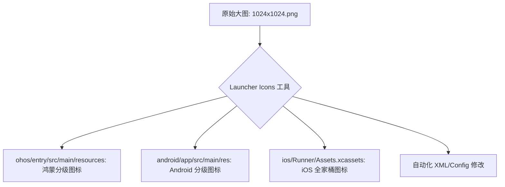
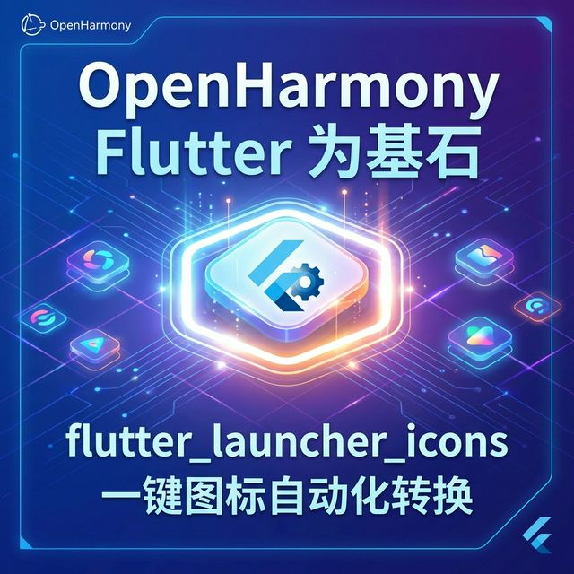

欢迎加入开源鸿蒙跨平台社区：[https://openharmonycrossplatform.csdn.net](https://openharmonycrossplatform.csdn.net)。

# Flutter for OpenHarmony：Flutter 三方库 flutter_launcher_icons — 一键自动化生成多端应用图标（品牌自动化引擎）

## 前言

在鸿蒙（OpenHarmony）应用开发的最后冲刺阶段，你是否还在为了生成几十张不同尺寸（hdpi, xhdpi, xxhdpi...）的应用图标而焦头烂额？手动裁剪图片不仅低效，还容易出现缩放后的边缘锯齿或比例失效。

`flutter_launcher_icons` 是 Flutter 生态中装机量极其庞大的 CLI 工具。它能让你仅需一张高分辨率的原始图片，通过一行简单的命令，自动化为鸿蒙、Android 和 iOS 等所有平台裁剪、重命名并放置好对应的图标。在鸿蒙应用追求“像素级完美”的视觉标准下，它是你的品牌工业化利器。

## 一、原理展示 / 概念介绍

### 1.1 基础概念

本库通过脚本读取你的单张 PNG/SVG 原始文件，并按照各个操作系统的标准目录结构进行自动化分发。



### 1.2 进阶概念

- **Adaptive Icons (自适应图标)**：完美支持 Android 的前景（Foreground）与背景（Background）分离架构，让图标支持各种抖动和遮罩效果。
- **Image Cropping**：内置了符合标准的 Alpha 通道处理和圆角预留。

## 二、核心 API / 组件详解

### 2.1 安装与配置

该工具纯粹在开发阶段使用，请在 `pubspec.yaml` 中添加：

```yaml
dev_dependencies:
  flutter_launcher_icons: ^0.13.1

# ✅ 推荐做法：在根目录下直接定义配置
flutter_launcher_icons:
  android: "launcher_icon"
  ios: true
  image_path: "assets/images/app_logo_v3.png"
  min_sdk_android: 21 # 针对 Android 的特定配置
```

### 2.2 执行生成命令

在你的终端（如鸿蒙 DevEco-Studio 内置终端）输入：

```bash
dart run flutter_launcher_icons:main
```

## 三、场景示例

### 3.1 场景一：鸿蒙级应用的“快速换肤/多环境”分发

当你有“开发版”、“测试版”、“正式版”三种由于图标不同的构建需求时。

```yaml
# 💡 技巧：创建一个独立的配置文件 flutter_launcher_icons-dev.yaml
flutter_launcher_icons:
  image_path: "assets/images/logo-dev.png"
  # 运行命令时指定配置文件：
  # dart run flutter_launcher_icons:main -f flutter_launcher_icons-dev.yaml
```



## 四、OpenHarmony 平台适配挑战

### 4.1 鸿蒙系统特有的路径结构适配

鸿蒙系统的图标通常存放在 `resources/base/media` 或特定的 `element` 目录下，文件格式要求可能与 Android 略有出入。

✅ **适配策略建议**：
1. **预览校验**：由于鸿蒙系统对于方形图标的自动裁切逻辑（Mask）可能与 iOS 的圆角策略不通。运行完工具后，务必通过鸿蒙真机或模拟器的主屏幕预览一下图标是否出现了不期望的黑边。
2. **前景图间隙预留**：建议提供的原始大图四周留出 1/6 左右的透明空间，防止在鸿蒙某些主题下由于过度缩放导致图标内容被切断（Bleed Region）。

## 五、综合实战示例代码

这是一个包含了“自适应背景色”的高级配置演示：

```yaml
# pubspec.yaml
flutter_launcher_icons:
  image_path: "assets/images/icon_main.png"
  # 为 Android 开启自适应图标支持
  adaptive_icon_background: "#FFFFFF" 
  adaptive_icon_foreground: "assets/images/icon_foreground.png"
  # 为 Web 平台也顺便生成图标
  web:
    generate: true
    image_path: "assets/images/icon_main.png"
    backgroundColor: "#2196F3"
    themeColor: "#2196F3"
```


## 六、总结

`flutter_launcher_icons` 将数小时的繁琐美工琐事缩减到了 10 秒之内。它不仅极大地提升了研发效率，更确保了鸿蒙应用在不同分级屏幕下都能拥有及其锐利、规范的品牌入口。

✅ **核心建议**：
1. 始终保留 1024x1024 的高品质 PNG 原图。
2. 每当应用更名或品牌策略调整时，第一时间跑一遍脚本。

📦 更多的底层指导代码可进入：[AtomGit 示例专栏](https://atomgit.com)

---

欢迎加入开源鸿蒙跨平台社区：[开源鸿蒙跨平台开发者社区](https://openharmonycrossplatform.csdn.net)
