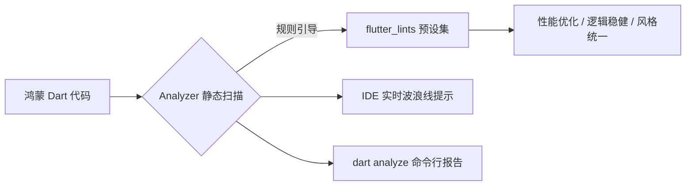

欢迎加入开源鸿蒙跨平台社区：[https://openharmonycrossplatform.csdn.net](https://openharmonycrossplatform.csdn.net)。

# Flutter for OpenHarmony：Flutter 三方库 flutter_lints — 守护代码质量的官方严选规范（静态扫描引擎）

## 前言

在鸿蒙（OpenHarmony）跨平台项目的协作开发中，代码质量的腐化往往是从细节开始的：有人没写 `const` 导致 UI 重复渲染性能下降，有人用了不推荐的私有 API 导致版本升级时崩溃，有人代码风格混乱导致他人难以维护。

`flutter_lints` 是一款包含官方推荐（Recommended）规则集的静态分析库。它不仅仅是一堆“警告”，更是由 Google 专家团队背书的开发最佳实践。在鸿蒙这种注重极致性能的系统上，遵循这些 Lints 规则能帮你自动化地规避掉 80% 的性能陷阱和逻辑隐患。

## 一、原理展示 / 概念介绍

### 1.1 基础概念

Lint 是一种静态扫描工具，它不运行代码，而是通过解析抽象语法树（AST）来发现潜在问题。



### 1.2 进阶概念

- **Recommended Rules**：涵盖了对性能影响最大的规则，如强制标识没有状态改变的 Widget 为 `const`。
- **Core Rules**：更底层的代码合法性和稳健性规则。

## 二、核心 API / 组件详解

### 2.1 依赖引入与配置

在鸿蒙工程的 `pubspec.yaml` 中添加，通常放在 `dev_dependencies` 下：

```yaml
dev_dependencies:
  flutter_lints: ^4.0.0
```

然后在工程根目录创建/修改 `analysis_options.yaml` 文件：

```yaml
include: package:flutter_lints/flutter.yaml # ✅ 推荐做法：一键引入官方严选全家桶

analyzer:
  # 💡 技巧：根据鸿蒙业务需求，可以开启/关闭特定规则
  errors:
    missing_required_param: error # 把缺失必选参数这类警告提升为 Error，防止发布事故
```

## 三、场景示例

### 3.1 场景一：鸿蒙级应用的“性能死角”清理

Lint 会强制要求你在可能的地方使用 `const`。

```dart
// ❌ 差的代码
Widget build(BuildContext context) {
  return Container(child: Text('欢迎来到鸿蒙世界')); // 每次父组件刷新，这里都会重新创建对象
}

// ✅ 好的代码 (Lint 自动提示)
Widget build(BuildContext context) {
  return const Container(child: Text('欢迎来到鸿蒙世界')); // 💡 节省内存与 CPU 调度，这在鸿蒙穿戴设备上尤其重要
}
```


## 四、OpenHarmony 平台适配挑战

### 4.1 适配过程中对于“非推荐 API”的容忍度

在鸿蒙特定的适配库中，有时我们不得不使用一些标记为“弃用”或“实验性”的接口。

✅ **适配策略建议**：
1. **局部忽略 (Ignoring)**：不要因为一个特殊情况就关闭全局规则。使用 `// ignore: ...` 注释局部掩盖，并写明注释。
2. **严进宽出**：在 CI/CD 流中强制执行 `dart analyze`。如果由于 Lint 不通过，则禁止代码合并进鸿蒙主分支。

```dart
// ignore_for_file: avoid_print 
// 💡 适配提示：在鸿蒙调试阶段，某些文件可能需要大量打印日志，可以单文件禁用
```

## 五、综合实战示例代码

这是一个包含了多条 Lint 优化建议的、高质量鸿蒙业务代码模板：

```dart
import 'package:flutter/material.dart';

/// 💡 良好习惯：遵循 flutter_lints，为每个类添加中文文档注释
class HarmonyCleanWidget extends StatelessWidget {
  /// 💡 良好习惯：添加 Key，方便鸿蒙 UI 树精准查找
  const HarmonyCleanWidget({super.key});

  @override
  Widget build(BuildContext context) {
    // 💡 核心：尽量提取可被 const 的组件，优化鸿蒙刷新帧率
    return const Scaffold(
      body: Center(
        child: Column(
          children: [
             Text('代码越整洁，性能越强悍'),
             Icon(Icons.check_circle_outline, color: Colors.green),
          ],
        ),
      ),
    );
  }
}
```


## 六、总结

`flutter_lints` 就像是鸿蒙项目经理的“代码显微镜”。它不仅仅保证了代码好看，更通过静态约束手段，强制开发者写出在鸿蒙底层运行更加高效的代码。

✅ **核心建议**：
1. 鸿蒙新项目初始化的第一步，就是引入并激活 `flutter_lints`。
2. 每一个“警告”背后几乎都隐藏着一个潜在的 Bug 或性能瓶颈，千万不要视而不见。

📦 更多的底层指导代码可进入：[AtomGit 示例专栏](https://atomgit.com)

---

欢迎加入开源鸿蒙跨平台社区：[开源鸿蒙跨平台开发者社区](https://openharmonycrossplatform.csdn.net)
