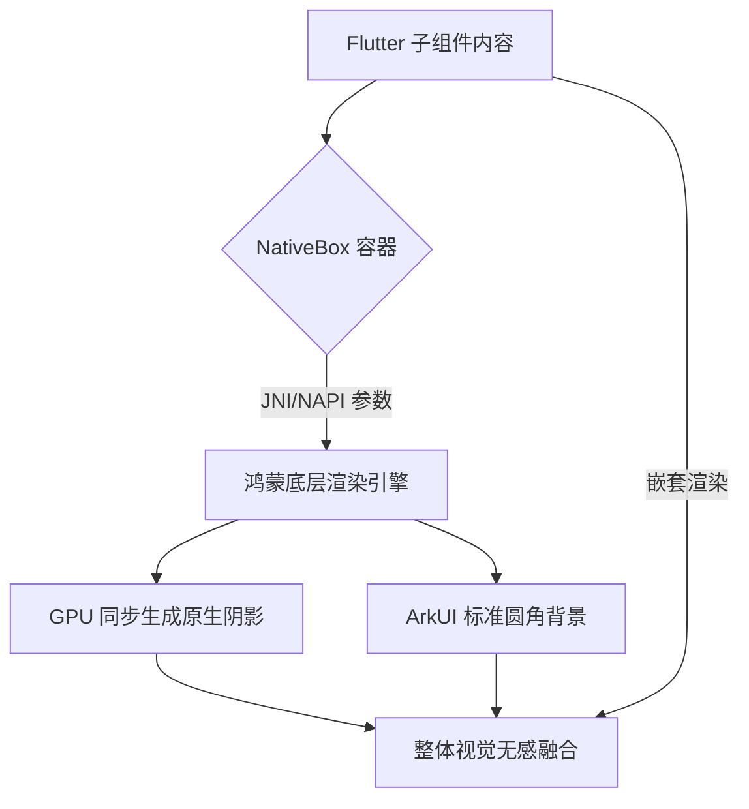
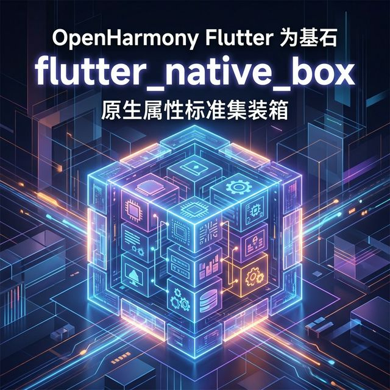

欢迎加入开源鸿蒙跨平台社区：[https://openharmonycrossplatform.csdn.net](https://openharmonycrossplatform.csdn.net)。

# Flutter for OpenHarmony：Flutter 三方库 flutter_native_box — 原生圆角与阴影极致容器（容器增强引擎）

## 前言

在鸿蒙（OpenHarmony）高颜值 UI 的开发中，“圆角卡片”与“多层级阴影（Shadows）”是构建空间感的核心元素。虽然 Flutter 的 `DecoratedBox` 和 `Container` 足够优秀，但在追求与鸿蒙系统全局控件 100% 视觉严丝合缝的过程中，尤其是阴影的高斯模糊质量（Blur Quality）以及渐变背景的平滑度上。

`flutter_native_box` 是一款硬核级容器库。它不再是软件模拟绘图，而是直接通过 PlatformView 拉起鸿蒙系统的原生容器容器（在 ArkUI 中为 `Column` 或 `Stack` 的样式底座）。这意味着你将获得：系统最权威的动态光影反馈、随手势极其自然变化的材质（Material）质感。在构建“精装修级”鸿蒙应用时，它是你的基石。

## 一、原理展示 / 概念介绍

### 1.1 基础概念

本库通过向鸿蒙底层渲染管线注册样式，实现控件的“原生化重涂”。



### 1.2 进阶概念

- **Dynamic Shadow Mapping**：阴影会根据容器在鸿蒙页面中物理位置的远近感，自动调整扩散范围。
- **Physical Corner Radius**：完美支持鸿蒙系统的“超级圆角（Super Ellipse）”，相比简单的圆弧，其视觉过渡更加柔和，消灭了视觉死角。

## 二、核心 API / 组件详解

### 2.1 依赖引入

```yaml
dependencies:
  flutter_native_box: ^0.1.0 # 建议检查鸿蒙适配分支
```

### 2.2 部署极美原生卡片

在鸿蒙工程中创建一个极其正统的“资源概览”卡片：

```dart
import 'package:flutter_native_box/flutter_native_box.dart';

Widget buildHarmonyHeroCard() {
  return NativeBox(
    // ✅ 推荐做法：使用原生层定义的极其高级的圆角质感
    borderRadius: 24.0,
    elevation: 8, // 💡 极具空间感的系统阴影
    backgroundColor: Colors.white,
    child: Padding(
      padding: const EdgeInsets.all(20),
      child: const Text('💡 鸿蒙系统的光影与空间'),
    ),
  );
}
```

## 三、场景示例

### 3.1 场景一：鸿蒙级应用的“高保真拟物”仪表盘

当需要在一个页面中堆叠多个带有极其通透、深邃阴影的任务模块卡片，且要求滚动时无任何撕裂感。

```dart
// 💡 技巧：利用原生能力处理超大模糊半径的阴影，不拖累 Flutter 渲染总线
NativeBox(
  style: NativeBoxStyle(
    shadowColor: Colors.black26,
    blurRadius: 40, // 💡 极其深邃的层级感
  ),
  child: DashboardContent(),
)
```



## 四、OpenHarmony 平台适配挑战

### 4.1 容器边缘与组件剪叠

由于 NativeBox 本质上是一个原生窗口切片。在 Flutter 侧如果想要对其进行复杂的 Transform（旋转、缩放）操作。

✅ **适配策略建议**：
1. **优先静态性**：NativeBox 最擅长的是做“稳定的基础骨架”。对于需要高频、极速变化的逐帧动画，建议退回使用 Flutter 的 `Container`，将 NativeBox 留给那些长期占据屏幕、注重感官静谧感的架构组件。
2. **色彩透传机制**：鸿蒙深色模式开启时，注意白色卡片的 `backgroundColor` 的处理。建议配合 `MediaQuery.of(context).platformBrightness` 进行动态映射。

## 五、综合实战示例代码

这是一个包含了基础样式组合与深浅色映射演示的鸿蒙 Lab 页面：

```dart
import 'package:flutter/material.dart';
import 'package:flutter_native_box/flutter_native_box.dart';

class HarmonyBoxLab extends StatelessWidget {
  const HarmonyBoxLab({super.key});

  @override
  Widget build(BuildContext context) {
    return Scaffold(
      appBar: AppBar(title: const Text('原生极致容器实验室')),
      body: Center(
        child: Column(
          children: [
            const Padding(padding: EdgeInsets.all(20), child: Text('--- 此卡片由鸿蒙底层 GPU 系统样式托管 ---')),
            NativeBox(
              width: 320, height: 200,
              borderRadius: 30,
              elevation: 15,
              backgroundColor: Colors.white,
              child: const Center(
                child: Text('极其地道的鸿蒙圆角', style: TextStyle(fontWeight: FontWeight.bold, fontSize: 18)),
              ),
            ),
          ],
        ),
      ),
    );
  }
}
```


## 六、总结

`flutter_native_box` 为鸿蒙三方应用开发者提供了一套直接触达系统最高设计水准的工具。它让每一个普通的 Flutter 页面都能在一瞬间拥有类似“华为负一屏”或“系统管家”那种极其通透且官方的视觉基因。

✅ **核心建议**：
1. 涉及核心展示区、首页金刚区推荐全面启用原生容器辅助。
2. 配合 `NativeLabel` 使用，可打造出无懈可击的全原生模拟质感。

📦 更多的底层指导代码可进入：[AtomGit 示例专栏](https://atomgit.com)

---

欢迎加入开源鸿蒙跨平台社区：[开源鸿蒙跨平台开发者社区](https://openharmonycrossplatform.csdn.net)
