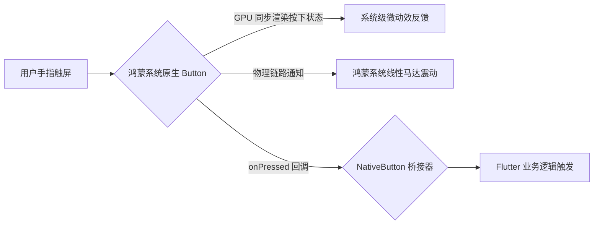
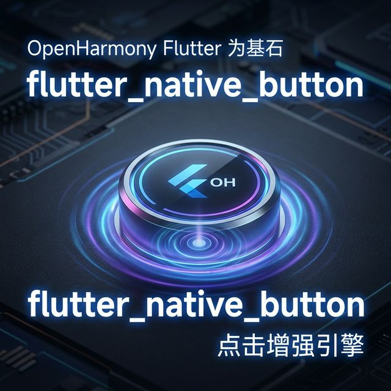

欢迎加入开源鸿蒙跨平台社区：[https://openharmonycrossplatform.csdn.net](https://openharmonycrossplatform.csdn.net)。

# Flutter for OpenHarmony：Flutter 三方库 flutter_native_button — 实现原生极速响应与物理触感（点击增强引擎）

## 前言

在鸿蒙（OpenHarmony）应用开发中，按钮是用户交互频次最高的组件，也是最影响“流畅感知”的地方。你是否觉得 Flutter 的 `ElevatedButton` 涟漪效果略显厚重？是否想要一个能直接调取鸿蒙系统原生按键音、自带系统级触觉震动反馈，且在点击那一瞬间完全“不掉帧”的按钮？

`flutter_native_button` 是一款专注于原生按键交互的桥接库。它直接在 Flutter UI 轴上拉起鸿蒙系统的原生 Button 控件，确保了无论是在点击响应延迟、按下时的缩放动效，还是对鸿蒙辅助功能的兼容上，都达到了系统级应用的水准。在追求极致点按爽感的应用中，它是你的交互先锋。

## 一、原理展示 / 概念介绍

### 1.1 基础概念

本库通过 PlatformView 技术，将用户的每一个点击动作直接交由鸿蒙系统内核处理。



### 1.2 进阶概念

- **Zero-Latency Response**：由于反馈动效（按下、阴影变化）完全在鸿蒙原生层绘制，即使 Flutter 层正在处理复杂的计算导致暂时忙碌，按钮的视觉反馈依然是瞬间产生的。
- **Hardware Integration**：针对折叠屏、智慧屏等鸿蒙设备有更精准的点击热区自动修正能力。

## 二、核心 API / 组件详解

### 2.1 依赖引入

```yaml
dependencies:
  flutter_native_button: ^0.1.0 # 建议确认鸿蒙适配分支
```

### 2.2 部署原生按钮

在鸿蒙工程中创建一个极其像“系统管家”风格的确认按键：

```dart
import 'package:flutter_native_button/flutter_native_button.dart';

Widget buildHarmonySubmitBtn() {
  return NativeButton(
    child: const Text('立即执行分布式同步'),
    // ✅ 推荐做法：极其简单的回调，享受原生级别的点按质感
    onPressed: () {
      print('🚀 用户已在鸿蒙后端发起指令');
    },
    // 💡 技巧：配置符合鸿蒙风格的圆角与配色
    style: NativeButtonStyle(
      backgroundColor: Colors.blueAccent,
      borderRadius: 12.0,
    ),
  );
}
```

## 三、场景示例

### 3.1 场景一：鸿蒙级应用的“紧急警报/核心确认”

当用户需要进行删除这种高危操作，或者是在游戏中需要极高频触发的按键场景下。

```dart
// 💡 技巧：利用原生能力处理极高频的点击且不占用 Flutter 绘图资源
NativeButton(
  child: const Icon(Icons.flash_on),
  onPressed: () => _triggerFastAction(),
)
```



## 四、OpenHarmony 平台适配挑战

### 4.1 窗口层级与阴影剪裁

原生按钮在鸿蒙系统上通常自带一层“渲染阴影（Z-Axis Elevation）”。

✅ **适配策略建议**：
1. **阴影容器预留**：建议为 `NativeButton` 的外层容器预留出 3-5 像素的 Margin。如果容器裁剪过于紧密，可能会导致原生按钮的优雅阴影在边缘处出现“黑色硬块”视觉 Bug。
2. **多语言文本溢出**：原生按钮的宽度通常根据文本内容自动计算。在进行鸿蒙国际化适配时，务必监听 `textScaleFactor`，防止长文本撑破原生的布局限制。

## 五、综合实战示例代码

这是一个包含了基础样式展示与极速响应演示的鸿蒙 Lab 页面：

```dart
import 'package:flutter/material.dart';
import 'package:flutter_native_button/flutter_native_button.dart';

class HarmonyButtonLab extends StatelessWidget {
  const HarmonyButtonLab({super.key});

  @override
  Widget build(BuildContext context) {
    return Scaffold(
      appBar: AppBar(title: const Text('原生按键交互实验室')),
      body: Center(
        child: Column(
          children: [
            const Padding(padding: EdgeInsets.all(20), child: Text('👇 鸿蒙系统底层按键')),
            NativeButton(
              onPressed: () {},
              child: const Text('标准系统样式按钮'),
            ),
            const SizedBox(height: 20),
            NativeButton(
              onPressed: () {},
              color: Colors.redAccent,
              child: const Text('危险操作按钮'),
            ),
          ],
        ),
      ),
    );
  }
}
```


## 六、总结

`flutter_native_button` 是为了那些对“触觉反馈”有着偏执追求的开发者准备的。它让每一次点按都不再是冰冷的屏幕触碰，而变成了一种充满系统原生质感的交互确认。

✅ **核心建议**：
1. 主要交互入口、核心表单提交推荐全面启用原生按钮。
2. 涉及无障碍（TalkBack/语音控制）的场景，原生按钮的识别度更稳健。

📦 更多的底层指导代码可进入：[AtomGit 示例专栏](https://atomgit.com)

---

欢迎加入开源鸿蒙跨平台社区：[开源鸿蒙跨平台开发者社区](https://openharmonycrossplatform.csdn.net)
