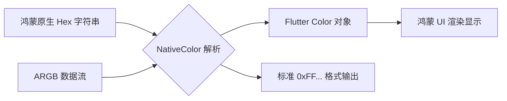
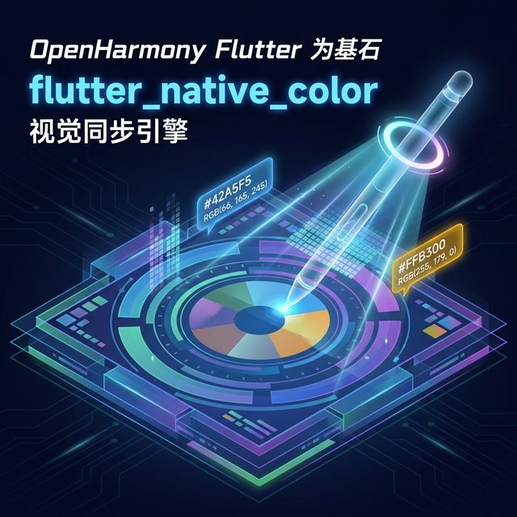

欢迎加入开源鸿蒙跨平台社区：[https://openharmonycrossplatform.csdn.net](https://openharmonycrossplatform.csdn.net)。

# Flutter for OpenHarmony：Flutter 三方库 flutter_native_color — 原生层面的色彩转换与提取（视觉同步引擎）

## 前言

在鸿蒙（OpenHarmony）应用开发中，视觉的统一性极其关键。你是想要让 Flutter 组件的颜色完美匹配鸿蒙系统在当前主题下定义的“品牌蓝”？还是需要将鸿蒙底层传来的十六进制、ARGB 或者是特定的资源引用 ID 准确地还原为 Flutter 中的 `Color` 对象？

`flutter_native_color` 是一款极其轻量且专业的颜色转换工具。它专注于解决跨平台开发中“颜色表达不统一”的痛点，确保你在鸿蒙原生层定义的色彩逻辑能极其精准、无损地流动到 Flutter UI 中。

## 一、原理展示 / 概念介绍

### 1.1 基础概念

为了确保色彩在鸿蒙与 Flutter 之间无缝对接，插件提供了强大的字符串与对象映射能力。



### 1.2 进阶概念

- **Hex with Alpha**：完美支持 `#AARRGGBB` 这种包含透明度的标准格式，解决了鸿蒙开发者经常在 CSS 或资源文件中遇到透明度处理困难的问题。
- **Memory Efficiency**：作为一个纯计算工具，它几乎零开销，适合在鸿蒙高频率刷新（如 120Hz 动画）中进行颜色动态计算。

## 二、核心 API / 组件详解

### 2.1 依赖引入

```yaml
dependencies:
  flutter_native_color: ^1.0.0 # 建议检查鸿蒙兼容版本
```

### 2.2 核心解析用法

在鸿蒙业务逻辑中，将各类混乱的颜色格式标准化：

```dart
import 'package:flutter_native_color/flutter_native_color.dart';

void applyHarmonyTheme() {
  // ✅ 推荐做法：通过解析十六进制字符串获得准确色彩
  Color themeColor = FlutterNativeColor.fromHex("#FF2196F3");
  
  // 🎨 获取带有透明度的鸿蒙强调色
  Color accent = FlutterNativeColor.fromHex("#80000000"); // 50% 不透明的黑色
}
```

## 三、场景示例

### 3.1 场景一：鸿蒙级应用的“配置化皮肤”中心

当应用的主题色是通过鸿蒙服务器接口动态下发的。

```dart
import 'package:flutter_native_color/flutter_native_color.dart';

void updateHarmonySkin(String brandColorHex) {
  // 💡 技巧：利用 flutter_native_color 确保动态色转换不会因为格式问题 Crash
  try {
     final color = FlutterNativeColor.fromHex(brandColorHex);
     _globalThemeController.update(color);
  } catch (e) {
     print('⚠️ 无效的颜色标识码');
  }
}
```



## 四、OpenHarmony 平台适配挑战

### 4.1 鸿蒙系统深色模式的颜色反转

鸿蒙系统的 `dark_mode` 开启时，某些原生传来的颜色可能需要进行亮度微调。

✅ **适配策略建议**：
1. **亮度判定**：将解析出的 `Color` 对象通过 `computeLuminance()` 进行检测。如果颜色太暗而鸿蒙正处于深色环境，可以利用插件辅助逻辑进行减淡。
2. **规范化存储**：建议在鸿蒙本地存储中统一使用该插件生成的 `#AARRGGBB` 字符串格式，以防在不同设备间迁移数据时出现色值丢失。

## 五、综合实战示例代码

这是一个包含了随机颜色生成与十六进制实时解析的鸿蒙实验室项目：

```dart
import 'package:flutter/material.dart';
import 'package:flutter_native_color/flutter_native_color.dart';

class HarmonyColorLab extends StatefulWidget {
  const HarmonyColorLab({super.key});

  @override
  _HarmonyColorLabState createState() => _HarmonyColorLabState();
}

class _HarmonyColorLabState extends State<HarmonyColorLab> {
  Color _mainColor = Colors.blue;
  final _controller = TextEditingController();

  void _convert() {
    setState(() {
      // 💡 核心：尝试解析用户输入的任意格式
      _mainColor = FlutterNativeColor.fromHex(_controller.text);
    });
  }

  @override
  Widget build(BuildContext context) {
    return Scaffold(
      appBar: AppBar(title: const Text('NativeColor 鸿蒙色彩验证器')),
      body: Column(
        children: [
          Container(width: double.infinity, height: 200, color: _mainColor),
          Padding(
            padding: const EdgeInsets.all(20),
            child: TextField(
              controller: _controller,
              decoration: const InputDecoration(hintText: '输入带 # 的色值，如 #9966FF'),
            ),
          ),
          ElevatedButton(onPressed: _convert, child: const Text('立即转换为鸿蒙 UI 色彩')),
        ],
      ),
    );
  }
}
```


## 六、总结

`flutter_native_color` 虽然功能及其纯粹，但它在鸿蒙应用的“精装修”阶段表现不可或缺。它消灭了因颜色解析逻辑不统一导致的 UI “白屏”或“杂色”现象。

✅ **核心建议**：
1. 建立全局统一的颜色常量池，并配合该工具类进行静态初始化。
2. 涉及自定义画笔、Canvas 绘制时，它是处理动态色彩序列的最佳帮手。

📦 更多的底层指导代码可进入：[AtomGit 示例专栏](https://atomgit.com)

---

欢迎加入开源鸿蒙跨平台社区：[开源鸿蒙跨平台开发者社区](https://openharmonycrossplatform.csdn.net)
