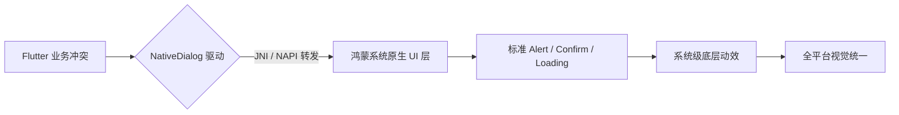

欢迎加入开源鸿蒙跨平台社区：[https://openharmonycrossplatform.csdn.net](https://openharmonycrossplatform.csdn.net)。

# Flutter for OpenHarmony：Flutter 三方库 flutter_native_dialog — 极速拉起系统原生反馈（轻量提示引擎）

## 前言

在鸿蒙（OpenHarmony）某些高性能、极致精简的工具类应用里，有时我们不希望为了展示一个简单的“操作成功”或者是“确认删除”弹窗，就去加载几百 KB 的 Flutter Material 动画资源。你是否想过，直接调用鸿蒙系统底层的 Alert 弹窗、确认框或者是 Loading 等待？

`flutter_native_dialog` 提供了一个极其直观的桥接方式。它不是“模拟”原生，而是真正“呼叫”原生。它能跨越渲染层，直接让鸿蒙系统的窗口管理器展示标准对话框。在追求应用体积与启动响应速度的竞赛中，它是你的秘密武器。

## 一、原理展示 / 概念介绍

### 1.1 基础概念

为了实现极致响应，插件直接通过 MethodChannel 与鸿蒙原生的弹窗 Service 对话。



### 1.2 进阶概念

- **Platform Decoupling (平台解耦)**：你只需调用一个 `showNativeDialog`，它在鸿蒙上显示鸿蒙 UI，在 iOS 上则自动变为熟悉的圆角弹窗，实现真正的代码全同、体感原生。
- **Zero-Rendering Footprint**：弹窗时，Flutter 层的绘图引擎几乎处于休息状态，所有的交互与模糊特效都由鸿蒙系统接管。

## 二、核心 API / 组件详解

### 2.1 依赖引入

```yaml
dependencies:
  flutter_native_dialog: ^1.1.0 # 建议检查鸿蒙适配分支
```

### 2.2 呼叫极简原生对话框

在鸿蒙工程中执行删除确认逻辑：

```dart
import 'package:flutter_native_dialog/flutter_native_dialog.dart';

Future<void> confirmDelete() async {
  // ✅ 推荐做法：极其简单的一行代码，返回布尔值
  bool confirmed = await FlutterNativeDialog.showConfirmDialog(
    title: "确定删除吗？",
    message: "此操作不可撤销，请谨慎操作。",
    positiveButtonText: "确定",
    negativeButtonText: "取消",
  );

  if (confirmed) {
    print('🗑️ 用户已在鸿蒙端确认删除任务');
  }
}
```

## 三、场景示例

### 3.1 场景一：鸿蒙级应用的“紧急权限”引导

当应用检测到录音权限被禁，需要以最严肃的姿态打断用户进行提醒。

```dart
// 💡 技巧：利用原生弹窗绕过所有 Flutter 的 UI 遮罩
FlutterNativeDialog.showAlertDialog(
  title: "权限警告",
  message: "鸿蒙系统权限不足，请在设置中开启麦克风权限。",
);
```


## 四、OpenHarmony 平台适配挑战

### 4.1 异步非阻塞的 UI 等待

由于原生弹窗由系统托管。如果用户长时间不点击，Flutter 的后续逻辑将一直处于 `await` 状态。

✅ **适配策略建议**：
1. **超时机制**：对于某些非关键通知，建议配合 `Future.timeout` 使用，防止用户由于去忙别的导致鸿蒙应用内业务“卡死”在等待回调上。
2. **多语言对齐**：原生弹窗的按钮文本如果不指定，会跟随鸿蒙系统当前的 Locale 环境。这在多国语言适配时极其省心。

## 五、综合实战示例代码

这是一个包含了基础弹窗、确认框与简单 Loading 风格演示的鸿蒙 Demo：

```dart
import 'package:flutter/material.dart';
import 'package:flutter_native_dialog/flutter_native_dialog.dart';

class HarmonyDialogLab extends StatelessWidget {
  const HarmonyDialogLab({super.key});

  @override
  Widget build(BuildContext context) {
    return Scaffold(
      appBar: AppBar(title: const Text('原生对话框实验室')),
      body: Center(
        child: Column(
          children: [
            ElevatedButton(
              onPressed: () => FlutterNativeDialog.showAlertDialog(title: '系统通知', message: '鸿蒙连接成功！'),
              child: const Text('简单原生弹窗'),
            ),
            const SizedBox(height: 20),
            ElevatedButton(
              onPressed: () async {
                await FlutterNativeDialog.showConfirmDialog(title: '操作确认', message: '您是否要重置系统配置？');
              },
              child: const Text('标准原生确认框'),
            ),
          ],
        ),
      ),
    );
  }
}
```


## 六、总结

`flutter_native_dialog` 是为了追求卓越性能与系统原生感的开发者准备的精干工具。它在交互上能“借力”鸿蒙底层的设计语言，让你的应用感官与系统设置极其一致。

✅ **核心建议**：
1. 后台由于异常需要强制打断并通知用户时，它是最佳、最稳的手段。
2. 追求极致精简体积的项目，可以使用它代替复杂的 UI 库展示 Alert。

📦 更多的底层指导代码可进入：[AtomGit 示例专栏](https://atomgit.com)

---

欢迎加入开源鸿蒙跨平台社区：[开源鸿蒙跨平台开发者社区](https://openharmonycrossplatform.csdn.net)
