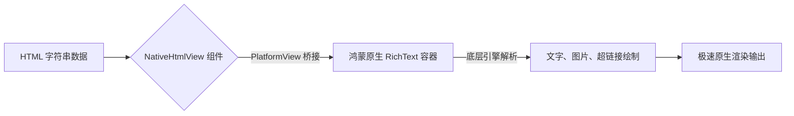
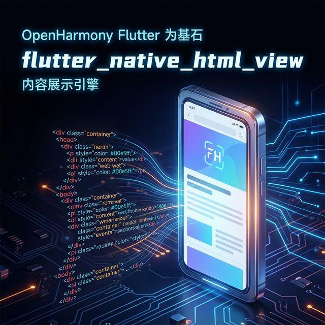

欢迎加入开源鸿蒙跨平台社区：[https://openharmonycrossplatform.csdn.net](https://openharmonycrossplatform.csdn.net)。

# Flutter for OpenHarmony：Flutter 三方库 flutter_native_html_view — 实现原生级高性能 HTML 渲染（内容展示引擎）

## 前言

在鸿蒙（OpenHarmony）新闻资讯、富文本公告或者是含有复杂排版的内容阅读类应用中，直接用 Flutter 的 `Text` 拼凑 HTML 是一场灾难：样式难保、性能低下。而内置一个沉重的 `WebView` 只为显示一段图文混排又显得大材小用且内存开销巨大。

`flutter_native_html_view` 提供了一个折中且高效的方案：它通过 PlatformView 调用鸿蒙原生的轻量级富文本渲染引擎来展示 HTML。这样既能保证 100% 的原生排版视觉，又比完整的 WebView 节省了大量的系统资源。在鸿蒙应用追求“内容显示性能极致”的今天，它是展现数字化内容的利器。

## 一、原理展示 / 概念介绍

### 1.1 基础概念

它利用了鸿蒙系统的“原生控件注入”能力，将系统级的富文本容器嵌入到 Flutter 的组件树中。



### 1.2 进阶概念

- **Style Injection**：支持在渲染前注入 CSS 样式块，统一鸿蒙与 Flutter 的主题色。
- **Auto-Height Calculation**：自动计算 HTML 内容的总高度，从而能极其完美地嵌入到 Flutter 的 `ListView` 或是滚动视口中。

## 二、核心 API / 组件详解

### 2.1 引入依赖

```yaml
dependencies:
  flutter_native_html_view: ^0.1.0 # 请根据鸿蒙兼容性选版本
```

### 2.2 基础展示用法

在鸿蒙页面中直接渲染一段富文本：

```dart
import 'package:flutter_native_html_view/flutter_native_html_view.dart';

Widget buildHarmonyNewsContent() {
  const String rawHtml = """
    <h1>鸿蒙 NEXT 开发者版本发布</h1>
    <p>全新的跨平台框架性能提升了 <b>30%</b> 以上。</p>
    
  """;

  return const NativeHtmlView(
    // ✅ 推荐做法：传入原始字符串即可实现原生渲染
    html: rawHtml,
    onLinkTap: (url) => print('🔗 鸿蒙内链被点击: $url'),
  );
}
```

## 三、场景示例

### 3.1 场景一：鸿蒙级应用的“资讯详情页”嵌入

当详情页是长篇累牍的图文，且包含一些 HTML 表格时。

```dart
// 💡 技巧：利用 NativeHtmlView 自动处理复杂的 HTML 表格，这是 Flutter 纯组件最难处理的部分
ListView(
  children: [
     HeaderWidget(),
     NativeHtmlView(html: news.content),
     CommentSection(),
  ]
)
```



## 四、OpenHarmony 平台适配挑战

### 4.1 跨层级的手势冲突

由于 HTML 渲染在原生的 PlatformView 中。在鸿蒙设备上滑动这段富文本时，可能会与 Flutter 外层的滑动列表产生竞争。

✅ **适配策略建议**：
1. **禁用内滚**：如果只是为了显示在列表中，务必确保 HTML 视图是固定高度或自适应高度，并禁止原生的滚动条，将滚动权交给 Flutter。
2. **图片资源安全地址**：鸿蒙系统对于非 HTTPS 的图片链接有严格的拦截机制。确保 HTML 中的 `img src` 指向安全的加速域名。

## 五、综合实战示例代码

这是一个完整的鸿蒙“动态公告板”逻辑演示：

```dart
import 'package:flutter/material.dart';
import 'package:flutter_native_html_view/flutter_native_html_view.dart';

class HarmonyAnnouncementPage extends StatelessWidget {
  const HarmonyAnnouncementPage({super.key});

  @override
  Widget build(BuildContext context) {
    return Scaffold(
      appBar: AppBar(title: const Text('原生 HTML 渲染实验室')),
      body: SingleChildScrollView(
        child: Column(
          children: [
            const Padding(padding: EdgeInsets.all(10), child: Text('以下内容由鸿蒙原生引擎渲染：', style: TextStyle(color: Colors.grey))),
            // 💡 重点：高性能的富文本段落
            const NativeHtmlView(
              html: "<div style='color:blue;font-size:18px;'>🚀 恭喜！您的鸿蒙设备已就绪。</div><br/>请阅读<a href='https://developer.huawei.com'>官方文档</a>。",
            ),
          ],
        ),
      ),
    );
  }
}
```


## 六、总结

`flutter_native_html_view` 是一款极其高效的“排版转换器”。它避开了 WebView 的沉重，利用鸿蒙最原始的渲染能量。

✅ **核心建议**：
1. 涉及简单的静态图文公告，放弃 WebView，直接使用该插件。
2. 对于包含交互式 JS 运行的高复杂度 HTML，请切换回 `webview_flutter` 鸿蒙定制版。

📦 更多的底层指导代码可进入：[AtomGit 示例专栏](https://atomgit.com)

---

欢迎加入开源鸿蒙跨平台社区：[开源鸿蒙跨平台开发者社区](https://openharmonycrossplatform.csdn.net)
