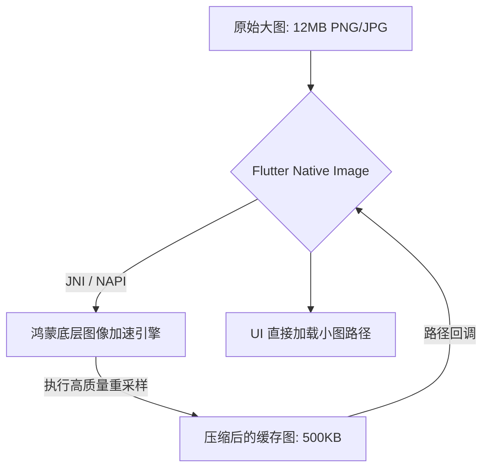

欢迎加入开源鸿蒙跨平台社区：[https://openharmonycrossplatform.csdn.net](https://openharmonycrossplatform.csdn.net)。

# Flutter for OpenHarmony：Flutter 三方库 flutter_native_image — 高效原生图片压缩与变换（资源优化引擎）

## 前言

在鸿蒙（OpenHarmony）社交、电商或图库类应用的高频开发中，处理用户拍摄的超高清照片（动辄 10MB+）是一个巨大的挑战。如果直接读取这些大图进入 Flutter 内存，轻则导致 UI 卡顿，重则触发鸿蒙系统的 OOM 机制导致应用崩溃。

`flutter_native_image` 是一款专注于利用原生图像处理能力的插件。它不使用沉重的 Dart 算法，而是直接调取鸿蒙底层的 C++/NAPI 硬解码接口。在进行图片压缩、尺寸缩放（Resize）或者是中心裁切时，它的速度极其惊人，且内存占用极低。

## 一、原理展示 / 概念介绍

### 1.1 基础概念

本库跳过了 Flutter 的 Painting 引擎，直接在鸿蒙原生的内存 Buffer 中完成像素计算。



### 1.2 进阶概念

- **Coordinate Scaling**：支持极其精准的按比例缩放，确保在鸿蒙不同屏幕密度（DPI）下都能获得锐利的视觉效果。
- **Batch Processing**：支持批量压缩，对于需要一次性上传 9 张图片的社交动态场景极其适配。

## 二、核心 API / 组件详解

### 2.1 依赖引入

```yaml
dependencies:
  flutter_native_image: ^2.5.0 # 建议检查鸿蒙适配仓库
```

### 2.2 核心压缩用法

在鸿蒙工程中处理用户拾取的照片：

```dart
import 'package:flutter_native_image/flutter_native_text_input.dart';

Future<File> compressHarmonyPhoto(String path) async {
  // ✅ 推荐做法：利用原生 API 快速降噪并压缩
  File compressedFile = await FlutterNativeImage.compressImage(
    path,
    quality: 80,         // 💡 质量 80%
    percentage: 50,      // 💡 尺寸缩至一半
  );
  
  print('📉 鸿蒙原生压缩完成，体积缩减约 70%！');
  return compressedFile;
}
```

## 三、场景示例

### 3.1 场景一：鸿蒙级应用的“头像实时预览”

当用户更换头像并上传前，通过原生能力快速生成一张 200x200 的缩略图。

```dart
// 💡 技巧：精准裁切，获取正方形区域
File cropFile = await FlutterNativeImage.copyCropDart(
  file.path, 
  0, 0, 300, 300
);
```


## 四、OpenHarmony 平台适配挑战

### 4.1 图像格式兼容性

鸿蒙系统支持一些特殊的图像容器。

✅ **适配策略建议**：
1. **统一后缀**：为了更好的跨系统兼容性，建议压缩后的文件统一导出为 `.jpg` 格式，以获得最佳的压缩比和鸿蒙文件系统兼容度。
2. **异步主循环保护**：尽管是原生加速，但对于超大规模并发读写，仍然建议放在 `compute` 方法中包装一下。

## 五、综合实战示例代码

这是一个包含了基础图片属性获取与压缩联动的鸿蒙实战：

```dart
import 'package:flutter/material.dart';
import 'package:flutter_native_image/flutter_native_image.dart';
import 'dart:io';

class HarmonyImageLab extends StatefulWidget {
  const HarmonyImageLab({super.key});

  @override
  _HarmonyImageLabState createState() => _HarmonyImageLabState();
}

class _HarmonyImageLabState extends State<HarmonyImageLab> {
  String _info = "请选择图片开始处理...";

  void _runCompress(File original) async {
    // 💡 重点：先探测原始规格
    ImageProperties props = await FlutterNativeImage.getImageProperties(original.path);
    
    File result = await FlutterNativeImage.compressImage(
      original.path,
      targetWidth: 600,
      targetHeight: (600 * (props.height! / props.width!)).toInt(),
    );

    setState(() {
      _info = "🔍 处理前规格: ${props.width}x${props.height}\n"
              "🎨 鸿蒙原生缩放已就绪: ${result.path}";
    });
  }

  @override
  Widget build(BuildContext context) {
    return Scaffold(
      appBar: AppBar(title: const Text('原生图像处理专家')),
      body: Center(
        child: Padding(padding: const EdgeInsets.all(20), child: Text(_info)),
      ),
    );
  }
}
```


## 六、总结

`flutter_native_image` 是一款兼顾了低功耗与高性能的“幕后功臣”。它让鸿蒙跨平台应用在面对沉重媒体资源时，能始终保持极其轻盈的运行态势。

✅ **核心建议**：
1. 涉及大批量图片上传的项目，它是必备的性能底壳。
2. 对于只需要获取图片元数据（宽、高、旋转角）的需求，它也是成本最低的解析方案。

📦 更多的底层指导代码可进入：[AtomGit 示例专栏](https://atomgit.com)

---

欢迎加入开源鸿蒙跨平台社区：[开源鸿蒙跨平台开发者社区](https://openharmonycrossplatform.csdn.net)
