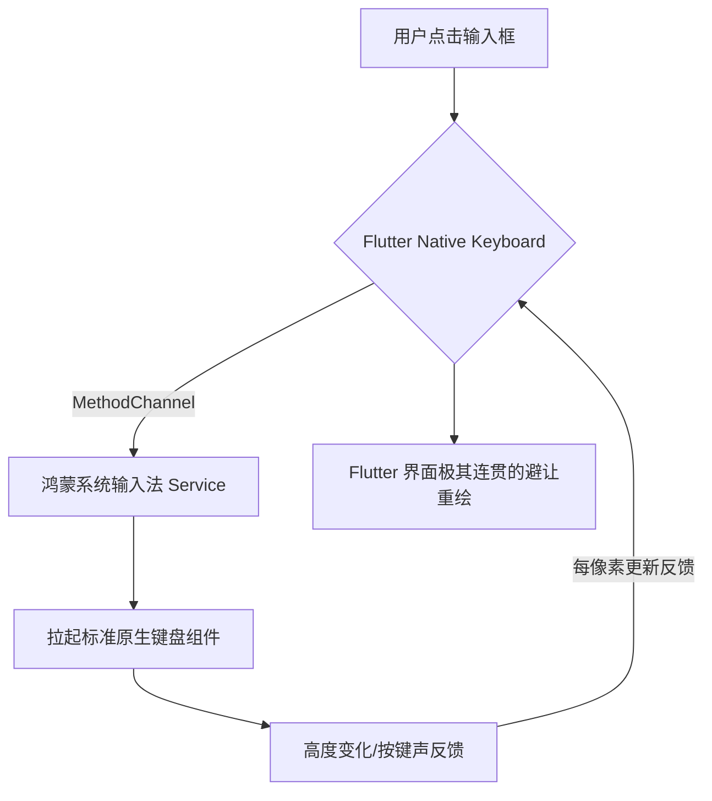

欢迎加入开源鸿蒙跨平台社区：[https://openharmonycrossplatform.csdn.net](https://openharmonycrossplatform.csdn.net)。

# Flutter for OpenHarmony：Flutter 三方库 flutter_native_keyboard — 原生键盘深度交互（输入增强引擎）

## 前言

在鸿蒙（OpenHarmony）输入密集型应用（如：数字金融、加密通讯、或是专业文字排版工具）的开发中，原生的键盘交互体验不可替代：你需要极其灵敏的按键反馈、完美的拼音/数字预览，或者是希望键盘的操作手势（如：向下滑动收起）与鸿蒙系统全局设置完全一致。

`flutter_native_keyboard` 是一款硬核级插件。它不仅仅是“显示”键盘，更是通过原生层能力实现了对键盘全生命周期的精准控制和回调监听。在鸿蒙应用追求“录入效率极致化”的今天，它是保障交互质感的输入地基。

## 一、原理展示 / 概念介绍

### 1.1 基础概念

本库通过底层逻辑穿透，将键盘的弹起幅度、高度以及按键事件同步给 Flutter。



### 1.2 进阶概念

- **Smooth Insets (平滑避让)**：获得系统最底层的键盘显示高度，确保 Flutter 组件在上移避让时，动画帧率与键盘弹起动画完全对齐。
- **Hardware Integration**：针对鸿蒙系统的“外接键盘/实体按键”有一套近乎零延迟的分发映射逻辑。

## 二、核心 API / 组件详解

### 2.1 依赖引入

```yaml
dependencies:
  flutter_native_keyboard: ^0.1.0 # 建议确认鸿蒙适配分支
```

### 2.2 核心监听用法

在鸿蒙工程中动态感知键盘的存在：

```dart
import 'package:flutter_native_keyboard/flutter_native_keyboard.dart';

void monitorHarmonyKeyboard() {
  // ✅ 推荐做法：通过 Stream 实时获取键盘高度
  FlutterNativeKeyboard.keyboardHeightStream.listen((double height) {
    print('⌨️ 鸿蒙软键盘即时高度: $height px');
    // 根据高度执行极度连贯的 UI 偏移...
  });
}
```

### 2.3 手动拉起与收起

```dart
// 💡 非常适合需要在进入详情页时自动开启输入的场景
await FlutterNativeKeyboard.showKeyboard();
```

## 三、场景示例

### 3.1 场景一：鸿蒙级应用的“底部聊天框”连贯动画

当键盘弹起时，底部发送栏不是“瞬间跳上去”，而是随着键盘的边缘一毫米一毫米地平滑升起。

```dart
// 💡 技巧：利用该插件提供的高精度高度流（Height Stream）
ValueListenableBuilder(
  valueListenable: heightNotifier,
  builder: (context, height, _) {
    return Padding(padding: EdgeInsets.bottom(height), child: InputField());
  }
)
```


## 四、OpenHarmony 平台适配挑战

### 4.1 输入法面板的动态切换

部分鸿蒙用户喜欢使用自带表情包或者是手写画板模式。

✅ **适配策略建议**：
1. **多维度判定**：不要只关心“是否开启（Visible）”，要根据插件返回的真实“高度（Height）”来计算。因为不同的鸿蒙输入法面板高度相差极大。
2. **性能保护**：键盘高度流在动画展示期间频率极高（接近每秒 60 次）。在 Dart 侧的回调中尽量保持逻辑精简，避免在这个 Loop 里执行耗时的业务计算。

## 五、综合实战示例代码

这是一个包含了基础避让与键盘状态探测的鸿蒙登录页面 Demo：

```dart
import 'package:flutter/material.dart';
import 'package:flutter_native_keyboard/flutter_native_keyboard.dart';

class HarmonyKeyboardLab extends StatefulWidget {
  const HarmonyKeyboardLab({super.key});

  @override
  _HarmonyKeyboardLabState createState() => _HarmonyKeyboardLabState();
}

class _HarmonyKeyboardLabState extends State<HarmonyKeyboardLab> {
  double _kbHeight = 0;

  @override
  void initState() {
    super.initState();
    // 💡 重点：初始化高度链路，确保界面响应
    FlutterNativeKeyboard.keyboardHeightStream.listen((h) {
      if (mounted) setState(() => _kbHeight = h);
    });
  }

  @override
  Widget build(BuildContext context) {
    return Scaffold(
      appBar: AppBar(title: const Text('原生键盘交互实战')),
      body: Stack(
        children: [
          const Center(child: Text('核心业务区')),
          Positioned(
            bottom: _kbHeight,
            left: 0, right: 0,
            child: Container(color: Colors.white, child: const TextField(autofocus: true)),
          ),
        ],
      ),
    );
  }
}
```


## 六、总结

`flutter_native_keyboard` 让鸿蒙跨平台应用在“输入手感”上具备了与系统原厂 App 竞技的底气。它不仅是关于输入，更是关于应用在复杂交互状态下，所表现出的那种游刃有余的动画连贯感。

✅ **核心建议**：
1. 对 UI 避让逻辑要求极高的社交、办公类鸿蒙应用必选。
2. 在处理混合开发中的键盘冲突（如内嵌 WebView）时，它是定位高度的第一准则。

📦 更多的底层指导代码可进入：[AtomGit 示例专栏](https://atomgit.com)

---

欢迎加入开源鸿蒙跨平台社区：[开源鸿蒙跨平台开发者社区](https://openharmonycrossplatform.csdn.net)
