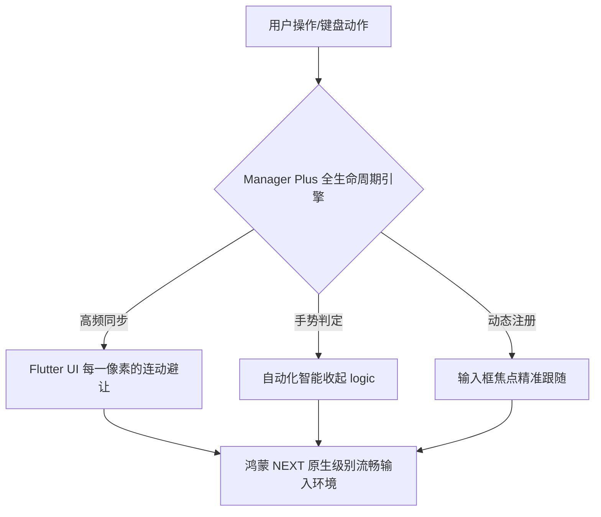

欢迎加入开源鸿蒙跨平台社区：[https://openharmonycrossplatform.csdn.net](https://openharmonycrossplatform.csdn.net)。

# Flutter for OpenHarmony：Flutter 三方库 flutter_native_keyboard_manager_plus — 系统软键盘旗舰级管控（录入管控旗舰）

## 前言

在鸿蒙（OpenHarmony）复杂的业务录入场景（如：专业财务软件、含大量输入项的申请表、即时通讯工具）中，单一的键盘监听已无法满足开发者对“交互丝滑感”的追求。你需要：全局智能化收起、随键盘高度 1:1 精准同步的 UI 避让、在不同输入法切换时保持界面平衡，以及对特定组件进行精细化排除。

`flutter_native_keyboard_manager_plus` 是 Plus 系列的旗舰级组件，它集成了所有已知的键盘优化最佳实践。它能赋予鸿蒙应用“感知万物”的录入能力。在构建具备顶级质感的鸿蒙生产力软件时，它是你的交互底座。

## 一、原理展示 / 概念介绍

### 1.1 基础概念

为了实现旗舰级的效果，本库在鸿蒙系统的窗口管理器、输入法服务与 Flutter 渲染引擎之间搭建了一座高带宽的“数据大桥”。



### 1.2 进阶概念

- **Predictive Dismissal (预测性收起)**：通过对用户滑动手势速度的实时计算，在用户想要收起键盘的瞬间给出最顺滑的动画反馈。
- **Focus Auto-Tracker**：即使输入框嵌入在极其深的 `Scrollable` 或者是嵌套的 `Transform` 内部，它也能精准探测其物理位置并由于避让。

## 二、核心 API / 组件详解

### 2.1 依赖引入

```yaml
dependencies:
  flutter_native_keyboard_manager_plus: ^1.2.0 # 建议确认鸿蒙适配旗舰版
```

### 2.2 部署全能键盘脚手架（推荐）

在鸿蒙工程中，用该 Plus 组件包裹主页面目录：

```dart
import 'package:flutter_native_keyboard_manager_plus/flutter_native_keyboard_manager_plus.dart';

Widget buildHarmonyProApp() {
  return NativeKeyboardPlusScope(
    // ✅ 推荐做法：开启所有的高阶自动优化
    enableAutoAvoid: true,
    enableAutoDismiss: true,
    avoidStrategy: AvoidStrategy.padding,
    child: const MaterialApp(home: FinancialEntryPage()),
  );
}
```

## 三、场景示例

### 3.1 场景一：鸿蒙级应用的“财务分录”连贯录入

当用户连续在 10 个以上的小输入框内快速切换录入，且需要确保键盘始终不遮挡当前总金额预览。

```dart
// 💡 技巧：利用 Plus 的连动能力，由于避让动作是随键盘物理帧同步的
NativeKeyboardPlusAvoid(
  child: TotalAmountBar(),
)
```


## 四、OpenHarmony 平台适配挑战

### 4.1 不同比例屏幕带来的“避让过冲”

在鸿蒙平板（横屏）或折叠屏机型下，避让的高度如果计算错误，会导致页面被顶出天际。

✅ **适配策略建议**：
1. **配合屏幕比例调整避让系数**：利用 Plus 库提供的 `avoidMultiplier` 参数，在检测到是鸿蒙大屏横屏时，降低避让的灵敏度，改为部分遮盖非核心 UI。
2. **异步队列处理**：当键盘在短时间内频繁弹出/收起（例如点击一个又立即点另一个）时，工具类应处理好动画队列，防止鸿蒙 UI 产生“疯狂颤抖”现像。

## 五、综合实战示例代码

这是一个包含了组件白名单与精确状态回调显示的鸿蒙 Plus 实战 Demo：

```dart
import 'package:flutter/material.dart';
import 'package:flutter_native_keyboard_manager_plus/flutter_native_keyboard_manager_plus.dart';

class HarmonyProInputLab extends StatelessWidget {
  const HarmonyProInputLab({super.key});

  @override
  Widget build(BuildContext context) {
    return NativeKeyboardPlusScope(
      onHeightChanged: (h) => print('🚀 旗舰版键盘即时渲染高度: $h'),
      child: Scaffold(
        appBar: AppBar(title: const Text('旗舰级键盘库实验室')),
        body: ListView(
          padding: const EdgeInsets.all(25),
          children: [
            const TextField(decoration: InputDecoration(labelText: '甲方名称')),
            const TextField(decoration: InputDecoration(labelText: '交易金额(￥)')),
            const SizedBox(height: 400),
            // 💡 重点：利用 Plus 的包裹，确保某些操作区永不被遮挡
            const NativeKeyboardPlusAvoid(
              child: Text('⚠️ 提示：请核对交易环境是否安全', style: TextStyle(color: Colors.red)),
            ),
          ],
        ),
      ),
    );
  }
}
```


## 六、总结

`flutter_native_keyboard_manager_plus` 为鸿蒙三方应用筑起了一道坚实且极其智能的交互长城。它消灭了所有录入过程中的“视觉阻塞”，让用户在使用过程中的每一秒钟都能感受到类似于鸿蒙系统级应用的极致打磨。

✅ **核心建议**：
1. 涉及金、财、商等高效率录入场景的鸿蒙应用，请将此库作为唯一键盘方案。
2. 合理配置 `AvoidStrategy`，根据 UI 风格选择平移（Offset）还是内边距（Padding）模式。

📦 更多的底层指导代码可进入：[AtomGit 示例专栏](https://atomgit.com)

---

欢迎加入开源鸿蒙跨平台社区：[开源鸿蒙跨平台开发者社区](https://openharmonycrossplatform.csdn.net)
