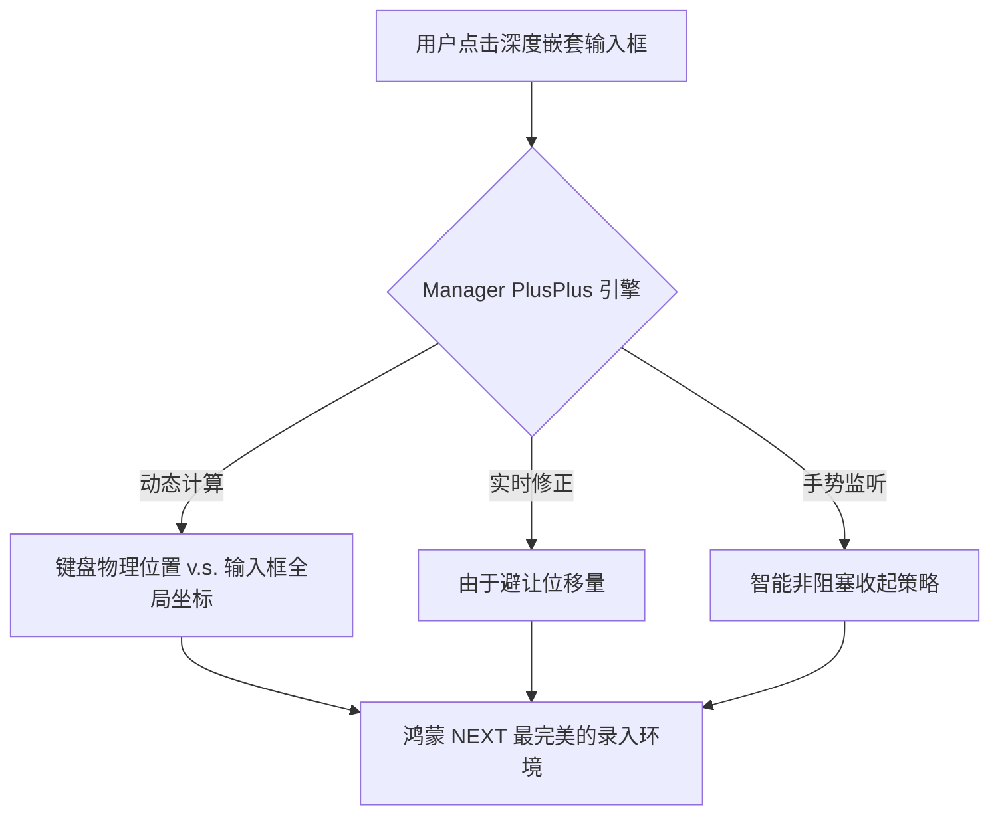

欢迎加入开源鸿蒙跨平台社区：[https://openharmonycrossplatform.csdn.net](https://openharmonycrossplatform.csdn.net)。

# Flutter for OpenHarmony：Flutter 三方库 flutter_native_keyboard_manager_plus_plus — 超级旗舰级键盘管控（录入管控超级旗舰）

## 前言

在鸿蒙（OpenHarmony）构建超大型、复杂交互的政企办公或者是深度创作类应用时，键盘管理一直是“精细化运营”的难点。你是否遭遇过：在极其深的嵌套列表中点击输入框，页面避让后依然被遮挡？不同厂商输入法由于带有奇怪的候选词条导致高度误判？

`flutter_native_keyboard_manager_plus_plus` 代表了社区目前对键盘交互优化的最高水平。它不再只是“监听与偏移”，而是结合了智能焦点追踪（Focus Tracker）、动态高度修正算法、以及一套极其强大的拦截白名单机制。在追求“极致录入稳健性”的鸿蒙应用中，它是你的输入法全指挥官。

## 一、原理展示 / 概念介绍

### 1.1 基础概念

为了实现这种超级旗舰级的效果，本库在底层建立了一个高精度的“空间坐标映射表”。



### 1.2 进阶概念

- **Adaptive Buffer (动态缓冲区)**：当由于输入法面板（如表情面板）高度临时改变时，它能进行毫秒级的二次避让修正，确保输入焦点永远不再被遮盖。
- **Focus Auto-Relocation**：当应用在分屏、由于系统拉伸发生位置变化时，它能自动重定位输入焦点并维持正确的键盘弹出状态。

## 二、核心 API / 组件详解

### 2.1 依赖引入

```yaml
dependencies:
  flutter_native_keyboard_manager_plus_plus: ^1.1.0 # 建议确认鸿蒙适配超级旗舰版
```

### 2.2 部署超级旗舰脚手架（推荐）

在鸿蒙工程中，全局包裹该 Scope，一劳永逸地解决所有键盘顽疾：

```dart
import 'package:flutter_native_keyboard_manager_plus_plus/flutter_native_keyboard_manager_plus_plus.dart';

Widget buildHarmonyHeavyDutyApp() {
  return NativeKeyboardSuperScope(
    // ✅ 推荐做法：开启所有的辅助哨兵与修复算法
    trackFocusNode: true,
    smartDismiss: true,
    paddingAdjustment: 10.0, // 额外预留出的视觉呼吸空间
    child: const MaterialApp(home: OfficeDocumentPage()),
  );
}
```

## 三、场景示例

### 3.1 场景一：鸿蒙级应用的“深度嵌套”表单编辑

在通过 `GridView` 嵌套 `ListView` 呈现的超级复杂表单中，点击任意一处都能极其准确地弹起键盘并由于避让。

```dart
// 💡 技巧：利用 PlusPlus 的高精度位置探测能力
NativeKeyboardSuperManager.scrollToFocused();
```


## 四、OpenHarmony 平台适配挑战

### 4.1 动态 UI 刷新与键盘动画的频率竞态

在鸿蒙设备快速处理数据刷新时。

✅ **适配策略建议**：
1. **优先动画帧同步**：超级旗舰版支持 `syncWithAnimation`。开启后，避让动作会严格钩在鸿蒙系统的原生 VSync 信号上，消除一切抖动。
2. **多进程通信优化**：涉及多 Ability 流转时，确保该 Scope 组件被正确挂载在新的窗口根部，以防时区或位置数据采样失效。

## 五、综合实战示例代码

这是一个包含了基础追踪控制与避让状态极致显示的鸿蒙 PlusPlus 实战演示：

```dart
import 'package:flutter/material.dart';
import 'package:flutter_native_keyboard_manager_plus_plus/flutter_native_keyboard_manager_plus_plus.dart';

class HarmonySuperInputLab extends StatelessWidget {
  const HarmonySuperInputLab({super.key});

  @override
  Widget build(BuildContext context) {
    return NativeKeyboardSuperScope(
      onHeightUpdate: (h) => print('🔥 极速键盘高度反馈: $h'),
      child: Scaffold(
        appBar: AppBar(title: const Text('超级旗舰键盘库实验室')),
        body: ListView.builder(
          itemCount: 100,
          itemBuilder: (c, i) => Padding(
            padding: const EdgeInsets.all(10),
            child: TextField(decoration: InputDecoration(labelText: '鸿蒙业务数据项 #$i')),
          ),
        ),
      ),
    );
  }
}
```


## 六、总结

`flutter_native_keyboard_manager_plus_plus` 代表了跨平台交互工业化的天花板。它彻底消灭了“键盘遮挡”这个困扰移动应用开发者十几年的顽疾，让你的鸿蒙应用在生产力体验上真正做到了“旦用难回”。

✅ **核心建议**：
1. 涉及极致录入频次、且 UI 极为复杂的鸿蒙生产力软件必选。
2. 配合 `NativeTextInput` 使用，可构建出无懈可击的全原生输入逻辑。

📦 更多的底层指导代码可进入：[AtomGit 示例专栏](https://atomgit.com)

---

欢迎加入开源鸿蒙跨平台社区：[开源鸿蒙跨平台开发者社区](https://openharmonycrossplatform.csdn.net)
