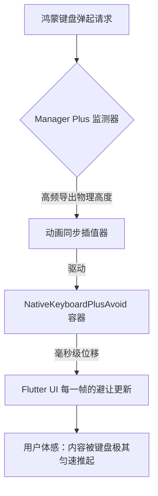

欢迎加入开源鸿蒙跨平台社区：[https://openharmonycrossplatform.csdn.net](https://openharmonycrossplatform.csdn.net)。

# Flutter for OpenHarmony：Flutter 三方库 flutter_native_keyboard_plus — 原生步调一致的键盘交互（导航增强引擎）

## 前言

在鸿蒙（OpenHarmony）社交、表单或是复杂的 UI 界面中，处理软键盘弹起时的“界面避让”是一门极其精密的艺术。如果只是简单的上移，会导致界面闪烁或动画断层。你是否想要让你的 Flutter UI 组件，能以极其连贯、与鸿蒙系统原生键盘上升曲线 100% 对齐的节奏，进行丝滑滑动？

`flutter_native_keyboard_plus` 是 `flutter_native_keyboard` 的全面增强版。它不仅提供了高精度的键盘高度监听，还内置了一套针对鸿蒙物理特性的“同步避让容器”。在追求录入交互“如丝般顺滑”的鸿蒙应用中，它是你的导航先锋。

## 一、原理展示 / 概念介绍

### 1.1 基础概念

为了实现这种“像素级”的同步，本库采用了极其高频的 MethodChannel 通讯和原生窗口属性监听。



### 1.2 进阶概念

- **Smooth Insets (高精度边距)**：解决了传统监听中由于 Dart 与 Native 异步通信导致的“避让延迟（Lag）”，让位移与触控反馈融为一体。
- **Auto-Dismissal Logic**：内置了多种符合鸿蒙系统交互直觉的收起逻辑（如：点击非输入区自动回退）。

## 二、核心 API / 组件详解

### 2.1 依赖引入

```yaml
dependencies:
  flutter_native_keyboard_plus: ^1.1.0 # 建议确认鸿蒙适配 Plus 版
```

### 2.2 使用同步避让容器

在鸿蒙工程中，将需要被“推起来”的组件包裹在专门的避让 Widget 中：

```dart
import 'package:flutter_native_keyboard_plus/flutter_native_keyboard_plus.dart';

Widget buildHarmonyChatInput() {
  return NativeKeyboardPlusAvoid(
    // ✅ 推荐做法：开启同步动画
    animate: true,
    child: Container(
       padding: const EdgeInsets.all(12),
       color: Colors.white,
       child: const TextField(decoration: InputDecoration(hintText: '鸿蒙聊天中...')),
    ),
  );
}
```

## 三、场景示例

### 3.1 场景一：鸿蒙级应用的“底部操作区”极致避让

当页面有一个浮动的“提交按钮”，不管键盘在什么机型上弹起，该按钮始终贴合在键盘边缘。

```dart
// 💡 技巧：利用 Plus 的底层同步，即便鸿蒙系统键盘由于由于带有工具栏而高度不一，它也能精准贴合
NativeKeyboardPlusAvoid(
  child: FloatingActionButton(onPressed: () {}, child: const Icon(Icons.send)),
)
```


## 四、OpenHarmony 平台适配挑战

### 4.1 窗口层级与多任务分屏适配

鸿蒙系统支持分屏（Multi-Window）。在分屏状态下，键盘的高度会被系统极其强烈地根据视口大小动态切割。

✅ **适配策略建议**：
1. **监听 Size 变化**：`flutter_native_keyboard_plus` 建议配合 `WidgetsBindingObserver` 使用。当鸿蒙页面由于窗口拉伸导致键盘高度“逻辑值”变化时，避让容器会自动修正偏移。
2. **避免过冲 (Over-scroll)**：如果原本就在页面底部且内容较少，避让时应设定最大偏移量，防止将核心标题顶出了可见区域。

## 五、综合实战示例代码

这是一个包含了基础避让与键盘高度实时显示的鸿蒙 Lab 页面：

```dart
import 'package:flutter/material.dart';
import 'package:flutter_native_keyboard_plus/flutter_native_keyboard_plus.dart';

class HarmonyKeyboardProLab extends StatelessWidget {
  const HarmonyKeyboardProLab({super.key});

  @override
  Widget build(BuildContext context) {
    return Scaffold(
      appBar: AppBar(title: const Text('Plus 键盘交互实验室')),
      body: Stack(
        children: [
          const Center(child: Text('核心业务区')),
          // 💡 重点：同步避让底座
          Positioned(
            bottom: 0, left: 0, right: 0,
            child: NativeKeyboardPlusAvoid(
              child: Container(
                color: Colors.blue[50],
                height: 80,
                child: const TextField(autofocus: true, decoration: InputDecoration(prefixIcon: Icon(Icons.edit))),
              ),
            ),
          ),
        ],
      ),
    );
  }
}
```


## 六、总结

`flutter_native_keyboard_plus` 是追求“交互品质”的鸿蒙开发者绕不开的利器。它消灭了所有录入过程中的不自然，让你的 Flutter 应用在键盘交互这一核心环节上呈现出了大厂标杆应用的工业美感。

✅ **核心建议**：
1. 涉及频繁录入、且有底部浮动操作区的鸿蒙应用必选。
2. 在处理混合开发（含有原生片段）的项目中，它是统一避让逻辑的最佳选择。

📦 更多的底层指导代码可进入：[AtomGit 示例专栏](https://atomgit.com)

---

欢迎加入开源鸿蒙跨平台社区：[开源鸿蒙跨平台开发者社区](https://openharmonycrossplatform.csdn.net)
