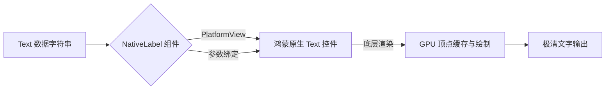

欢迎加入开源鸿蒙跨平台社区：[https://openharmonycrossplatform.csdn.net](https://openharmonycrossplatform.csdn.net)。

# Flutter for OpenHarmony：Flutter 三方库 flutter_native_label — 高性能原生文本标签（展示增强引擎）

## 前言

在鸿蒙（OpenHarmony）新闻列表、卡片流或者是信息展示类应用中，文本的渲染质量直接决定了应用的高级感。虽然 Flutter 的 `Text` 已经非常出色，但在处理极致的长段落性能、或者是某些特定的鸿蒙系统字库抗锯齿特性上，原生的 `Label`（在 ArkUI 中为 `Text`）有时能提供更接近系统级别的视觉纯净度。

`flutter_native_label` 是一款专注于将鸿蒙原生的文本显示控件“嵌入”到 Flutter 布局中的轻量级桥接库。它绕过了 Flutter 自身的渲染流水线，直接调取鸿蒙系统的文字绘制引擎，让你的每一行文字都拥有纯正的鸿蒙血统。

## 一、原理展示 / 概念介绍

### 1.1 基础概念

它利用 PlatformView 技术在 Flutter 树中挖掘出一个原生的“显示洞口”。



### 1.2 进阶概念

- **Subpixel Antialiasing**：获得系统级的次像素抗锯齿能力，在某些老旧鸿蒙 LCD 屏幕上文字会显得更加厚实、清晰。
- **Hardware Acceleration**：完全由鸿蒙原生的 GPU 合成引擎控制，对于超大字号或高频滚动的 UI 性能极佳。

## 二、核心 API / 组件详解

### 2.1 依赖引入

```yaml
dependencies:
  flutter_native_label: ^0.1.0 # 建议检查鸿蒙适配版本
```

### 2.2 基础展示用法

在鸿蒙页面中部署一段原生文本：

```dart
import 'package:flutter_native_label/flutter_native_label.dart';

Widget buildHarmonyNewsHeader() {
  return const NativeLabel(
    text: "鸿蒙系统全新 NEXT 版本今日全球推送",
    // ✅ 推荐做法：配置与系统一致的样式参数
    style: TextStyle(
      fontSize: 22.0,
      fontWeight: FontWeight.bold,
      color: Colors.black,
    ),
  );
}
```

## 三、场景示例

### 3.1 场景一：鸿蒙级应用的“极致排版”详情页

当页面包含大量的文字公告，且要求文字的行间距、字间距与鸿蒙设置中的全局偏好完全锁定时。

```dart
// 💡 技巧：利用原生能力自动适配系统字体缩放（Accessibility）
NativeLabel(
  text: announcementBody,
  maxLines: 5,
  overflow: TextOverflow.ellipsis,
);
```


## 四、OpenHarmony 平台适配挑战

### 4.1 布局边界与视口裁剪

由于原生控件位于 Flutter 渲染层之上。在鸿蒙系统进行列表滑动时，如果处理不当，文字可能会“溢出”到 Scaffold 的 AppBar 之外。

✅ **适配策略建议**：
1. **配合封装**：将 `NativeLabel` 放在具有明确 `height` 的容器中。
2. **渐进式替换**：不要在整个列表（如 1000 行）中全量使用。建议仅在详情页正文等对质感有硬性要求的核心区域使用，以平衡内存与画质。

## 五、综合实战示例代码

这是一个包含了基础样式映射与自适应宽度演示的鸿蒙 Lab 页面：

```dart
import 'package:flutter/material.dart';
import 'package:flutter_native_label/flutter_native_label.dart';

class HarmonyLabelLab extends StatelessWidget {
  const HarmonyLabelLab({super.key});

  @override
  Widget build(BuildContext context) {
    return Scaffold(
      appBar: AppBar(title: const Text('原生文本标签实战')),
      body: SingleChildScrollView(
        padding: const EdgeInsets.all(25),
        child: Column(
          children: [
            const Text('--- 以下为鸿蒙底层绘制 ---', style: TextStyle(color: Colors.green)),
            const SizedBox(height: 20),
            // 💡 重点：高性能文字块
            const NativeLabel(
              text: "这段文字使用了鸿蒙底层的渲染链路进行绘制，不论您如何缩放系统字体，它都能保持最标准的排版比例。",
              style: TextStyle(fontSize: 18, color: Colors.blueGrey, height: 1.5),
            ),
          ],
        ),
      ),
    );
  }
}
```


## 六、总结

`flutter_native_label` 是一款追求视觉像素级完美的插件。它让鸿蒙应用在文字展现这一核心维度上，具备了与系统内置应用平起平坐的竞争资本。

✅ **核心建议**：
1. 阅读类、公告类等纯文字比例较高的鸿蒙应用推荐选用。
2. 涉及非标准特殊字库显示时，配合系统级字体包，原生标签的兼容性更好。

📦 更多的底层指导代码可进入：[AtomGit 示例专栏](https://atomgit.com)

---

欢迎加入开源鸿蒙跨平台社区：[开源鸿蒙跨平台开发者社区](https://openharmonycrossplatform.csdn.net)
