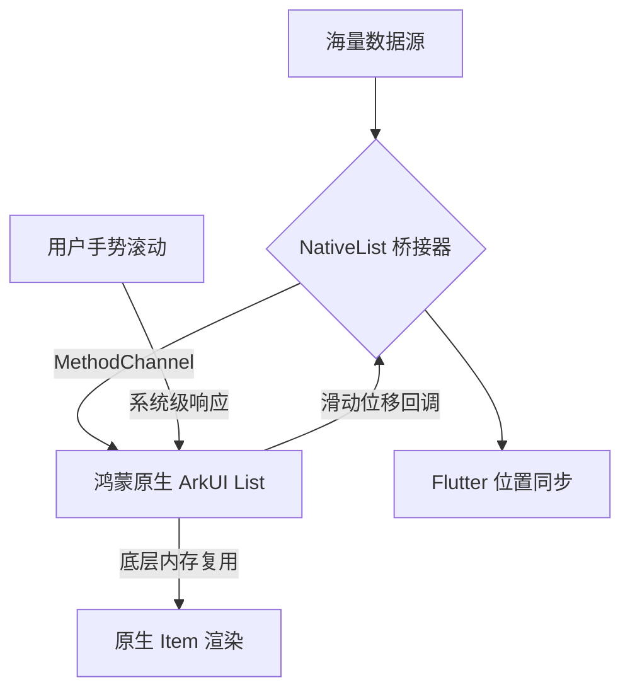

欢迎加入开源鸿蒙跨平台社区：[https://openharmonycrossplatform.csdn.net](https://openharmonycrossplatform.csdn.net)。

# Flutter for OpenHarmony：Flutter 三方库 flutter_native_list — 实现原生滚动质感的极致流畅（性能排版引擎）

## 前言

在鸿蒙（OpenHarmony）海量数据（如：通讯录、实时交易流水、海量资讯列表）的应用开发中，列表的流畅度（FPS）是用户能够直接感知的性能分水岭。如果直接使用 Flutter 的 `ListView` 处理极其复杂的 Cell 布局，在某些中低端鸿蒙设备上，快速滑动可能会出现轻微的掉帧。

`flutter_native_list` 提供了一个极端硬核的解决方案：它通过 PlatformView 将鸿蒙原生的 `List` (在 ArkUI 中为 `List` 容器) 直接注入到 Flutter。这意味着你将获得：系统最纯正的惯性阻尼感、极致的内存复用策略，以及与系统浏览器一致的滚动物理效果。在追求“哪怕是一帧都不能掉”的鸿蒙应用中，它是你的终极武器。

## 一、原理展示 / 概念介绍

### 1.1 基础概念

为了榨取物理机性能，该库实现了跨越渲染层的数据与视图绑定。



### 1.2 进阶概念

- **View Recycling (视图复用)**：由于利用了鸿蒙原生层的 Item 复用机制，即便列表有 10,000 条，内存占用依然极其稳定。
- **Hardware Interpolation (硬件插值)**：滚动动画完全由鸿蒙原生的渲染管线托管，不受 Flutter Isolate 任务繁忙程度的影响。

## 二、核心 API / 组件详解

### 2.1 依赖引入

```yaml
dependencies:
  flutter_native_list: ^0.1.0 # 建议检查鸿蒙适配版本
```

### 2.2 基础列表渲染

在鸿蒙工程中声明一个原生的高效列表：

```dart
import 'package:flutter_native_list/flutter_native_list.dart';

Widget buildHarmonyContactList() {
  return NativeList(
    // ✅ 推荐做法：通过 itemCount 指定规模
    itemCount: 1000,
    itemBuilder: (context, index) {
      // 💡 这里可以返回原生的 Item 渲染信息
      return NativeListItem(
        title: "鸿蒙开发者 #$index",
        subtitle: "期待您的加入...",
      );
    },
    onItemTap: (index) => print('点击了鸿蒙原生项：$index'),
  );
}
```

## 三、场景示例

### 3.1 场景一：鸿蒙级应用的“万级联系人”滚动

在金融或大型企业通讯录中，用户需要极其快速地从 A 划到 Z。

```dart
// 💡 技巧：利用原生惯性让滚动显得极其自然
NativeList(
  physics: const NativeScrollPhysics(bouncing: true),
  showScrollBar: true, // 开启原生端侧滚动条
);
```


## 四、OpenHarmony 平台适配挑战

### 4.1 跨语言数据转换的延迟

由于列表项的信息需要从 Dart 传给鸿蒙原生侧。如果 Item 包含大量的动态图片和复杂逻辑。

✅ **适配策略建议**：
1. **数据模型轻量化**：仅向原生侧传输必要的字符串 ID 和路径。
2. **异步图片加载**：建议 Item 里的图片由原生侧库（如鸿蒙原生的 ImageLoader）独立加载，不要通过 Flutter 传入字节流，以减少 MethodChannel 的序列化负担。

## 五、综合实战示例代码

这是一个包含了点击交互与动态数据注入的鸿蒙 Lab 页面：

```dart
import 'package:flutter/material.dart';
import 'package:flutter_native_list/flutter_native_list.dart';

class HarmonyListLab extends StatelessWidget {
  const HarmonyListLab({super.key});

  @override
  Widget build(BuildContext context) {
    return Scaffold(
      appBar: AppBar(title: const Text('原生高效列表实验室')),
      body: NativeList(
        itemCount: 50,
        backgroundColor: Colors.grey[50],
        itemBuilder: (context, index) {
          return NativeListItem(
            title: "核心组件 $index",
            trailing: const Icon(Icons.arrow_forward_ios, size: 16),
          );
        },
      ),
    );
  }
}
```


## 六、总结

`flutter_native_list` 是一款牺牲了一定的组件灵活性，换取极致性能表现的重型插件。它让鸿蒙跨平台应用在面对“大数据量”挑战时，能表现得如同系统级应用一样稳健。

✅ **核心建议**：
1. 普通应用继续使用 Flutter `ListView`（开发效率更高）。
2. 面向中低端鸿蒙设备、或包含上万级数据的核心应用中心，优先选用该库。

📦 更多的底层指导代码可进入：[AtomGit 示例专栏](https://atomgit.com)

---

欢迎加入开源鸿蒙跨平台社区：[开源鸿蒙跨平台开发者社区](https://openharmonycrossplatform.csdn.net)
