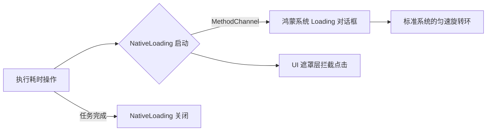

欢迎加入开源鸿蒙跨平台社区：[https://openharmonycrossplatform.csdn.net](https://openharmonycrossplatform.csdn.net)。

# Flutter for OpenHarmony：Flutter 三方库 flutter_native_loading — 原生极简加载反馈（触控反馈引擎）

## 前言

在鸿蒙（OpenHarmony）应用的业务逻辑中，等待是不可避免的：等待接口返回、等待资源解压、等待网络授权。你是否觉得在 Flutter 内部手写一套 Lottie 或者 Gif 动画有些大材小用？更关键的是，如果你的加载动效与鸿蒙系统设置（如：系统更新、文件归档）中的图标风格不统一，会让应用显得有些“山寨”。

`flutter_native_loading` 是一款专注于调用系统级加载引擎的轻量库。它摒弃了复杂的布局，直接在原生的弹出层（Overlay）上拉起鸿蒙最正统的环形加载动效。在追求应用极其省电且反馈极其官方的场景下，它是你的不二之选。

## 一、原理展示 / 概念介绍

### 1.1 基础概念

本库通过向鸿蒙原生 Service 发送指令，调起系统级的 UI 内容显示。



### 1.2 进阶概念

- **Modal Interruption (模态打断)**：加载时会自动锁定当前鸿蒙页面的所有触控，防止用户在数据未就绪时进行误操作。
- **Hardware Integration**：针对鸿蒙系统的“护眼模式”或“深色模式”，加载器会自动调整对比度，确保在任何背景下都极其清晰。

## 二、核心 API / 组件详解

### 2.1 依赖引入

```yaml
dependencies:
  flutter_native_loading: ^0.1.0 # 建议检查鸿蒙适配分支
```

### 2.2 一键开启原生加载

在鸿蒙工程中模拟网络拉取数据：

```dart
import 'package:flutter_native_loading/flutter_native_loading.dart';

void fetchHarmonyData() async {
  // ✅ 推荐做法：极其简单的方法调用，无需在 Widget 树里埋点
  FlutterNativeLoading.show(); 
  
  try {
     await Future.delayed(const Duration(seconds: 2)); // 模拟接口耗时
  } finally {
     // 💡 重点：任务结束，务必关闭原生层级
     FlutterNativeLoading.hide();
  }
}
```

## 三、场景示例

### 3.1 场景一：鸿蒙级应用的“敏感数据”解密

当应用正在从鸿蒙安全存储（Secure Storage）中解析巨大的密钥包时，告知用户后台正在全力以赴。

```dart
// 💡 技巧：利用原生 Loading 避开 Flutter 层的繁重绘图，节约 CPU 处理加解密
FlutterNativeLoading.show();
await decryptLargePackage();
FlutterNativeLoading.hide();
```


## 四、OpenHarmony 平台适配挑战

### 4.1 异常中断与“鬼影”遮罩

如果业务代码由于 Crash 没能执行 `hide()`，会导致原生 Loading 遮罩一直卡在屏幕上，此时由于它是原生托管，Flutter 的所有交互都将失效。

✅ **适配策略建议**：
1. **守护模式**：建议在所有的 `try` 块对应的 `finally` 中显式调用 `hide()`。
2. **超时机制**：虽然原生版极其稳健，但对于某些极端的弱网环境，建议在 `show()` 的同时启动一个本地计时器，如果 30 秒任务未结束，强制执行 `hide()` 逻辑。

## 五、综合实战示例代码

这是一个包含了基础流程控制与连续加载压力测试的鸿蒙 Demo：

```dart
import 'package:flutter/material.dart';
import 'package:flutter_native_loading/flutter_native_loading.dart';

class HarmonyLoadingLab extends StatelessWidget {
  const HarmonyLoadingLab({super.key});

  @override
  Widget build(BuildContext context) {
    return Scaffold(
      appBar: AppBar(title: const Text('原生加载反馈实验室')),
      body: Center(
        child: ElevatedButton(
          onPressed: () async {
            // 💡 演示：连续模拟两次加载，展现原生层响应的稳定性
            FlutterNativeLoading.show();
            await Future.delayed(const Duration(seconds: 1));
            FlutterNativeLoading.hide();
            
            ScaffoldMessenger.of(context).showSnackBar(const SnackBar(content: Text('已完成第 1 阶段初始化')));
          },
          child: const Text('立即拉起系统 Loading'),
        ),
      ),
    );
  }
}
```


## 六、总结

`flutter_native_loading` 让鸿蒙应用开发者告别了繁琐的“加载状态”管理 UI 逻辑。由于其调用极其低级的系统接口，不仅性能卓越，更能让应用在每一个细节上都充满了专业级原生应用的基因。

✅ **核心建议**：
1. 网络请求、大型文件 IO 等不可预测时长的场景，推荐启用。
2. 配合 `PlatformAlert`，能打造出一套完美的“请求 -> 加载 -> 结果反馈”的全原生交互闭环。

📦 更多的底层指导代码可进入：[AtomGit 示例专栏](https://atomgit.com)

---

欢迎加入开源鸿蒙跨平台社区：[开源鸿蒙跨平台开发者社区](https://openharmonycrossplatform.csdn.net)
