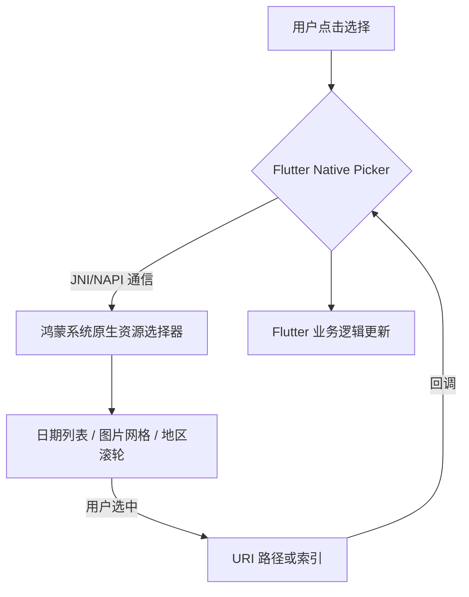

欢迎加入开源鸿蒙跨平台社区：[https://openharmonycrossplatform.csdn.net](https://openharmonycrossplatform.csdn.net)。

# Flutter for OpenHarmony：Flutter 三方库 flutter_native_picker — 系统原生资源选择器（拾取增强引擎）

## 前言

在鸿蒙（OpenHarmony）社交、电商或个人中心类应用中，用户经常需要执行“选择”动作：选一张最新的自拍做头像、选一个生日日期或者是选一个收货省市区。你是否想要让用户在点击时，极其自然地呼叫出鸿蒙系统原生的滚轮选择器（Column Picker）或图片选辑？

`flutter_native_picker` 提供了一套极其稳健的桥接方案。它直接与鸿蒙底层的 `Picker` 组件家族对话。这意味着你将获得：系统最精确的日期滚轮手势、100% 完美的图片缩略图预览质感。在追求用户操作直觉与系统高度一致的鸿蒙应用中，它是你的拾取专家。

## 一、原理展示 / 概念介绍

### 1.1 基础概念

本库通过 PlatformView 或 MethodChannel 直接在业务层触发系统的拾取逻辑。



### 1.2 进阶概念

- **Adaptive Scrolling**：获得系统级滚轮的“磁吸感（Magnetic Snap）”，让选择精确到毫秒。
- **Hardware Integration**：针对折叠屏、智慧屏等鸿蒙设备有更完美的宽屏/多窗口适配展示效果。

## 二、核心 API / 组件详解

### 2.1 依赖引入

```yaml
dependencies:
  flutter_native_picker: ^1.1.0 # 建议确认鸿蒙适配分支
```

### 2.2 呼叫极简原生日期选择器

在鸿蒙工程中实现一个优雅的生日设置：

```dart
import 'package:flutter_native_picker/flutter_native_picker.dart';

Future<void> pickHarmonyDate(BuildContext context) async {
  // ✅ 推荐做法：通过一站式方法调起系统标准弹窗
  DateTime? pickedDate = await FlutterNativePicker.showDatePicker(
    context: context,
    initialDate: DateTime.now(),
    title: '请选择您的认证日期',
  );
  
  if (pickedDate != null) {
    print('📦 鸿蒙原生拾取结果：${pickedDate.toIso8601String()}');
  }
}
```

## 三、场景示例

### 3.1 场景一：鸿蒙级应用的“高保真预览”视频拾取

当用户需要分享视频，通过调用系统原生 Picker，可以利用鸿蒙底层性能在网格中实时预览视频。

```dart
// 💡 技巧：利用原生能力处理海量媒体资源的流畅拾取
FlutterNativePicker.pickVideo(source: PickerSource.gallery);
```


## 四、OpenHarmony 平台适配挑战

### 4.1 窗口层级与软键盘冲突

如果当前页面已经开启了软键盘输入。在某些鸿蒙机型下强行拉起 Picker 可能导致 UI 重叠。

✅ **适配策略建议**：
1. **自动失焦策略**：在调起 `showDatePicker` 之前，强制执行 `FocusScope.of(context).unfocus()`，确保鸿蒙系统的软键盘先优雅收起，再拉起选择器。
2. **多语言文本对齐**：原生 Picker 的按钮（如“确认”、“取消”）会跟随鸿蒙系统的全局语言设置，开发者无需在 Flutter 层手动维护多套翻译文本。

## 五、综合实战示例代码

这是一个包含了基础日期与基础列选择反馈的鸿蒙 Lab 页面：

```dart
import 'package:flutter/material.dart';
import 'package:flutter_native_picker/flutter_native_picker.dart';

class HarmonyPickerLab extends StatefulWidget {
  const HarmonyPickerLab({super.key});

  @override
  _HarmonyPickerLabState createState() => _HarmonyPickerLabState();
}

class _HarmonyPickerLabState extends State<HarmonyPickerLab> {
  String _res = "等待选择...";

  @override
  Widget build(BuildContext context) {
    return Scaffold(
      appBar: AppBar(title: const Text('原生拾取器实验室')),
      body: Center(
        child: Column(
          children: [
            const Padding(padding: EdgeInsets.all(20), child: Icon(Icons.calendar_month, size: 80, color: Colors.blue)),
            Text(_res, style: const TextStyle(fontSize: 18)),
            const Spacer(),
            ElevatedButton(
              onPressed: () async {
                final d = await FlutterNativePicker.showDatePicker(context: context);
                if (d != null) setState(() => _res = d.toLocal().toString());
              }, 
              child: const Text('立即拉起鸿蒙原生日期拾取器'),
            ),
            const SizedBox(height: 50),
          ],
        ),
      ),
    );
  }
}
```


## 六、总结

`flutter_native_picker` 让鸿蒙跨平台应用在交互细节上真正回归平淡中的不凡。它消灭了因自定义 UI 带来的“滞后感”，让每一次的选择都在用户的指尖之下极其自然地流动。

✅ **核心建议**：
1. 对交互质感敏感、且需要支持海量数据的拾取场景，推荐启用原生版。
2. 涉及无障碍（TalkBack）模式的应用，原生版在语音播报上更加准确、规范。

📦 更多的底层指导代码可进入：[AtomGit 示例专栏](https://atomgit.com)

---

欢迎加入开源鸿蒙跨平台社区：[开源鸿蒙跨平台开发者社区](https://openharmonycrossplatform.csdn.net)
