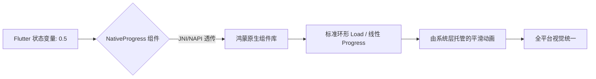
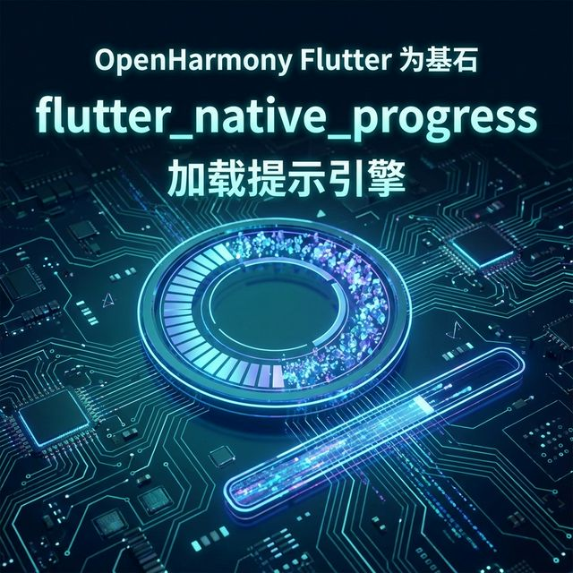

欢迎加入开源鸿蒙跨平台社区：[https://openharmonycrossplatform.csdn.net](https://openharmonycrossplatform.csdn.net)。

# Flutter for OpenHarmony：Flutter 三方库 flutter_native_progress — 实现原生级的极简进度反馈（加载提示引擎）

## 前言

在鸿蒙（OpenHarmony）应用中，当用户正在等待一个 100MB 的 HAP 包下载或者是进行底层数据库备份时，一个符合系统设计语言的进度条至关重要。你是否觉得 Flutter 自带的 `LinearProgressIndicator` 缺乏一种“呼吸感”，想要调用鸿蒙系统底层的原生进度控件？

`flutter_native_progress` 是一款极其纯粹的桥接库。它直接将鸿蒙原生的进度条（ProgressBar/LoadingProgress）“嵌入”到 Flutter 布局中。在追求加载动画与系统设置一致性、或者是对渲染功耗要求极低的应用中，它是保障用户耐心的利器。

## 一、原理展示 / 概念介绍

### 1.1 基础概念

为了榨取系统原生的加载质感，插件利用了 PlatformView 与底层绘制链路握手。



### 1.2 进阶概念

- **Indeterminate Mode (不确定模式)**：支持开启无限循环的加载动画，常用于鸿蒙应用初次启动时的资源扫描。
- **Zero-CPU Overhead (渲染托管)**：由于动画完全由鸿蒙原生的 UI 线程驱动，Flutter 层即便在处理复杂逻辑，进度条也不会出现卡顿掉帧。

## 二、核心 API / 组件详解

### 2.1 依赖引入

```yaml
dependencies:
  flutter_native_progress: ^0.1.0 # 建议检查鸿蒙适配版本
```

### 2.2 基础展示用法

在鸿蒙页面中展示一个极其稳健的进度条：

```dart
import 'package:flutter_native_progress/flutter_native_progress.dart';

Widget buildHarmonyUploader() {
  return const NativeProgress(
    progress: 0.75, // 💡 指定当前进度（0.0 - 1.0）
    color: Colors.blueAccent, // ✅ 推荐做法：通过 Color 自动映射到原生配色
    height: 10.0,
    isIndeterminate: false,
  );
}
```

## 三、场景示例

### 3.1 场景一：鸿蒙级应用的“大型数据同步”

当用户正在进行云端同步，通过原生的环形加载器告知用户进度正在安全推进。

```dart
// 💡 技巧：利用原生能力展示“圆圈”风格的加载
const NativeProgress(
  isIndeterminate: true, // 💡 确定性未知，开启循环动效
  style: ProgressStyle.circular, // 指定为环形风格
)
```



## 四、OpenHarmony 平台适配挑战

### 4.1 动画刷新与状态同步

虽然原语是原生的，但进度的更新仍然需要依靠 Flutter 的 `setState`。

✅ **适配策略建议**：
1. **频率控制**：由于 progress 变量变更时会触发跨层通信。建议在更新进度时增加简单的阈值判断（如：只有进度变动 > 1% 才更新），以减少鸿蒙系统的 MethodChannel 负载。
2. **色彩回退机制**：由于鸿蒙不同主题下按钮色（Accent Color）可能不同，建议通过 `Platform.isOHOS` 判断，显式注入符合鸿蒙 NEXT 设计标准的蓝色。

## 五、综合实战示例代码

这是一个包含了“确定性/非确定性”切换的鸿蒙实操 Demo：

```dart
import 'package:flutter/material.dart';
import 'package:flutter_native_progress/flutter_native_progress.dart';

class HarmonyProgressLab extends StatefulWidget {
  const HarmonyProgressLab({super.key});

  @override
  _HarmonyProgressLabState createState() => _HarmonyProgressLabState();
}

class _HarmonyProgressLabState extends State<HarmonyProgressLab> {
  double _value = 0.2;

  @override
  Widget build(BuildContext context) {
    return Scaffold(
      appBar: AppBar(title: const Text('原生进度条实验室')),
      body: Center(
        child: Column(
          children: [
            const Padding(padding: EdgeInsets.all(20), child: Text('👇 鸿蒙系统底层 Progress')),
            SizedBox(
              width: 300,
              child: NativeProgress(progress: _value, color: Colors.indigo),
            ),
            Slider(value: _value, onChanged: (v) => setState(() => _value = v)),
            const Divider(height: 100),
            const Text('正在执行后台任务...'),
            const SizedBox(height: 20),
            const NativeProgress(isIndeterminate: true, color: Colors.blue),
          ],
        ),
      ),
    );
  }
}
```


## 六、总结

`flutter_native_progress` 为鸿蒙应用提供了一种极其体面的加载体验。它避开了 Flutter 自身计算动画的资源开销，让每一次“等待”都变得专业且令人安心。

✅ **核心建议**：
1. 涉及大批量、耗时长的下载/上传操作，推荐使用原生版进度条。
2. 在处理低功耗物联网（IoT）管理应用时，原生进度条更省电。

📦 更多的底层指导代码可进入：[AtomGit 示例专栏](https://atomgit.com)

---

欢迎加入开源鸿蒙跨平台社区：[开源鸿蒙跨平台开发者社区](https://openharmonycrossplatform.csdn.net)
